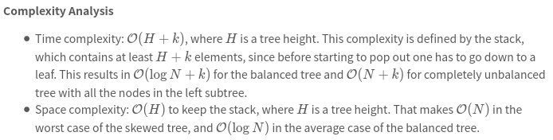

[230.Kth Smallest Element in a BST](https://leetcode.com/problems/kth-smallest-element-in-a-bst/)

* Amazon, Facebook, TripleByte, Oracle
* Binary Search, Tree
* Similar Questions:
    * 94.Binary Search Inorder Traversal
    * Second Minimum Node in a Binary Tree
* Hints:
    * Try to utilize the property of a BST.
    * Try inorder traversal
    * What if you could modify the BST node's structure
    * The optimal runtime complexity is O(height of BST).


## Method 1. Recursion of Inorder traversal
既然要找 `k-th` smallest number, 那么可以先将这棵书进行 inorder traversal，因为 BST 的 inorder traversal is in ascending order.
那么就可以直接定位到 `k-th` element。

```java
class Solution {
    public int kthSmallest(TreeNode root, int k) {
        List<Integer> list = new ArrayList<>();
        helper(root, list);
        return list.get(k-1);
    }
    
    private void helper(TreeNode node, List<Integer> list) {
        if(node == null) {
            return;
        }
        helper(node.left, list);
        list.add(node.val);
        helper(node.right, list);
    }
}
```
**Complexity Analysis:**
* Time complexity: `O(N)` to build a traversal.
* Space complexity: `O(N)` to keep an inorder traversal. 


## Method 2. Iterative
Iterative way could speed up the solution because there is no need to build the entire inorder traversal, and one could stop after the k-th element.

```java 
class Solution {
    public int kthSmallest(TreeNode root, int k) {
        LinkedList<TreeNode> stack = new LinkedList<>();
        
        TreeNode node = root;
        while(node != null || !stack.isEmpty()) {
            while(node != null) {
                stack.push(node);
                node = node.left;
            }
            node = stack.pop();
            if(--k == 0) {
                return node.val;
            }
            node = node.right;
        }
        return 0;
    }
}
```



## ✅Method 3. 只有两个遍历，不用 list
```java
class Solution {
    private int res;
    private int k;

    public int kthSmallest(TreeNode root, int k) {
        this.k = k;
        dfs(root);
        return res;
    }

    private void dfs(TreeNode node) {
        if(node == null) {
            return;
        }
        dfs(node.left);

        if(--k == 0) {
            res = node.val;
            return;
        } 

        dfs(node.right);
    }
}
```
**复杂度分析：**
* 时间复杂度：`O(n)`，其中 n 是二叉树的大小（节点个数）。
* 空间复杂度：`O(h)`，其中 `h` 是树高，递归需要 `O(h)` 的栈空间。最坏情况下树是一条链，h=n，空间复杂度为 O(n)。


## Follow up: What if the BST is modified often and you need to find the k-th smallest frequently. How would you optimize the kth smallest routine?
* 701.Insert into a Binary Search Tree
* 450.Delete Node in a BST


## Reference
* https://leetcode.com/problems/kth-smallest-element-in-a-bst/editorial/
* 灵茶山艾府: https://leetcode.cn/problems/kth-smallest-element-in-a-bst/solutions/2952810/zhong-xu-bian-li-pythonjavaccgojsrust-by-wc02/
