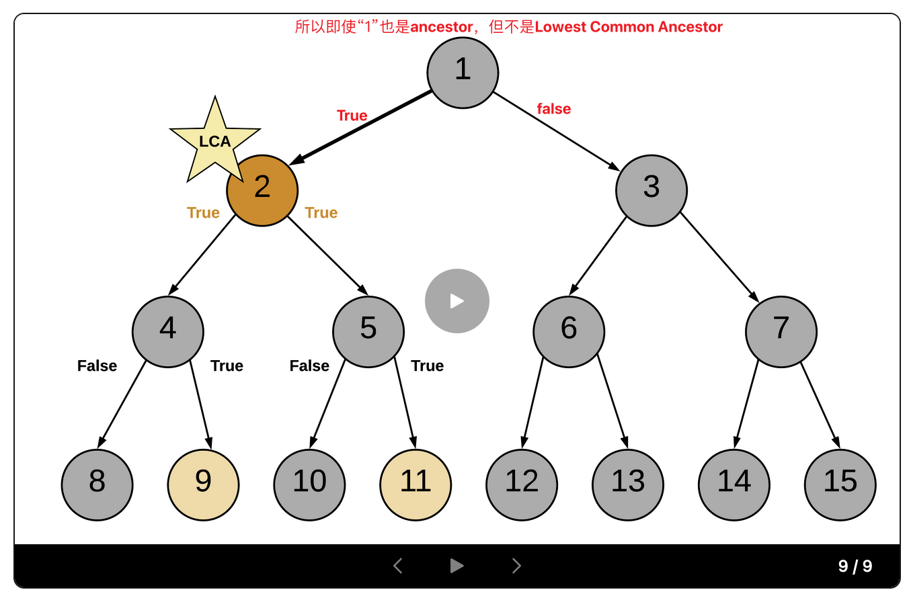

[236. Lowest Common Ancestor of a Binary Tree](https://leetcode.com/problems/lowest-common-ancestor-of-a-binary-tree/)

* Tree, Binary Tree, Depth-First Search
* Meta, Amazon, Microsoft, Google, Apple, Oracle, LinkedIn, Bloomberg, Wix, Yandex, Adobe, TikTok, Flipkart, Wayfair, PayPal, Salesforce
* Similar Questions:
    * [235. Lowest Common Ancestor of a Binary Search Tree](https://leetcode.com/problems/lowest-common-ancestor-of-a-binary-search-tree/)
    * Smallest Common Region
    

**Notes:**
1. All `node.val` are unique.
2. `p != q`
3. `p` and `q` will exist in the tree.


## 🟩 Method 1. Recursive (8ms, beats 19%)
**Intuition:**
1. The moment you encounter either of the nodes `p` or `q`, return some boolean flag. The flag helps to determine if we found the required nodes in any paths. 当遇到node `p` or `q`时，返回一个boolean flag, 表示我们在path中遇到了目标nodes。
2. The least common ancestor would then be the node for which both the subtree recursions return a `true` flag. 最近共同的祖先将是两个子树递归都返回`true`标志的节点。
    * It can also be the node which itself is one of `p` or `q` and for which one of the subtree recursions returns a `true` flag.

**Algorithm**
1. Start traversing the tree from the root node.
2. If the current node itself is one of `p` or `q`, we would mark a variable `mid` as True and continue the search for the other node in the left and right branches.
3. If either of the left or the right branch returns True, this means one of the two nodes was found below.
4. If at any point in the traversal, any two of the three flags left, right or mid become True, this means we have found the lowest common ancestor for the nodes p and q.



```Java
class Solution {
    private TreeNode res;
    
    public TreeNode lowestCommonAncestor(TreeNode root, TreeNode p, TreeNode q) {
        recurseTree(root, p, q);
        return res;
    }
    
    // 返回节点 p or q 是否在以 curr 为根节点的子树上。
    private boolean recurseTree(TreeNode curr, TreeNode p, TreeNode q) {
        // If reached the end of a branch, return false
        if(curr == null) {
            return false;
        }
        
        // Left branch. If left recursion returns ture, set left=1 else 0
        int left = recurseTree(curr.left, p, q) ? 1 : 0;
        int right = recurseTree(curr.right, p, q) ? 1 : 0;
        // If the current node is one of p or q
        int mid = (curr == p || curr == q) ? 1 : 0;
        
        if(mid + left + right >= 2) {
            res = curr;
        }
        return mid + left + right > 0;  // > 0: means we find at least one node of p and q
    }
}
```
**Complexity Analysis:**
1. Time Complexity: `O(N)`, where `N` is the number of nodes in the binary tree. In the worst case we might be visiting all the nodes of the binary tree.
2. Space Complexity: `O(N)`. This is because the maximum amount of space utilized by the recursion stack would be NNN since the height of a skewed binary tree could be `N`.


## 🟩 Method 2. Recursion (6ms, 100%)
Key Points:
1. `left == null`, means that there is no `p` or `q` in the left subtree.
2. `right == null`, means that there is no `p` or `q` in the right subtree.

```java
class Solution {
    public TreeNode lowestCommonAncestor(TreeNode root, TreeNode p, TreeNode q) {
        // 如果遍历过程中遇到了p或者q，就往上返回这个节点，否则就往上一层返回null
        if(root == p || root == q || root == null) {
            return root;
        }

        // 分别递归去看左右子树: left --> right --> root, 典型的后续遍历
        TreeNode left = lowestCommonAncestor(root.left, p, q);
        TreeNode right = lowestCommonAncestor(root.right, p, q);

        // 走到某个节点，如果发现他的左右孩子都不为空，说明当前节点就是最小公共祖先
        if(left != null && right != null) {
            return root;
        }

         // 如果只找到一个孩子，需要给父节点返回另一个不为空的孩子
        return left != null ? left : right;
    }
}
```
From [CNoodle [LeetCode] 236. Lowest Common Ancestor of a Binary Tree](https://www.cnblogs.com/cnoodle/p/12456108.html)

or 

```java
class Solution {
    public TreeNode lowestCommonAncestor(TreeNode root, TreeNode p, TreeNode q) {
        if(root==null || root==p || root==q) {
            return root;
        }
        
        TreeNode left = lowestCommonAncestor(root.left, p, q);
        TreeNode right = lowestCommonAncestor(root.right, p, q);
        
        return (left == null) ? right : (right == null) ? left : root;
    }
}
```
or a clear way
```Java
class Solution {
    public TreeNode lowestCommonAncestor(TreeNode root, TreeNode p, TreeNode q) {
        //base case
        if(root == null || root == p || root == q) 
            return root;
        
        TreeNode left = lowestCommonAncestor(root.left,p,q);
        TreeNode right = lowestCommonAncestor(root.right,p,q);

        // result
        if(left == null)
            return right;
        else if(right == null)
            return left;
        else
            return root;
    }
}
```
* https://leetcode.com/problems/lowest-common-ancestor-of-a-binary-tree/solutions/4425847/clean-solution/


## Method 3. Iterative using parent pointers (22ms)
> If we have parent pointers for each node, we can traverse back from `p` and `q` to get their ancestors. The first common node we get during this traversal would be the LCA. We can save the parent pointers in a dictionary as we traverse the tree. 

```Java
/**
 * Definition for a binary tree node.
 * public class TreeNode {
 *     int val;
 *     TreeNode left;
 *     TreeNode right;
 *     TreeNode(int x) { val = x; }
 * }
 */
class Solution {
    public TreeNode lowestCommonAncestor(TreeNode root, TreeNode p, TreeNode q) {
        // Stack for tree traversal
        Deque<TreeNode> stack = new ArrayDeque<>();

        // HashMap for saving parent pointers
        Map<TreeNode, TreeNode> parent = new HashMap<>();

        parent.put(root, null);
        stack.push(root);

        // Iteration until we find both the nodes p and q
        while(!parent.containsKey(p) || !parent.containsKey(q)) {
            TreeNode node = stack.pop();

            // While traversing the tree, keep saving the parent pointers
            if(node.left != null) {
                parent.put(node.left, node);
                stack.push(node.left);
            }
            if(node.right != null) {
                parent.put(node.right, node);
                stack.push(node.right);
            }
        }   // After the while-loop, parent contains parents of both p and q

        // Ancestors Set for node p
        Set<TreeNode> ancestors = new HashSet<>();

        // Process all ancesstors for node p using parent pointers
        while(p != null) {
            ancestors.add(p);
            p = parent.get(p);
        }

        // The first ancestor of q which appears in p's ancestor Set is their lowest common ancestor
        while(!ancestors.contains(q)) {
            q = parent.get(q);
        }

        return q;
    }
}
```
**Complexity Analysis:**
1. Time Complexity: `O(N)`, where `N` is the number of nodes in the binary tree. In the worst case we might be visiting all the nodes of the binary tree.
2. Space Complexity: `O(N)`. In the worst case space utilized by the stack, the parent pointer dictionary and the ancestor set, would be `N` each, since the height of a skewed binary tree could be `N`.


## Method 4. Iterative without parent pointers
> In the previous approach, we come across the LCA during the backtracking process. We can get rid of the backtracking process itself. 
> In this approach we always have a pointer to the probable LCA and the moment we find both the nodes we return the pointer as the answer. 


## Reference
* https://leetcode.com/problems/lowest-common-ancestor-of-a-binary-tree/editorial/
* CNoodle: [[LeetCode] 236. Lowest Common Ancestor of a Binary Tree](https://www.cnblogs.com/cnoodle/p/12456108.html)
* LeetCodeCN 力扣: [「代码随想录」带你学透二叉树！236. 二叉树的最近公共祖先:【递归与回溯】详解](https://leetcode.cn/problems/lowest-common-ancestor-of-a-binary-tree/solutions/625063/236-er-cha-shu-de-zui-jin-gong-gong-zu-x-tl5b/)
* LeetCodeCN 力扣: [二叉树的最近公共祖先](https://leetcode.cn/problems/lowest-common-ancestor-of-a-binary-tree/solutions/238552/er-cha-shu-de-zui-jin-gong-gong-zu-xian-by-leetc-2/)
* LeetCodeCN: [「代码随想录」带你学透二叉树！236. 二叉树的最近公共祖先:【递归与回溯】详解](https://leetcode.cn/problems/lowest-common-ancestor-of-a-binary-search-tree/solutions/428633/er-cha-sou-suo-shu-de-zui-jin-gong-gong-zu-xian-26/)