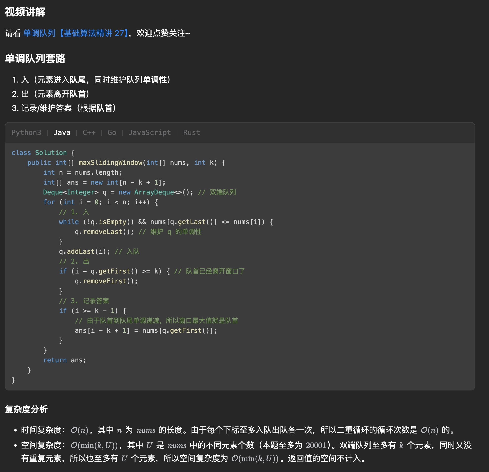

[239. Sliding Window Maximum](https://leetcode.com/problems/sliding-window-maximum/)

* Amazon, Microsoft, Google, Apple, Adobe, ByteDance, Dropbox
* Heap, Sliding Window
* Similar Questions:
    * Minimum Window Substring
    * Min Stack
    * Longest Substring with at Most Two Distinct Characters
    * Paint House II
* Hints:
    * How about using a data structure such as a deque (double-ended queue)?
    * The queue size need not be the same as the window's size
    * Remove redundant elements and the queue should store only elements that need to be considered.
   

## Method 1. Monotonic Deque
```java

```
 
    
## Method 1. [Java O(n) solution using deque with explanation](https://leetcode.com/problems/sliding-window-maximum/discuss/65884/Java-O(n)-solution-using-deque-with-explanation)
We scan the array from 0 to n-1, keep "promising" elements in the deque. The algorithm is amortized O(n) as each element is put and polled once.

Key Points:
1. Keep only the indexes of elements from the current sliding window;
2. Remove indexes of all elements smaller than the current one, since they will not be the maximum ones.
3. Append the current element to the deque;
4. Append `nums[deque[0]]` to the output.

```java
class Solution {
    public int[] maxSlidingWindow(int[] nums, int k) {
        if(nums == null || nums.length * k == 0) {
            return new int[0];
        }
        int n = nums.lengh;
        int[] res = new int[n - k + 1];
        int idx = 0;
        // Deque: to store idx
        Deque<Integer> queue = new ArrayDeque<>();
        for(int i=0; i<nums.length; i++) {
            // Remove numbers out of range k, i.e. the very first idx
            while(!queue.isEmpty() && queue.peek() < i - k + 1) {
                queue.poll();
            }
            // Remove smaller numbers in k range as they are useless
            while(!queue.isEmpty() && nums[queue.peekLast()] < nums[i]) {
                queue.pollLast();
            }
            // queue contains index... , res contains content
            queue.offer(i);
            if(i >= k - 1) {    // Begin to collect result when i >= k-1
                res[idx++] = nums[queue.peek()];
            }
        }
        return res;
    }
}
```
Example: `nums = [1, 3, -1, -3, 5, 3, 6, 7], len=8, k=3`
1. i=0,
    * After `queue.poll()`, queue=[]
    * After `queue.pollLast()`, queue=[]
    * After `queue.offer(0)`, queue=[0], res=[]
2. i=1, 
    * After `queue.poll()`, queue=[0]
    * After `queue.pollLast()`, queue=[]. 因为`nums[0] < nums[1]`, `nums[0]`不可能是`k` range范围内最大的，所以poll`0`.
    * After `queue.offer(1)`, queue=[1], res=[]
3. i=2, 
    * After `queue.poll()`, queue=[1],
    * After `queue.pollLast()`, queue=[1], 因为`nums[2]<nums[1]`, `nums[1]`依然可能是`k` range范围内最大的，所以不poll。
    * After `queue.offer(2)`, queue=[1,2], res=[3]. **queue.peek()=i**总是包含`nums[i]`的`k` range范围内最大的。
4. i=3, (queue.peek()=1 < 3-3+1 ? false)
    * After `queue.poll()`, queue=[1,2]
    * After `queue.pollLast()`, queue=[1,2]
    * After `queue.offer(3)`, queue=[1,2,3], res=[3,3]
5. i=4, 
    * After `queue.poll()`, queue=[2,3]
    * After `queue.pollLast()`, queue=[]. 因为`nums[4]=5`是目前最大的，没必要再追踪比`5`小的值
    * After `queue.offer(4)`, queue=[4], res=[3,3,5]
6. i=5, 
    * After `queue.poll()`, queue=[4]
    * After `queue.pollLast()`, queue=[4]
    * After `queue.offer(5)`, queue=[4,5], res=[3,3,5,5]
6. i=6, 
    * After `queue.poll()`, queue=[4,5]
    * After `queue.pollLast()`, queue=[], `nums[6]=6`是目前最大的。
    * After `queue.offer(6)`, queue=[6], res=[3,3,5,5,6]
6. i=7, 
    * After `queue.poll()`, queue=[6]. k=3, 以`index=7`结尾的range是`[5,6,7]`,所以要将4 poll出来。
    * After `queue.pollLast()`, queue=[], `nums[7]=7`是目前最大的。
    * After `queue.offer(6)`, queue=[7], res=[3,3,5,5,6,7]


**Complexity Analysis:**
1. Time complexity : `O(N)`, since each element is processed exactly twice - it's index added and then removed from the deque.
2. Space complexity : `O(N)`, since `O(N−k+1)` is used for an output array and `O(k)` for a deque. 

or 

```java
class Solution {
    
    public int[] maxSlidingWindow(int[] nums, int k) {
        if(nums == null || nums.length * k == 0) {
            return new int[0];
        }
        if(k == 1) {
            return nums;
        }
        
        // Init
        int N = nums.length;
        int[] res = new int[N - k + 1]; // There are (N - k + 1) sliding windows.
        int idx = 0;    // index of res
        Deque<Integer> queue = new ArrayDeque<>();
        for(int i=0; i<nums.length; i++) {
            // Remove indexes out of current sliding window, the range should be [i-k+1, i]
            while(!queue.isEmpty() && queue.peekFirst() < i - k + 1) {
                queue.pollFirst();
            }
            // Remove smaller numbers than current element, i.e. nums[i]
            while(!queue.isEmpty() && nums[queue.peekLast()] < nums[i]) {
                queue.pollLast();
            }
            // queue contains indexes in current sliding window, and queue.peekFirst() is the index of the largest element
            queue.offer(i);
            if(i >= k - 1) {
                res[idx++] = nums[queue.peekFirst()];
            }
        }
        return res;
    }
}
```
Complexity Analysis
1. Time complexity : `O(N)`, since each element is processed exactly twice - it's
 index added and then removed from the deque. [不对？Deque的操作应该是`logk`. 再考虑]
2. Space complexity : `O(N)`, since O(N−k+1) is used for an output array and `O(k)` for a deque. 
    

## Method 2. Dynamic
[O(n) solution in Java with two simple pass in the array](https://leetcode.com/problems/sliding-window-maximum/discuss/65881/O(n)-solution-in-Java-with-two-simple-pass-in-the-array)
For Example: A = [2,1,3,4,6,3,8,9,10,12,56], w=4

    1. partition the array in blocks of size w=4. The last block may have less then w.
    A = 2, 1, 3, 4 | 6, 3, 8, 9 | 10, 12, 56|

    2. Traverse the list from start to end and calculate max_so_far. Reset max after each block boundary (of w elements).
    left_max[] = 2, 2, 3, 4 | 6, 6, 8, 9 | 10, 12, 56
    left_max[0] = max(A[0, 0]) = 2, starts from 0 to 0
    left_max[1] = max(A[0, 1]) = 2
    left_max[2] = max(A[0, 2]) = 3
    left_max[3] = max(A[0, 3]) = 4, starts from 3 to 4
    left_max[4] = max(A[4, 4]) = 6, starts from 4 to 4
    
    3. Similarly calculate max in future by traversing from end to start.
    right_max[] = 4, 4, 4, 4 | 9, 9, 9, 9 | 56, 56, 56

    4. now, sliding max at each position i in current window, sliding-max(i) = max{right_max(i), left_max(i+w-1)}
    sliding_max = 4, 6, 6, 8, 9, 10, 12, 56

Key Points:
0. 分别从左右两侧找到最大的 element，然后在左右两侧的最大的 element 中取最大值。
1. If `i % w == 0`, then `i` is the start of a window block `[i ~ j]`;
2. If `(j + 1) % w == 0`, then `j` is the end of a window block `[i ~ j]`.
3. For example:
    index:  0, 1, 2, 3, | 4, 5, 6, 7, | 8
    nums:   2, 1, 3, 4, | 6, 3, 8, 9, | 10
                     |              |   
                  (3+1)%4==0     (7+1)%4==0 is an end
4. The index range of a random block with size `k`: `[i, i+k-1]`
5. `left[i+k-1]` represents the largest element from left to `nums[i]`.
    * ⚠️注意: 从left --> right, 最大的是`left[i+k-1]`, 而不是`left[i]`
6. `right[i]` represent the largest element from right to `nums[i]`;
7. Therefore, `res[i] = Math.max(right[i], left[i+k-1])`

Analysis:
1. If indexes `i` and `j` are in the same sliding window:
    index:    0, 1, 2, 3, | 4, 5, 6, 7, | 8
    nums:     2, 1, 3, 4, | 6, 3, 8, 9, | 10
    left(i) :  
    right(j):
    when i = 0:
    left[0+4-1]=left[3]: the maximum element in the range nums[0, 3]
    right[0]: the maximum element in the range nums[0, 3]
2. If indexes `i` and `j` are in different sliding windows:
    when i = 1:
    left[1+4-1]=left[4]: the maximum element in the range nums[4, 4], i.e. the only element in nums[4]
    right[1]: the maximum element if the range nums[1, 3], since 3 is the end of the first window
    i.e. [1 <- 3, 4] ==> i.e. sliding window with range [1, 4]
    
    while i = 2:
    left[2+4-1]=left[5]: the maximum element in the range nums[4, 5], since 4 is the beginning of a new sliding window
    right[2]: the maximum element if the range nums[2, 3], since 3 is the end of the first window
    

```java
class Solution {
    public int[] maxSlidingWindow(int[] nums, int k) {
        if(nums == null || nums.length * k == 0) {
            return new int[0];
        }
        if(k == 1) {
            return nums;
        }
        int n = nums.length;
        int[] left = new int[n];    // left[j] = max element from block_start to j, left --> right
        left[0] = 0;
        int[] right = new int[n];   // right[i] = max element from block_end to i, right --> left
        right[n-1] = nums[n-1];
        for(int i=1; i<n; i++) {
            // From left to right
            if(i % k == 0) {
                left[i] = nums[i];  // block start
            } else {
                left[i] = Math.max(left[i-1], nums[i]);
            }
            // From right to left
            int j = n - 1 - i;      // i.e. the begining of a block from right to left with size k is n-2
            if((j + 1) % k == 0) {  // j=5, (j+1)%3==0, ==> the end of a block
                right[j] = nums[j]; // block end
            } else {
                right[j] = Math.max(nums[j], right[j+1]);
            }
        }
        int[] res = new int[n - k + 1];
        for(int i=0; i<n-k+1; i++) {
            res[i] = Math.max(left[i+k-1], right[i]);
        }
        return res;
    }
}
```
Complexity Analysis
1. Time complexity : `O(N)`, since all we do is 3 passes along the array of length N.
2. Space complexity : `O(N)` to keep left and right arrays of length N, and output array of length `N - k + 1`.


## ✅⭐Method 4. Monotonic Queue

```java
class Solution {
    public int[] maxSlidingWindow(int[] nums, int k) {
        int[] res = new int[nums.length - k + 1];

        // 双端队列
        Deque<Integer> queue = new ArrayDeque<>();  // Monotonic queue, descending order
        for(int i=0; i<nums.length; i++) {
            // 1. Insert
            while(!queue.isEmpty() && nums[queue.getLast()] <= nums[i]) {
                queue.removeLast(); // Keep monotonic descending, 维护 q 的单调性
            }
            queue.addLast(i);   // 入队

            // 2. 出
            if(i - queue.getFirst() + 1 > k) {  // 队首已经离开窗口了
                queue.removeFirst();
            }

            // 3. 记录答案
            if(i >= k - 1) {
                // 由于队首到队尾单调递减，所以窗口最大值就是队首
                res[i-k+1] = nums[queue.getFirst()];
            }
        }
        return res;
    }
}
```
**复杂度分析:**
* 时间复杂度：`O(n)`，其中 n 为 nums 的长度。由于每个下标至多入队出队各一次，所以二重循环的循环次数是 O(n) 的。
* 空间复杂度：`O(min(k,U))`，其中 U 是 nums 中的不同元素个数（本题至多为 20001）。双端队列至多有 k 个元素，同时又没有重复元素，所以也至多有 U 个元素，所以空间复杂度为 O(min(k,U))。返回值的空间不计入。


## Reference:
1. [O(n) solution in Java with two simple pass in the array](https://leetcode.com/problems/sliding-window-maximum/discuss/65881/O(n)-solution-in-Java-with-two-simple-pass-in-the-array)
2. 灵茶山艾府 [单调队列 滑动窗口最大值【基础算法精讲 27】](https://www.bilibili.com/video/BV1bM411X72E?spm_id_from=333.788.recommend_more_video.1&vd_source=bd5e1cdd20d83feef8e77a781b33f083)
3. 灵茶山艾府 [【视频】一个视频秒懂单调队列！附题单！（Python/Java/C++/Go/JS/Rust）](https://leetcode.cn/problems/sliding-window-maximum/solutions/2499715/shi-pin-yi-ge-shi-pin-miao-dong-dan-diao-ezj6/)
