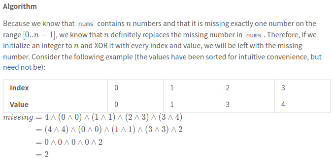

[268. Missing Number](https://leetcode.com/problems/missing-number/description/)

* Amazon, Capital One, Microsoft, Apple, Facebook
* Array, Math, Bit Manipulation
* Similar Questions:
    * First Missing Positive
    * Single Number
    * Find the Duplicate Number
    * Couples Holding Hands
    

## Method 1. Sorting
Key Points:
1. If `nums` were in order, it would be easy to see which number is missing.

```java
class Solution {
    public int missingNumber(int[] nums) {
        Arrays.sort(nums);
        
        // Ensure that n is at the last index.
        if(nums[nums.length - 1] != nums.length) {
            return nums.length;     // nums[0, 1, ..., n-1], then num n is the missing one
        } else if(nums[0] != 0) {   // i.e. nums[0] = 1, then num 0 is the missing one
            return 0;
        }
        
        // If we get here, then the missing number is on the range (0, n), i.e. not 0 or n
        for(int i=1; i<nums.length; i++) {
            int expectedNum = nums[i-1] + 1;
            if(nums[i] != expectedNum) {
                return expectedNum;
            }
        }
        
        // Array was not missing any numbers.
        return -1;
    }
}
```
or
```java
class Solution {
    public int missingNumber(int[] nums) {
        Arrays.sort(nums);

        for(int i=0; i<nums.length; i++) {
            if(nums[i] != i) {
                return i;
            }
        }
        return nums.length;
    }
}
```
Analysis:
1. Time analysis: `O(nlgn)`
2. Space analysis: `O(1) (or O(n))`


## Method 2. Hash Set
```java
class Solution {
    public int missingNumber(int[] nums) {
        Set<Integer> numSet = new HashSet<>();
        for(int num: nums) {
            numSet.add(num);
        }
        int expectedCount = nums.length + 1;
        for(int num=0; num < expectedCount; num++) {
            if(!numSet.contains(num)) {
                return num;
            }
        }
        return -1;
    }
}
```
or
```java
class Solution {
    public int missingNumber(int[] nums) {
        Set<Integer> set = new HashSet<>();
        for(int num: nums) {
            set.add(num);
        }

        for(int i=0; i<nums.length; i++) {
            if(!set.contains(i)) {
                return i;
            }
        }
        return nums.length;
    }
}
```
**Complexity Analysis:**
* Time complexity: `O(n)`
  * Because the set allows for `O(1)` containment queries, the main loop runs in `O(n)` time. Creating num_set costs `O(n)` time, as each set insertion runs in amortized `O(1)` time, so the overall runtime is `O(n+n)=O(n)`.
* Space complexity: `O(n)`
  * nums contains `n−1` distinct elements, so it costs `O(n)` space to store a set containing all of them.


## Method 3. Bit Manipulation
Key Points:
1. We can harness the fact tht XOR is its own inverse to find the missing element in linear time.
2. XOR 操作： 相异为 1, 相同为 0。例如 `1 XOR 1 = 0` and `1 XOR 0 = 1`。

位运算: 两个相同的数字进行**异或**运算，结果为0；一个数字与0进行**异或**运算，结果还未数字本身。
* Example: `2^2=0`, `2^0=2`, `1^1^2^2=0`, `1^1^2=0^2=2`



```java
class Solution {
    public int missingNumber(int[] nums) {
        int missing = nums.length;      // Add one more number for N
        for(int i=0; i<nums.length; i++) {
            missing ^= (i ^ nums[i]);
        }
        return missing;
    }
}
```
Complexity Analysis
1. Time complexity : O(n), Assuming that XOR is a constant-time operation, this algorithm does 
constant work on nnn iterations, so the runtime is overall linear.
2. Space complexity : O(1), This algorithm allocates only constant additional space.


## Method 4. Gauss' Formula (高斯公式)
`0+1+2...+n=n(n+1)/2`
```java
class Solution {
    public int missingNumber(int[] nums) {
        int expectedSum = nums.length * (1 + nums.length) / 2;
        int actualSum = 0;
        for(int num: nums) {
            actualSum += num;
        }
        return expectedSum - actualSum;
    }
}
```
**Complexity Analysis:**
* Time complexity: `O(n)`
  * Although Gauss' formula can be computed in O(1)\mathcal{O}(1)O(1) time, summing nums costs us O(n)\mathcal{O}(n)O(n) time, so the algorithm is overall linear.
* Space complexity: `O(1)`
  * This approach only pushes a few integers around, so it has constant memory usage.


## Method 5. [Reference](https://leetcode.com/problems/missing-number/solution/156813)
```java
class Solution {
    public int missingNumber(int[] nums) {
        int missing = nums.length;
        for(int i=0; i<nums.length; i++) {
            missing += (i - nums[i]);
        }
        return missing;
    }
}
```


## [Cyclic Sort](https://leetcode.com/problems/missing-number/discuss/450090/Cyclic-Sort)
Key Points:
1. Always put `nums[i]` at index `nums[i]`. 如果 nums[i] 不在 index 为 `nums[i]` 的位置，然后就与 `nums[i]`
交换，直到 `nums[i] == i`
```java
class Solution {
    public int missingNumber(int[] nums) {
        int N = nums.length;
        int i = 0;
        while(i < N) {
            if(nums[i] < N && nums[i] != i) {
                swap(nums, i, nums[i]); // nums[i] should be placed at index nums[i]
            } else {
                i++;    // nums[i] == i
            }
        }
        
        i = 0;
        while(i < N) {
            if(i != nums[i]) {
                return i;
            }
            i++;
        }
        return N;
    }
    
    private void swap(int[] nums, int i, int j) {
        int tmp = nums[i];
        nums[i] = nums[j];
        nums[j] = tmp;
    }
}
```


## Reference
* https://leetcode.com/problems/missing-number/editorial/
* [CNoodle [LeetCode] 268. Missing Number](https://www.cnblogs.com/cnoodle/p/11681825.html)