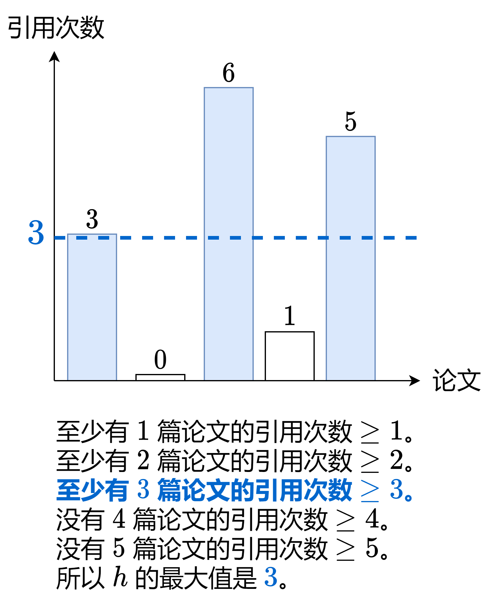

[274. H-Index](https://leetcode.com/problems/h-index/)

* Array, Sorting, Counting Sort

题意理解：


 
## Method 1
```java
/**
Input: citations
i: i-th paper
citations[i]: citation of i-th paper

cnt
i: the number of citations
cnt[i]: the number of papers, which have i citations
*/

class Solution {
    public int hIndex(int[] citations) {
        int n = citations.length;
        int[] cnt = new int[n + 1];
        for(int c: citations) {
            cnt[Math.min(c, n)]++;  // 引用次数 > n 时，等价于引用次数为 n
        }

        int s = 0;
        for(int i=n; ; i--) {   // i=0 的时候，s >= i 一定成立
            s += cnt[i];
            if(s >= i) {    // 有 s 篇文章的citation >= i
                return i;
            }
        }
    }
}
```
**复杂度分析:**
* 时间复杂度：`O(n)`，其中 n 为 citations 的长度。
* 空间复杂度：`O(n)`。


## Reference
* LeetCodeCN: [没看懂题意？一张图秒懂（Python/Java/C++/Go/JS/Rust）](https://leetcode.cn/problems/h-index/solutions/2502837/mei-kan-dong-ti-yi-yi-zhang-tu-miao-dong-8zps/)