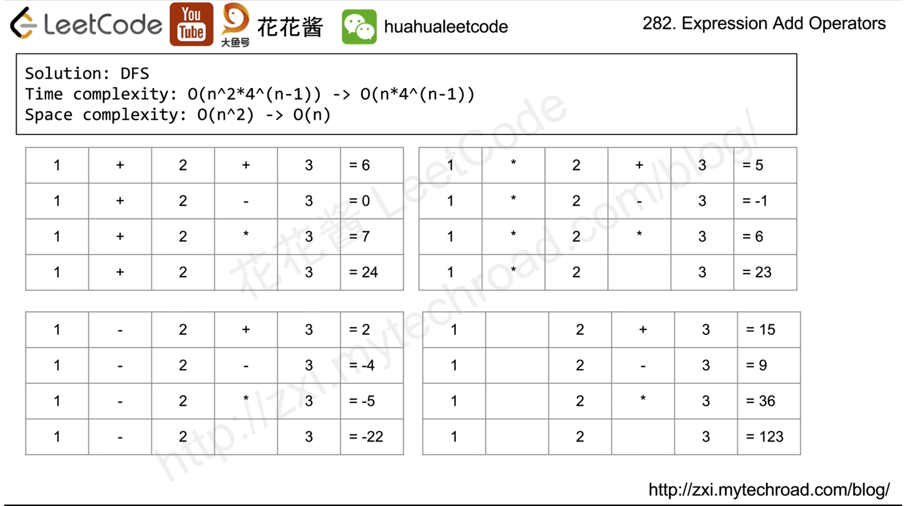
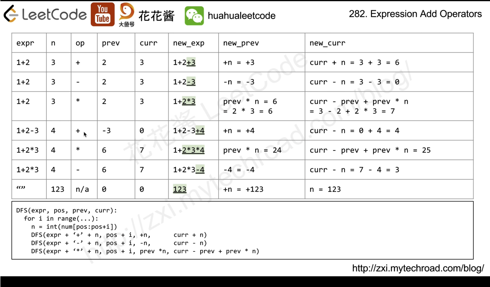

# [282. Expression Add Operators](https://leetcode.com/problems/expression-add-operators/description/)

* Facebook, TikTok, Google, Amazon
* Math, String, Backtracking


思路是**DFS backtracking**，一点点去尝试。helper函数里包括了如下几个参数
* `res` - `List<String> result`, 最终的结果
* `path` - `StringBuilder`, 当前被构建的运算表达式
* `eval` - `long`, 当前被构建的表达式结果
* `prev` - `logn`, 之前一个被构建的数字


## Method 1. DFS Backtracking (回溯)




This problem has a lot of edge cases to be considered:
1. overflow: we use a long type once it is larger than Integer.MAX_VALUE or minimum, we get over it.
2. 0 sequence: because we can't have numbers with multiple digits started with zero, we have to deal with it too.
3. a little trick is that we should save the value that is to be multiplied in the next recursion.
4. adding String is extremely expensive. Speed can be increased by 20% if you use `StringBuilder` instead.

```java
class Solution {
    /**
    num: "123"
    target: 6
    */
    public List<String> addOperators(String num, int target) {
        List<String> result = new ArrayList<>();

        dfsHelper(num, target, result, new StringBuilder(), 0, 0, 0);
        return result;
    }

    /**
    num: "123"
    target: 6
    result: list of strings
    path: like "1+2", "1+2+3" etc
    start: index of string num
    eval: evaluation result of current path
    eval: 
    */
    private void dfsHelper(String num, int target, List<String> result, StringBuilder path, int start, long eval, long prev) {
        // recursion的终止条件，即达到String num的结尾
        if(start == num.length()) {
            if(eval == target) {
                result.add(path.toString());
            }
            return;
        }

        for(int i=start; i<num.length(); i++) {
            // 数字不能以0开头
            if(num.charAt(start) == '0' && i>start) {
                break;
            }

            // 在recursion过程中，start是固定的，start=0，i+1=1,2,3,...
            long curr = Long.parseLong(num.substring(start, i+1));
            int len = path.length();
            
            // start=0, 即第一个数字，前面不需要符号，因此只有 path.append(curr)
            if(start == 0) {
                // The first curr is the evaluation result of path, for example path="12", curr = 12
                // The second curr is the evaluation result of previous number, 
                dfsHelper(num, target, result, path.append(curr), i+1, curr, curr);
                path.setLength(len);
            } else {
                // add
                dfsHelper(num, target, result, path.append("+").append(curr), i+1, eval+curr, curr);
                path.setLength(len);

                // minus
                dfsHelper(num, target, result, path.append("-").append(curr), i+1, eval-curr, -curr);
                path.setLength(len);

                // multiply
                dfsHelper(num, target, result, path.append("*").append(curr), i+1, eval - prev + prev * curr, prev * curr);
                path.setLength(len);
            }
        }
    }
}
```


## Reference
* [花花酱 LeetCode 282. Expression Add Operators](http://zxi.mytechroad.com/blog/searching/leetcode-282-expression-add-operators/)
* [CNoodle, [LeetCode] 282. Expression Add Operators](https://www.cnblogs.com/cnoodle/p/12928364.html)
* [力扣: 详细通俗的思路分析，多解法](https://leetcode.cn/problems/expression-add-operators/solutions/174926/xiang-xi-tong-su-de-si-lu-fen-xi-duo-jie-fa-by-52/)
* [Java Standard Backtrace AC Solutoin, short and clear](https://leetcode.com/problems/expression-add-operators/solutions/71895/Java-Standard-Backtrace-AC-Solutoin-short-and-clear/)