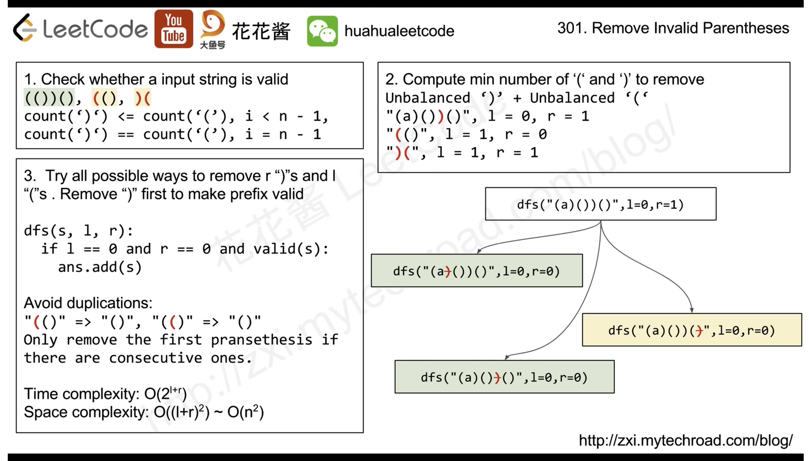
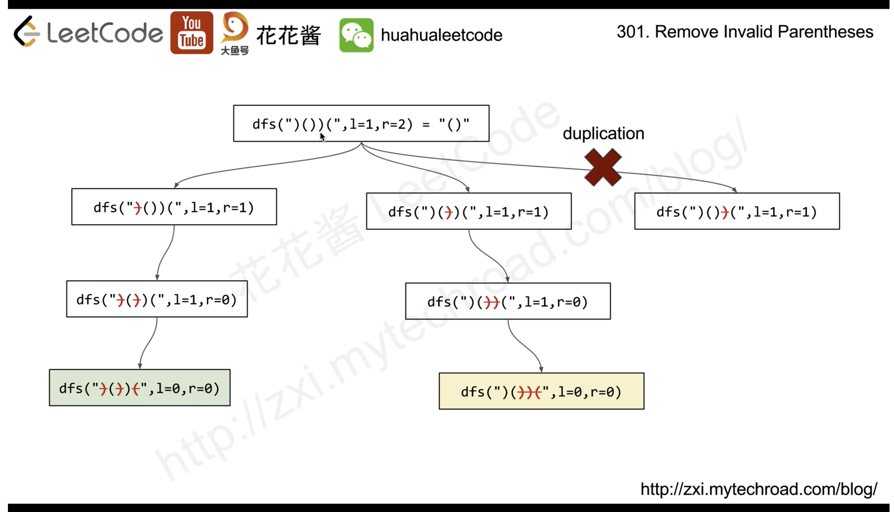

[301. Remove Invalid Parentheses](https://leetcode.com/problems/remove-invalid-parentheses/)

* String, Backtracking, Breadth-First Search
* Meta, Google, TikTok, Rubrik, Deliveroo, Amazon, Uber, Bloomberg, Adobe, Yandex, Apple
* Similar Questions:
    * [20. Valid Parentheses](https://leetcode.com/problems/valid-parentheses/description/)
* Hints:
    * Since we don't know which of the brackets can possibly be removed, we try out all the options.
    * 🟨🌟[1963. Minimum Number of Swaps to Make the String Balanced](https://leetcode.com/problems/minimum-number-of-swaps-to-make-the-string-balanced/) [Stack] 


## 分析
### 1. 如何判断一个 a string of parenthesis是否valid？
1. Using a stack
2. Using a counter. 遇到`(`时counter增加，遇到`)`时counter减少。如果counter < 0，则说明`)`的数目比`(`多，那么就是invalid。

### 2. To make the prefix valid, we need to remove a ‘)’. The problem is: which one?
1. 如果一个prefix substring invalid，那么说明`)`比`(`多，就需要删除一个`)`。那么该删除哪一个？答案是任何一个都可以。
2. 但是像`())`有连续的`))`，删除任何一个都会产生一样的结果，就会造成重复。Thus, we restrict ourself to remove the first `)` in a series of concecutive )s.

### 3. 如何开始recursion?
After the removal, the prefix is then valid. We then call the function recursively to solve the rest of the string. However, we need to keep another information: the last removal position. If we do not have this position, we will generate duplicate by removing two ‘)’ in two steps only with a different order.
For this, we keep tracking the last removal position and only remove ‘)’ after that.

### 4. What about `(`? What if s = `(()(()` in which we need remove `(`?
The answer is: do the same from right to left.
However a cleverer idea is: reverse the string and reuse the code!


## 🟨🌟Method 1. Backtracking + 反序遍历
Example: `"()())()"`

We use a counter to count `'(`' and `')'`, when the counter is negative, we have more `')'` than `'('` in the prefix. To make the prefix valid, we need to remove a `')'`. The key point is that we restrict to remove the first `')'` in a series of **consecutive** `')'`s. When there is more `'('`, we need to remove `'('`, so we the first `'('`.

```java 
class Solution {
    public List<String> removeInvalidParentheses(String s) {
        List<String> res = new ArrayList<String>();
        remove(s, 0, 0, new char[]{'(', ')'}, res);
        return res;
    }
    
    private void remove(String s, int last_i, int last_j, char[] par, List<String> res) {
        for(int cnt=0, i=last_i; i<s.length(); i++) {
            if(s.charAt(i) == par[0]) {
                cnt++;
            } else if(s.charAt(i) == par[1]) {
                cnt--;
            }
            if(cnt >= 0) {	// valid
                continue;
            }
            // If we have an extra closed par, then we need to remove
            for(int j=last_j; j<=i; j++) {  // Try to remove one at each position, and skip duplicates
                if(s.charAt(j)==par[1] && (j==last_j || s.charAt(j-1)!=par[1])) {
                    remove(s.substring(0, j) + s.substring(j+1), i, j, par, res);
                }
            }
            return; // Stop here. The recursive calls handle the rest of the string.
        }
        
        // No invalid closed parenthesis detected. Now check opposite direction, or reverse back to original direction.
        String reverse = new StringBuilder(s).reverse().toString();
        if(par[0] == '(') {
            remove(reverse, 0, 0, new char[]{')', '('}, res);
        } else {
            res.add(reverse);
        }
    }
}
```
* Reference: [Easy, Short, Concise and Fast Java DFS 3 ms solution](https://leetcode.com/problems/remove-invalid-parentheses/discuss/75027/Easy-Short-Concise-and-Fast-Java-DFS-3-ms-solution)

or 

```java 
class Solution {
    public List<String> removeInvalidParentheses(String s) {
        List<String> res = new ArrayList<>();
        dfs(s, 0, 0, new char[]{'(', ')'}, res);
        return res;
    }
    
    private void dfs(String s, int last_i, int last_j, char[] par, List<String> res) {
        int count = 0;
        int i = last_i;
        while(i < s.length() && count >= 0) {
            if(s.charAt(i) == par[0]) {
                count++;
            } else if(s.charAt(i) == par[1]) {
                count--;
            }
            i++;
        }
        
        if(count >= 0) {    // No extra par[1] is detected. We now have to detect if there has extra par[0] by reversin the string
            String reversed = new StringBuilder(s).reverse().toString();
            if(par[0] == '(') {
                dfs(reversed, 0, 0, new char[]{')', '('}, res);
            } else {
                res.add(reversed);
            }
        } else {    // extra par[1] is deteced and we need to remove
            i -= 1; // 'i-1' is the index of the extra par[1] which makes count<0
            for(int j=last_j; j<=i; j++) {
                if(s.charAt(j)==par[1] && (j == last_j || s.charAt(j-1)!=par[1])) {
                    dfs(s.substring(0, j) + s.substring(j+1, s.length()), i, j, par, res);
                }
            }
        }
    }
}
```


## Method 2. Backtracking (148ms, 36%)


```java
class Solution {
    public List<String> removeInvalidParentheses(String s) {
        int l = 0;
        int r = 0;
        // 1. Count the number of invalid parenthesis
        for(char c: s.toCharArray()) {
            if(c == '(') {
                l++;
            }
            if(l == 0) {
                r += (c == ')') ? 1 : 0;
            } else {
                l -= (c == ')') ? 1 : 0;
            }
        }

        List<String> res = new ArrayList<>();
        dfs(new StringBuilder(s), 0, l, r, res);
        return res;
    }

    private void dfs(StringBuilder s, int start, int l, int r, List<String> res) {
        // Nothing to remove 
        if(l == 0 && r == 0 && isValid(s.toString())) {
            res.add(s.toString());
            return;
        }

        for(int i=start; i<s.length(); i++) {
            // Only remove the first parenthesis if there are consecutive ones to void duplicate
            if(i != start && s.charAt(i) == s.charAt(i-1)) {
                continue;
            }
            if(s.charAt(i) == '(' || s.charAt(i) == ')') {
                StringBuilder curr = new StringBuilder(s);
                curr.deleteCharAt(i);   // 
                if(r > 0 && s.charAt(i) == ')') {
                    dfs(curr, i, l, r-1, res);
                } else if(l > 0 && s.charAt(i) == '(') {
                    dfs(curr, i, l-1, r, res);
                }
            }
        }
    }

    // Check if a string is valid
    private boolean isValid(String s) {
        int count = 0;    // Count the number of invalid '(' and ')'
        for(char c: s.toCharArray()) {
            if(c == '(') {
                count++;
            } else if(c == ')') {
                count--;
            }
            if(count < 0) {
                return false;
            }
        }
        return count == 0;
    }
}
```


## Reference
* [Easy, Short, Concise and Fast Java DFS 3 ms solution](https://leetcode.com/problems/remove-invalid-parentheses/discuss/75027/Easy-Short-Concise-and-Fast-Java-DFS-3-ms-solution)
* [CNoodle: [LeetCode] 301. Remove Invalid Parentheses 移除非法括号](https://www.cnblogs.com/grandyang/p/4944875.html)
* LeetCodeCN: https://leetcode.cn/problems/remove-invalid-parentheses/solutions/1067271/shan-chu-wu-xiao-de-gua-hao-by-leetcode-9w8au/
* [花花酱 LeetCode 301. Remove Invalid Parentheses - 刷题找工作 EP139](https://www.youtube.com/watch?v=2k_rS_u6EBk)
  * https://zxi.mytechroad.com/blog/string/leetcode-301-remove-invalid-parentheses/
* [Easy, Short, Concise and Fast Java DFS 3 ms solution](https://leetcode.com/problems/remove-invalid-parentheses/discuss/75027/Easy-Short-Concise-and-Fast-Java-DFS-3-ms-solution)