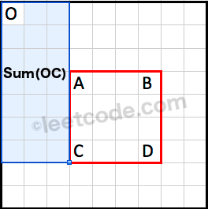
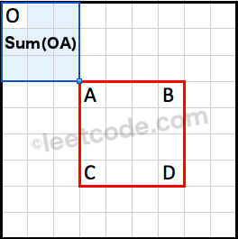

[304.Range Sum Query 2D - Immutable](https://leetcode.com/problems/range-sum-query-2d-immutable/)

* Array, Matrix, Prefix Sum, Design
* Meta, Amazon, Lyft, Bloomberg, Nvidia, Snowflake, Applied Intuition
* Similar Questions:
    * [303. Range Sum Query - Immutable](https://leetcode.com/problems/range-sum-query-immutable/)
    * Range Sum Query 2D - Mutable


## Method 1. Cache





* The region `Sum(OA)` is covered twice both by `Sum(OB)` and `Sum(OC)`. We could use the principle of inclusion-exclusion to calculate `Sum(ABCD)` as following:
`Sum(ABCD)=Sum(OD)−Sum(OB)−Sum(OC)+Sum(OA)`

```java
class NumMatrix {

    private int[][] preSum;
    
    public NumMatrix(int[][] matrix) {
        if(matrix == null || matrix.length == 0) {
            return;
        }
        
        preSum = new int[matrix.length + 1][matrix[0].length + 1];
        for(int i=0; i<matrix.length; i++) {
            for(int j=0; j<matrix[0].length; j++) {
                preSum[i+1][j+1] = preSum[i+1][j] + preSum[i][j+1] - preSum[i][j] + matrix[i][j];
            }
        }
    }
    
    public int sumRegion(int row1, int col1, int row2, int col2) {
        return preSum[row2+1][col2+1] - preSum[row2+1][col1] - preSum[row1][col2+1] + preSum[row1][col1];
    }
}
```
**Complexity analysis:**
1. Time complexity: `O(1)` time per query, `O(mn)` time pre-computation. The pre-computation in the constructor takes `O(mn)` time. Each sumRegion query takes `O(1)` time.
2. Space complexity: `O(mn)`. The algorithm uses `O(mn)` space to store the cumulative region sum.


## Reference
* https://leetcode.com/problems/range-sum-query-2d-immutable/editorial/
* [CNoodle: [LeetCode] 304. Range Sum Query 2D - Immutable](https://www.cnblogs.com/cnoodle/p/14466888.html)
