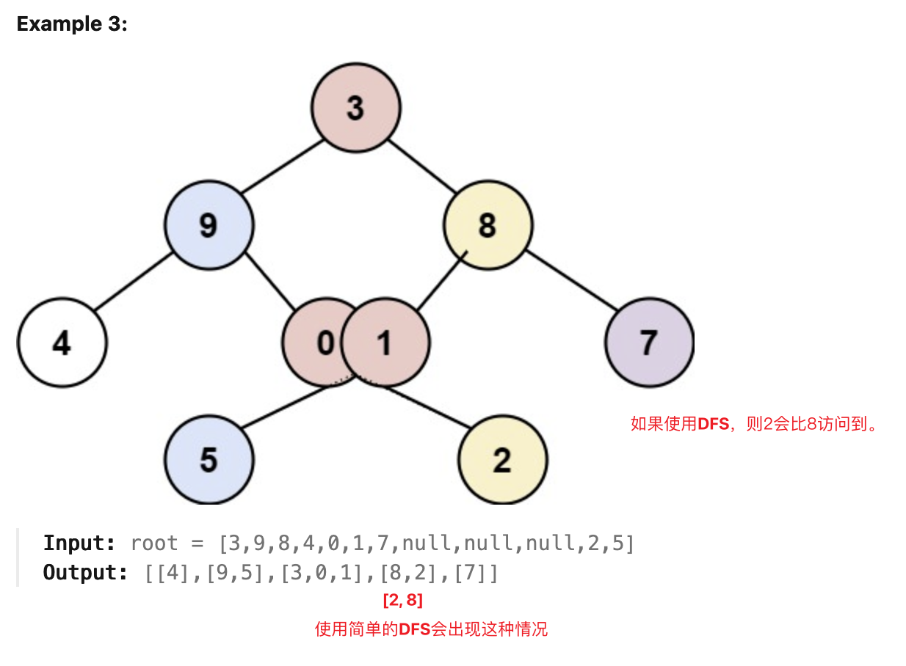
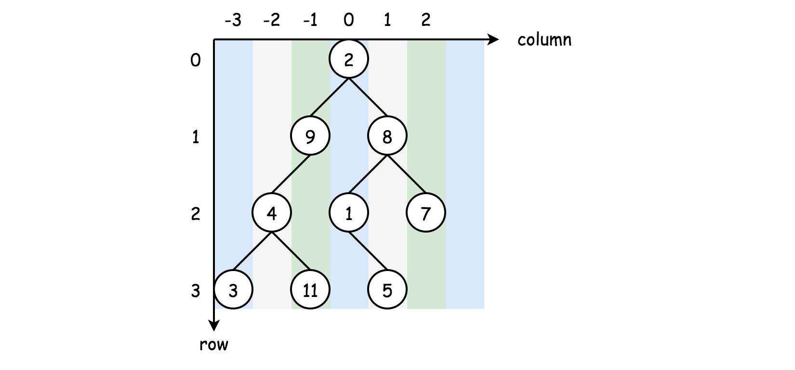
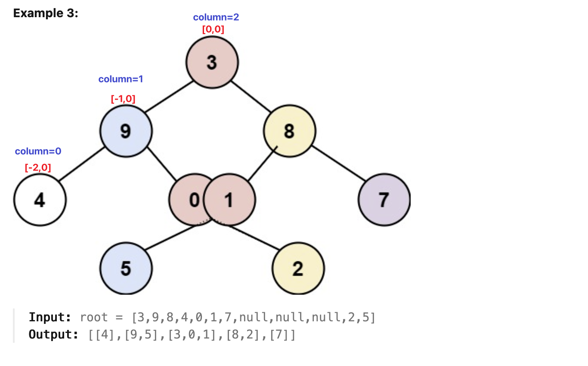

[314. Binary Tree Vertical Order Traversal](https://leetcode.com/problems/binary-tree-vertical-order-traversal/)

* Facebook, Amazon, Microsoft, Oracle, TikTok, Bloomberg, Google, Wish, Reddit 
* Hash Table, Tree, Depth-First Search, Breadth-First Search, Binary Tree
* Similar Questions:
    * [102. Binary Tree Level Order Traversal](https://leetcode.com/problems/binary-tree-level-order-traversal/)


**Note:**
1. 要保证from top to bottom的顺序，要使用BFS，因为DFS会造成低层节点在高层节点前面的情况。
    


The common strategies to traverse a **Tree** data structure are **Breadth-First Search** and **Depth-First Search**:
1. The DFS strategy can be further distinguished as **preorder**, **inorder DFS** and **postorder DFS**. depending on the relative order of visiting among the node itself and its child nodes.



* column-wise order
If we look at a binary tree horizontally, each node can be aligned to a specific column, based on its relative offset to the root node of the tree.
Let us assume that the root node has a column index of 0, then its left child node would have a column index of -1 and its right child node would have a column index of +1, and so on.

* row-wise order
    Now if we put the nodes into a vertical dimension, each node would be assigned to a specific row, based on its level (i.e. the vertical distance to the root node).

    Let us assume that the root node has a row index of 0, then both its child nodes would have the row index of 1.


## Method 1. BFS without sorting
此处用 Pair 保存 `column` 和 `TreeNode` 信息；也可以用两个 queue 分别保存。

```java
class Solution {
    public List<List<Integer>> verticalOrder(TreeNode root) {
        List<List<Integer>> res = new ArrayList<>();
        
        if(root == null) {
            return res;
        }
        
        Map<Integer, List<Integer>> columnTable = new HashMap<>();
        // Pair of node and its column offset
        Queue<Pair<TreeNode, Integer>> queue = new ArrayDeque<>();
        int column = 0;
        queue.offer(new Pair(root, column));
        
        int minColumn = 0;
        int maxColumn = 0;
        
        while(!queue.isEmpty()) {
            Pair<TreeNode, Integer> curr = queue.poll();
            root = curr.getKey();
            column = curr.getValue();
            
            if(root != null) {
                if(!columnTable.containsKey(column)) {
                    columnTable.put(column, new ArrayList<Integer>());
                }
                columnTable.get(column).add(root.val);
                minColumn = Math.min(minColumn, column);
                maxColumn = Math.max(maxColumn, column);
                
                queue.offer(new Pair(root.left, column - 1));
                queue.offer(new Pair(root.right, column + 1));
            }
        }
        
        for(int i=minColumn; i<maxColumn+1; i++) {
            res.add(columnTable.get(i));
        }
        return res;
    }
}
```
**Complexity Analysis:**
1. Time Complexity: `O(N)` where N is the number of nodes in the tree. Following the same analysis 
   in the previous BFS approach, the only difference is that this time we don't need the costy 
   sorting operation (i.e. `O(NlogN)`).  
2. Space Complexity: `O(N)` where N is the number of nodes in the tree. The analysis follows the 
   same logic as in the previous BFS approach. 


## Method 2. [5ms Java Clean Solution](https://leetcode.com/problems/binary-tree-vertical-order-traversal/discuss/76401/5ms-Java-Clean-Solution)
* 基于两个 queue 分别保存 TreeNode 和 column 的实现：
```java
class Solution {
    public List<List<Integer>> verticalOrder(TreeNode root) {
        List<List<Integer>> res = new ArrayList<>();
        if (root == null) {
            return res;
        }

        Map<Integer, ArrayList<Integer>> map = new HashMap<>();
        Queue<TreeNode> q = new LinkedList<>();
        Queue<Integer> cols = new LinkedList<>();

        q.add(root); 
        cols.add(0);

        int min = 0;
        int max = 0;

        while (!q.isEmpty()) {
            TreeNode node = q.poll();
            int col = cols.poll();

            if (!map.containsKey(col)) {
                map.put(col, new ArrayList<Integer>());
            }
            map.get(col).add(node.val);

            if (node.left != null) {
                q.add(node.left); 
                cols.add(col - 1);
                min = Math.min(min, col - 1);
            }

            if (node.right != null) {
                q.add(node.right);
                cols.add(col + 1);
                max = Math.max(max, col + 1);
            }
        }

        for (int i = min; i <= max; i++) {
            res.add(map.get(i));
        }

        return res;
    }
}
```


## Method 3. [5ms Java Clean Solution](https://leetcode.com/problems/binary-tree-vertical-order-traversal/discuss/76401/5ms-Java-Clean-Solution)
Alternatively, we can calculate the rang first, then insert into buckets. Credit to @Jinx_boom


```java
class Solution {
    public List<List<Integer>> verticalOrder(TreeNode root) {
        List<List<Integer>> res = new ArrayList<>();
        if(root == null) {
            return res;
        }

        int[] range = new int[]{0, 0};  // {minOffset, maxOffset}
        getRange(root, range, 0);

        for(int i=range[0]; i<=range[1]; i++) {
            res.add(new ArrayList<Integer>());
        }

        Queue<TreeNode> nodeQueue = new LinkedList<>();
        Queue<Integer> colQueue = new LinkedList<>();

        nodeQueue.add(root);
        colQueue.add(-range[0]);    // the offset of the root node, i.e. shift to right

        while(!nodeQueue.isEmpty()) {
            TreeNode node = nodeQueue.poll();
            int col = colQueue.poll();

            res.get(col).add(node.val);

            if(node.left != null) {
                nodeQueue.add(node.left);
                colQueue.add(col - 1);
            }
            if(node.right != null) {
                nodeQueue.add(node.right);
                colQueue.add(col + 1);
            }
        }
        return res;
    }

    public void getRange(TreeNode root, int[] range, int col) {
        if(root == null) {
            return;
        }
        range[0] = Math.min(range[0], col);
        range[1] = Math.max(range[1], col);

        getRange(root.left, range, col-1);
        getRange(root.right, range, col+1);
    }
}
```


## Method 2. DFS
1. 使用DFS获得`minColumn` and `maxColumn`
2. Shift `root` node to right by `-min`
```Java
/**
 * Definition for a binary tree node.
 * public class TreeNode {
 *     int val;
 *     TreeNode left;
 *     TreeNode right;
 *     TreeNode() {}
 *     TreeNode(int val) { this.val = val; }
 *     TreeNode(int val, TreeNode left, TreeNode right) {
 *         this.val = val;
 *         this.left = left;
 *         this.right = right;
 *     }
 * }
 */
class Solution {
    private int min = 0;
    private int max = 0;

    public List<List<Integer>> verticalOrder(TreeNode root) {
        List<List<Integer>> result = new ArrayList<>();
        if(root == null) {
            return result;
        }

        dfs(root, 0);
        for(int i=min; i<=max; i++) {
            result.add(new ArrayList<>());
        }

        Queue<TreeNode> queue = new LinkedList<>();
        Queue<Integer> index = new LinkedList<>();
        queue.offer(root);
        index.offer(-min);

        while(!queue.isEmpty()) {
            TreeNode curr = queue.poll();
            int idx = index.poll();
            result.get(idx).add(curr.val);
            if(curr.left != null) {
                queue.offer(curr.left);
                index.offer(idx-1);
            }
            if(curr.right != null) {
                queue.offer(curr.right);
                index.offer(idx+1);
            }
        }
        return result;
    }

    private void dfs(TreeNode root, int idx) {
        if(root == null) {
            return;
        }
        min = Math.min(min, idx);
        max = Math.max(max, idx);
        dfs(root.left, idx-1);
        dfs(root.right, idx+1);
    }
}
```
* Reference: https://leetcode.com/problems/binary-tree-vertical-order-traversal/submissions/1122298498/


## My BFS + Pair(self-defined class)
```Java
/**
 * Definition for a binary tree node.
 * public class TreeNode {
 *     int val;
 *     TreeNode left;
 *     TreeNode right;
 *     TreeNode() {}
 *     TreeNode(int val) { this.val = val; }
 *     TreeNode(int val, TreeNode left, TreeNode right) {
 *         this.val = val;
 *         this.left = left;
 *         this.right = right;
 *     }
 * }
 */
class Solution {
    public List<List<Integer>> verticalOrder(TreeNode root) {
        List<List<Integer>> res = new ArrayList<>();
        if(root == null) {
            return res;
        }

        Map<Integer, List<Integer>> map = new HashMap<>();
        Queue<Pair> queue = new LinkedList<>();
        queue.offer(new Pair(root, 0));
        int minColumn = 0;
        int maxColumn = 0;

        while(!queue.isEmpty()) {
            Pair pair = queue.poll();
            TreeNode curr = pair.node;
            int column = pair.column;

            if(curr != null) {
                if(!map.containsKey(column)) {
                    map.put(column, new ArrayList<>());
                }
                map.get(column).add(curr.val);
                minColumn = Math.min(minColumn, column);
                maxColumn = Math.max(maxColumn, column);

                queue.offer(new Pair(curr.left, column-1));
                queue.offer(new Pair(curr.right, column+1));
            }
        }

        for(int i=minColumn; i<=maxColumn; i++) {
            res.add(map.get(i));
        }
        return res;
    }

    private static class Pair {
        TreeNode node;
        int column;

        public Pair(TreeNode node, int column) {
            this.node = node;
            this.column = column;
        }
    }
}
```

## Reference
* https://leetcode.com/problems/binary-tree-vertical-order-traversal/editorial/