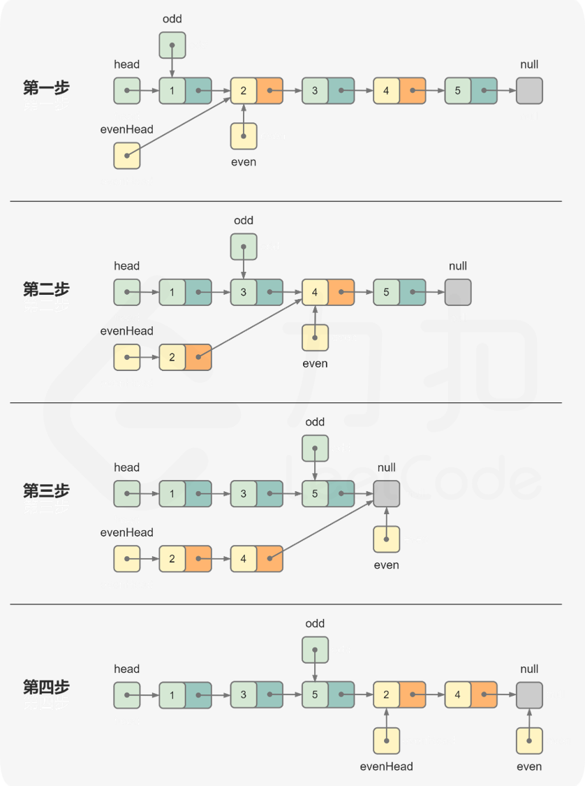

[328. Odd Even Linked List](https://leetcode.com/problems/odd-even-linked-list/description/)


## Method 1. 分离节点后合并

```java
/**
Index:  1   2   3   4   5
Value:  1,  2,  3,  4,  5

oddHead -> 1 -> 3 -> 5
evenHead -> 2 -> 4
*/
class Solution {
    public ListNode oddEvenList(ListNode head) {
        // Corner case
        if(head == null || head.next == null) {
            return head;
        }

        ListNode odd = head;    // the first node is considered as odd
        ListNode evenHead = head.next;
        ListNode even = head.next;
        while(even != null && even.next != null) {
            odd.next = even.next;
            odd = odd.next;

            even.next = even.next.next;
            even = even.next;
        }
        odd.next = evenHead;
        return head;
    }
}
```
**复杂度分析**
* 时间复杂度：O(n)，其中 n 是链表的节点数。需要遍历链表中的每个节点，并更新指针。
* 空间复杂度：O(1)。只需要维护有限的指针。


## Reference
* https://leetcode.cn/problems/odd-even-linked-list/solutions/482737/qi-ou-lian-biao-by-leetcode-solution/