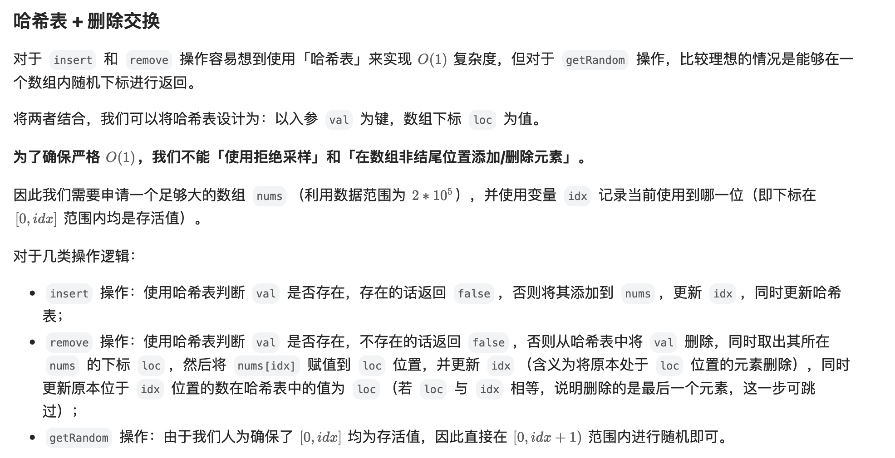

[380. Insert Delete GetRandom O(1)](https://leetcode.com/problems/insert-delete-getrandom-o1/)

* Array, Hash Table, Math, Design, Randomized
* Bloomberg, Meta, Amazon, Google, Uber, Affirm, TikTok, Grammarly, Microsoft, LinkedIn


## Analysis and Key Points
### Key Points
1. Efficient Lookups and Deletions
   * A hash set or hash map allows `O(1)` lookup and deletion.
   * However, removing an element from the middle of a dynamic-sized array is `O(n)`, so we need a workaround (解决方法).
2. Efficient random access.
   * A list (or array) allows `O(1)` random access via indexing.
   * A hash map alone does not support random access.
3. Maintaining the `O(1)` complexity.
   * A hash map (`val -> index`) stores the index of each value in the array.
   * A list (array) stores the actual values to support `getRandom()`.
   * To delete in `O(1)`, swap the target value with the last element and pop the last element.

### What the interviewer is testing?
1. Understanding of hash maps and lists
   * Using a `hash map` for `O(1)` insert/delete.
   * Using an `array` for `O(1)` random access.
2. Ability to handle edge cases
   * Inserting duplicate values.
   * Removing values from an empty set.
   * Ensuring `getRandom()` works correctly after insertions and deletions.
3. Knowledge of Amortized Complexity
   * Although `remove()` involves swapping elements, it remains `O(1)` amortized.
4. Coding Speed and Bug-Free Implementation
   * A clean, well-structured implementation within 10–15 minutes.


## Method 1. HashMap + ArrayList

```java
class RandomizedSet {
    private Map<Integer, Integer> map;  // val --> its index in list
    private List<Integer> list;
    private Random random;

    public RandomizedSet() {
        map = new HashMap<>();
        list = new ArrayList<>();
        random = new Random();
    }
    
    public boolean insert(int val) {
        if(map.containsKey(val)) {
            return false;
        }
        map.put(val, list.size());
        list.add(list.size(), val);
        return true;
    }
    
    public boolean remove(int val) {
        if(!map.containsKey(val)) {
            return false;
        }
        int lastElement = list.get(list.size() - 1);
        int idx = map.get(val);
        // update
        map.put(lastElement, idx);
        list.set(idx, lastElement);
        // remove
        list.remove(list.size() - 1);
        map.remove(val);
        return true;
    }
    
    public int getRandom() {
        return list.get(random.nextInt(list.size()));
    }
}
```
**Complexity Analysis:**
* Time complexity. 
  * GetRandom is always O(1). 
  * Insert and Delete both have O(1) average time complexity, and O(N) in the worst-case scenario when the operation exceeds the capacity of currently allocated array/hashmap and invokes space reallocation.
* Space complexity: O(N), to store N elements.


## Reference
* LeetCode: https://leetcode.com/problems/insert-delete-getrandom-o1/editorial/?envType=company&envId=facebook&favoriteSlug=facebook-thirty-days&role=backend
