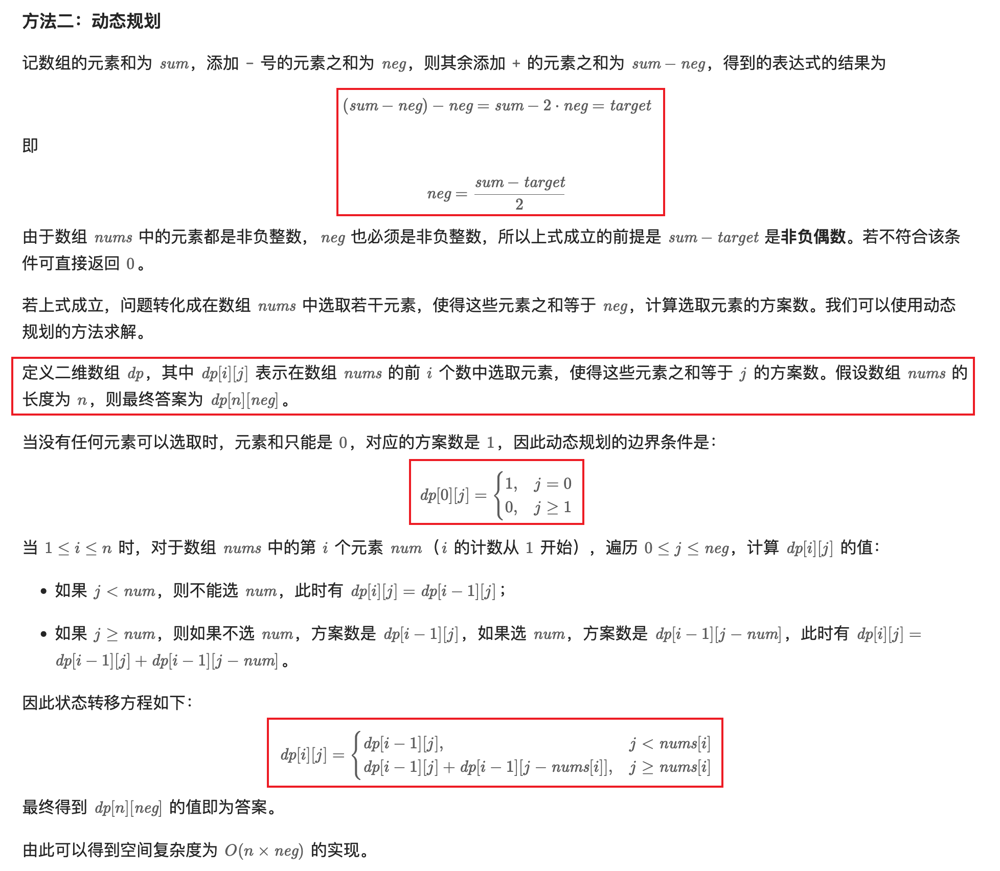

[494. Target Sum](https://leetcode.com/problems/target-sum/)

* Array, Dynamic Programming, Backtracking
* Meta, Amazon, Google, Bloomberg, Salesforce, Microsoft, Apple, Yahoo
* Similar Questions:
  * Expression Add Operators
  * Ways to Express an Integer as Sum of Powers


## Method 1. Backtracking
```java
class Solution {
    private int count = 0;

    public int findTargetSumWays(int[] nums, int target) {
        backtracking(nums, target, 0, 0);
        return count;
    }

    private void backtracking(int[] nums, int target, int idx, int sum) {
        if(idx == nums.length) {
            if(sum == target) {
                count++;
            }
        } else {
            backtracking(nums, target, idx+1, sum + nums[idx]);
            backtracking(nums, target, idx+1, sum - nums[idx]);
        }
    }
}
```
**Complexity Analysis:**
* Time complexity: `O(2^n)`. Size of recursion tree will be 2^n. n refers to the size of nums array.
* Space complexity: `O(n)`. The depth of the recursion tree can go up to n.


## Method 2. Dynamic Programming

```java
class Solution {
    public int findTargetSumWays(int[] nums, int target) {
//        int sum = 0;
//        for(int num: nums) {
//            sum += num;
//        }
        int sum = Arrays.stream(nums).sum();

        int diff = sum - target;
        if(diff < 0 || diff % 2 != 0) {
            return 0;
        }
        int n = nums.length;
        int neg = diff / 2;
        int[][] dp = new int[n + 1][neg + 1];
        dp[0][0] = 1;
        for(int i=1; i<=n; i++) {
            int num = nums[i-1];
            for(int j=0; j<=neg; j++) {
                dp[i][j] = dp[i-1][j];  // Do not choose current num
                if(j >= num) {
                    dp[i][j] += dp[i-1][j-num];
                }
            }
        }
        return dp[n][neg];
    }
}
```

## ✅⭐Method 3. Dynamic Programming, space optimization (Two arrays)
```java
class Solution {
    public int findTargetSumWays(int[] nums, int target) {
        int sum = 0;
        for(int num: nums) {
            sum += num;
        }

        // (sum - neg) - neg = target --> neg = (sum - target) / 2
        int diff = sum - target;
        if(diff < 0 || diff % 2 != 0) {
            return 0;
        }
        int neg = diff / 2;
        int[] prev = new int[neg + 1];
        prev[0] = 1;  // 当没有任何元素可以选取时，元素和只能是 0，对应的方案数是 1
        for(int num: nums) {
            int[] curr = new int[neg + 1];
            
            for(int j=0; j<=neg; j++) {
                if(j < num) {
                    curr[j] = prev[j];
                } else {
                    curr[j] = prev[j] + prev[j-num];
                }
            }
            prev = curr;
        }
        return prev[neg];
    }
}
```

## Method 3. Dynamic Programming, space optimization (One array)
```java
class Solution {
    public int findTargetSumWays(int[] nums, int target) {
        int sum = 0;
        for(int num: nums) {
            sum += num;
        }

        // (sum - neg) - neg = target --> neg = (sum - target) / 2
        int diff = sum - target;
        if(diff < 0 || diff % 2 != 0) {
            return 0;   // 如果没有结果，返回0，不是-1
        }
        int neg = diff / 2;
        int[] dp = new int[neg + 1];
        dp[0] = 1;  // 当没有任何元素可以选取时，元素和只能是 0，对应的方案数是 1
        for(int num: nums) {
            for(int j=neg; j>=num; j--) {
                dp[j] += dp[j-num];
            }
        }
        return dp[neg];
    }
}
```


## Reference
* LeetCodeCN: [目标和](https://leetcode.cn/problems/target-sum/solutions/816361/mu-biao-he-by-leetcode-solution-o0cp/)