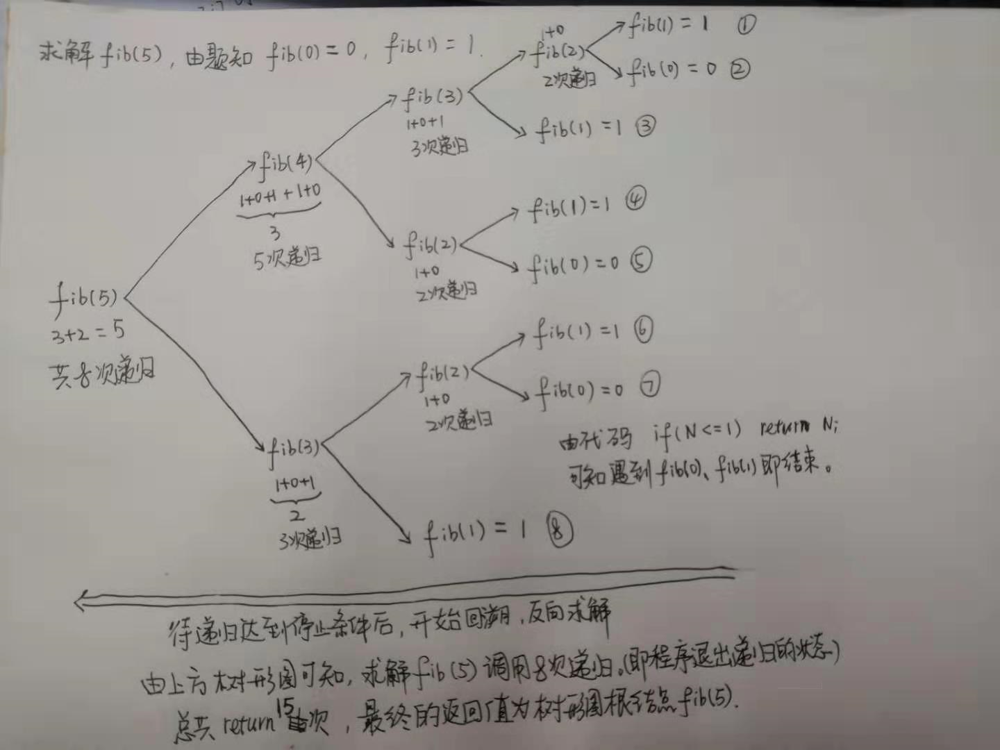

[509. Fibonacci Number](https://leetcode.com/problems/fibonacci-number/description/)

* Math, Dynamic Programming, Recursion, Memoization(记忆化)
* Amazon, Microsoft, tcs, Apple, Nvidia, Google, Adobe, Spotify, Facebook, Yahoo, Qualcomm, Bloomberg
* Similar Questions:
  * [70. Climbing Stairs](https://leetcode.com/problems/climbing-stairs/description/)
  * [842. Split Array into Fibonacci Sequence](https://leetcode.com/problems/split-array-into-fibonacci-sequence/description/)
  * [873. Length of Longest Fibonacci Subsequence](https://leetcode.com/problems/length-of-longest-fibonacci-subsequence/description/)
  * [1137. N-th Tribonacci Number](https://leetcode.com/problems/n-th-tribonacci-number/description/)


## Method 1. Basic Recursion (递归)


* 递归程序一定会有终止条件(i.e. base case)。在本例中，终止条件就是`f(0)=0, f(1)=1`
* 最基本的递归存在递归太深，内存不够，最终导致`StackOverflowError`。
  * [Class java.lang.StackOverflowError](https://docs.oracle.com/en/java/javase/17/docs/api/java.base/java/lang/StackOverflowError.html)
  * > Thrown when a stack overflow occurs because an application recurses too deeply.
* 另一个问题是重复执行的问题，比如`f(6)=f(5)+f(4)`，`f(5)`会调用`f(3)`，则`f(3)`执行一次；`f(4)`也会调用`f(3)`，则`f(3)`又会执行一次。当`n`更大的时候，`f(3)`被执行的次数就不知两次了。
```java
class Solution {
    public int fib(int n) {
        if(n == 0 || n == 1) {
            return n;
        }
        return fib(n-1) + fib(n-2);
    }
}
```
**Complexity Analysis:**
1. Time complexity: `O(2^N)`. This is the slowest way to solve the Fibonacci Sequence because **it takes exponential time**. The amount of operations needed, for each level of recursion, grows exponentially as the depth approaches N.
2. Space complexity: `O(N)`. We need space proportional to `N` to account for the max size of the stack, in memory. This stack keeps track of the function calls to `fib(N)`. This has the potential to be bad in cases that there isn't enough physical memory to handle the increasingly growing stack, leading to a StackOverflowError. The Java docs have a good explanation of this, describing it as an error that occurs because an application recurses too deeply.


## Method 2. Recursion + Momoization
```java
class Solution {
    public int fib(int n) {
        Map<Integer, Integer> cache = new HashMap();
        cache.put(0, 0);
        cache.put(1, 1);

        return helper(n, cache);        
    }

    private int helper(int n, Map<Integer, Integer> cache) {
        if(cache.containsKey(n)) {
            return cache.get(n);
        }
        cache.put(n, helper(n-2, cache) + helper(n-1, cache));
        return cache.get(n);
    }
}
```
**Complexity Analysis:**
1. Time complexity: `O(N)`. Each number, starting at 2 up to and including N, is visited, computed and then stored for `O(1)` access later on.
2. Space complexity: `O(N)`. The size of the stack in memory is proportional to N. Also, the memoization hash table is used, which occupies `O(N)` space.


## Method 2. Iteration (迭代)
```java
class Solution {
    public int fib(int n) {
        if(n <= 1) {
            return n;
        }

        int curr = 0;
        int prev1 = 0;
        int prev2 = 1;
        for(int i=2; i<=n; i++) {
            curr = prev1 + prev2;
            prev1 = prev2;
            prev2 = curr;
        }
        return curr;
    }
}
```
**Complexity Analysis:**
1. Time complexity: `O(N)`. Each value from 2 to N is computed once. Thus, the time it takes to find the answer is directly proportional to `N` where `N` is the Fibonacci Number we are looking to compute.
2. Space complexity: `O(1)`. This requires 1 unit of space for the integer `N` and 3 units of space to store the computed values (current, prev1, and prev2) for every loop iteration. The amount of space used is independent of `N`, so this approach uses a constant amount of space.


## Method 3. Iteration: Bottom-Up Approach using Tabulation (迭代, 使用制表的自下而上方法, 0ms, beats 100%) [动态规划 - 自底向上]
While using a bottom-up approach, we can **iteratively** compute and store the values, only returning once we reach the result.
```java
class Solution {
    public int fib(int n) {
        if(n <= 1) {
            return n;
        }
        int[] cache = new int[n + 1];
        cache[1] = 1;
        for(int i=2; i<=n; i++) {
            cache[i] = cache[i-1] + cache[i-2];
        }
        return cache[n];
    }
}
```
**Complexity Analysis:**
1. Time complexity: `O(N)`. Each number, starting at 2 up to and including N, is visited, computed and then **stored** for `O(1)` access later on.
2. Space complexity: `O(N)`. The size of the data structure is proportional to N.


## Reference
* ✅ [CNoodle: [LeetCode] 509. Fibonacci Number](https://www.cnblogs.com/cnoodle/p/12227820.html)
* [舞动的心: LeetCode刷题总结-递归篇](https://www.cnblogs.com/liuzhen1995/p/11748881.html)