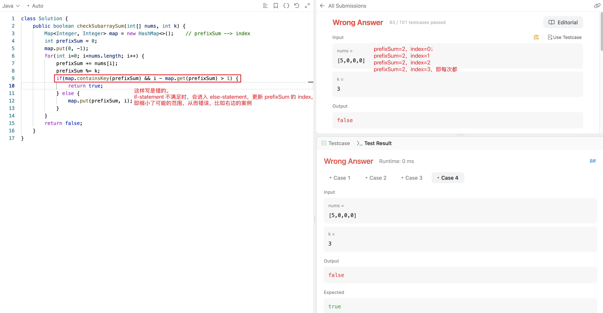

[523. Continuous Subarray Sum](https://leetcode.com/problems/continuous-subarray-sum/)

* Array, Math, Hash Table, Prefix Sum
* Facebook, Amazon
* Similar Questions:
    * [560. Subarray Sum Equals K](https://leetcode.com/problems/subarray-sum-equals-k/)


## Method 1. Brute Force with Memorization
Key Points:
1. Base case: If the `nums` is `null` or there is no element in the `nums` array, i.e. `nums.length == 0`, there is no 
subarray, then `return 0` directly.
2. `gap` is the sum of a subarray,`nums[i,j]`, of size at least 2.
3. Get prefix sum, `sums[i] = sum(nums[0, i]) = nums[0] + nums[1] + ... + nums[i]`, i.e. inclusive left and right bound. 
4. 遍历所有的 subarray `nums[i, j]`, where `i != j` ==> 两层 `for-loop`.
5. 注意 `k == 0` 的情况。
```java
class Solution {
    public boolean checkSubarraySum(int[] nums, int k) {
        if(nums == null || nums.length == 0) {
            return false;
        }
        
        int[] sum = new int[nums.length];
        sum[0] = nums[0];
        for(int i=1; i<nums.length; i++) {
            sum[i] = sum[i-1] + nums[i];
        }
        for(int i=0; i<nums.length; i++) {
            for(int j=i+1; j<nums.length; j++) {
                int gap = sum[j] - sum[i] + nums[i];    // Sum of subarray `nums[i, j]`
                if(gap == k || (k != 0 && gap % k == 0)) {
                    return true;
                }
            }
        }
        return false;
    }
}
```


## Method 2. Using HashMap with Prefix Sum
Key Points:
1. `HashMap` stores `sum%k --> index`, 注意这里 Map 的 value 存的是 `index`。
2. `k` could be negative.
3. Suppose that `map.get(sum) == j`, i.e. `sum(nums[0, i]) % k == rem`, and `sum(nums[0, j]) % k == rem`, then `sum(nums[i+1, j])` will be multiple of `k`, then the length of subarray should be `j - (i+1) + 1 = j - i`.
4. Base on (3), `len = j - (i+1) + 1 = j - i`
```java
class Solution {
    public boolean checkSubarraySum(int[] nums, int k) {
        Map<Integer, Integer> map = new HashMap<>();    // sum -> index
        map.put(0, -1);
        int preSum = 0;
        for(int i=0; i<nums.length; i++) {
            preSum += nums[i];
            if(k != 0) {    // k >= 1, 这步可省略
                preSum = preSum % k;
            }
            if(map.containsKey(preSum)) {
                if(i - map.get(preSum) > 1) {
                    return true;
                }
            } else {
                map.put(preSum, i);
            }
        }
        return false;
    }
}
```

or
```java
class Solution {
    public boolean checkSubarraySum(int[] nums, int k) {
        Map<Integer, Integer> map = new HashMap<>();
        map.put(0, -1);
        int prefixSum = 0;
        for(int i=0; i<nums.length; i++) {
            prefixSum += nums[i];
            prefixSum %= k;
            if(map.containsKey(prefixSum)) {
                if(i - map.get(prefixSum) > 1) {
                    return true;
                }
            } else {
                map.put(prefixSum, i);
            }
        }
        return false;
    }
}
```
Complexity Analysis
1. Time complexity : `O(n)`. Only one traversal of the array `nums` is done.
2. Space complexity : `O(min(n,k))`. The HashMap can contain upto `min(n,k)` different pairings.


## ❌错误写法
注意下面的错误写法
