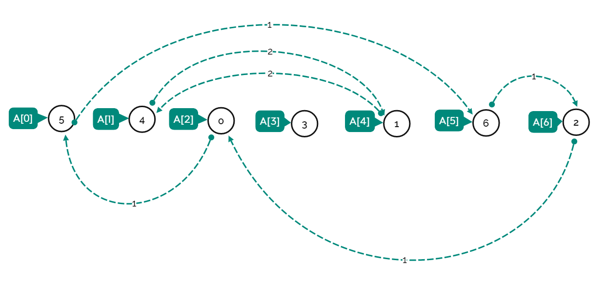

[565. Array Nesting](https://leetcode.com/problems/array-nesting/description/)

* Array, Depth-First Search
* Apple
* Similar Questions:


## Method 1. From LeetCodeCN (5ms, beats 66%)

> 遍历数组，从 i 向 nums[i] 连边，我们可以得到一张有向图。
> 由于题目保证 nums 中不含有重复的元素，因此有向图中每个点的出度和入度均为 1。
> 在这种情况下，有向图必然由一个或多个环组成。我们可以遍历 nums，找到节点个数最大的环。
```java
class Solution {
    public int arrayNesting(int[] nums) {
        int res = 0;
        int n = nums.length;
        boolean[] visited = new boolean[n];
        for(int i=0; i<n; i++) {
            int cnt = 0;
            while(!visited[i]) {
                visited[i] = true;
                i = nums[i];
                cnt++;
            }
            res = Math.max(res, cnt);
        }
        return res;
    }
}
```
**Complexity Analysis:**
* Time complexity: `O(n)`. Every element of the nums array will be considered at most once.
* Space complexity: `O(1)`. Constant Space is used.


## Reference
* LeetCodeCN: [数组嵌套](https://leetcode.cn/problems/array-nesting/solutions/1673589/shu-zu-qian-tao-by-leetcode-solution-7ur3/)
* 🟩 LeetCodeCN: [作图帮助理解](https://leetcode.cn/problems/array-nesting/solutions/1/by-heren1229-bb0n/)