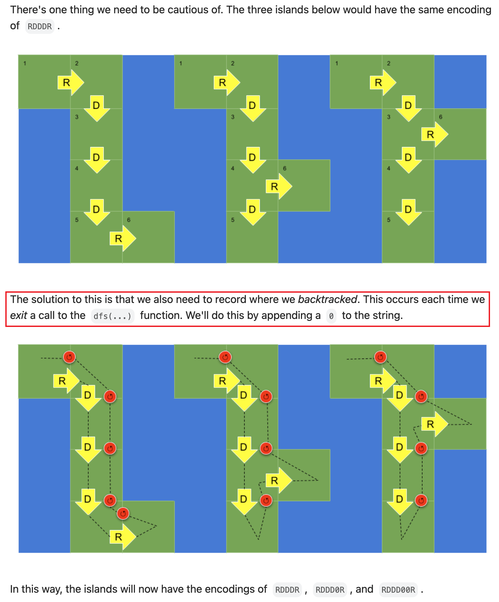

[694. Number of Distinct Islands](https://leetcode.com/problems/number-of-distinct-islands/)

* Amazon, Facebook, Bloomberg, Uber, Oracle
* Hash Table, Depth-First Search
* Similar Questions:
    * Number of Islands
    * Number of Distinct Islands II
    
    
> An island is considered to be the same as another if and only if one island can be translated (and not rotated or reflected) to equal the other.      
> [也就是如果可以通过平移得到，则认为两个是相同的 island。是**平移**，而不是旋转或反射。]


## ✅⭐Method 1. Hash By Local Coordinates (11ms, 38%)
> At the beginning, we need to find every island, which we can do using a straightforward depth-first search. 
> The hard part is deciding whether two islands are the same.
>
> Since two islands are the same if one can be translated to match another, let's translate every island so the top-left corner is `(0,0)`.
>
> In the java solution, we convert tuple `(r - r0, c - c0)` to integers. We multiplied the number of rows by `2 * cols` instead of `cols` because local **col-coordinate** could be negative.

Example:        
nums = [[0,1,1],[1,1,1],[0,0,0],[1,1,1],[1,1,0]]    == Can't use `(r-r0)*grid[0].length + (c-c0)`

要点: 
* Calculate a hash for each island in such a way that ensures two identical islands have the same hash value. These hashes could then be put into a hash set.
* 即对每个 island 计算其 hash value, 两个相同形状的 island 会有相同的 hash value。
```java 
class Solution {
    private int[][] grid;
    private boolean[][] seen;
    // private Set<Integer> shape;
    
    public int numDistinctIslands(int[][] grid) {
        this.grid = grid;
        this.seen = new boolean[grid.length][grid[0].length];
        Set shapes = new HashSet<HashSet<Integer>>();
        
        for(int r=0; r<grid.length; r++) {
            for(int c=0; c<grid[0].length; c++) {
                if(grid[r][c] == 1) {
                    Set<Integer> shape = new HashSet<Integer>();
                    explore(r, c, r, c, shape);
                    if(!shape.isEmpty()) {
                        shapes.add(shape);
                    }
                }
            }
        }
        return shapes.size();
    }
    
    private void explore(int r, int c, int r0, int c0, Set<Integer> shape) {
        if(r>=0 && r<grid.length && c>=0 && c<grid[0].length && grid[r][c]==1 && !seen[r][c]) {
            seen[r][c] = true;
            shape.add((r-r0) * 2 * grid[0].length + (c - c0));
            explore(r+1, c, r0, c0, shape);
            explore(r-1, c, r0, c0, shape);
            explore(r, c+1, r0, c0, shape);
            explore(r, c-1, r0, c0, shape);
        }
    }
}
```
**Complexity Analysis:**
* Time Complexity: `O(R*C)`, where R is the number of rows in the given grid, and C is the number of columns. We visit every square once.
* Space complexity: `O(R*C)`, the space used by seen to keep track of visited squares, and shapes.

or 更容易理解的版本
```java
class Solution {
    private static final int[][] DIRS = {{-1, 0}, {1, 0}, {0, -1}, {0, 1}};

    public int numDistinctIslands(int[][] grid) {
        Set<String> set = new HashSet<>();

        for(int i=0; i<grid.length; i++) {
            for(int j=0; j<grid[0].length; j++) {
                if(grid[i][j] == 1) {
                    StringBuilder sb = new StringBuilder();
                    helper(grid, i, j, i, j, sb);
                    set.add(sb.toString());
                }
            }
        }
        return set.size();
    }

    private void helper(int[][] grid, int i0, int j0, int i, int j, StringBuilder sb) {
        grid[i][j] = 0;
        
        sb.append((i - i0) + "" + (j - j0));
        for(int[] dir: DIRS) {
            int x = i + dir[0];
            int y = j + dir[1];
            if(x < 0 || x >= grid.length || y < 0 || y >= grid[0].length || grid[x][y] == 0) {
                continue;
            }
            helper(grid, i0, j0, x, y, sb);
        }
    }
}
```


## Method 2. Hash By Path Signature
> When we start a depth-first search on the top-left square of some island, the path taken by our depth-first will be the same if and only if the shape is same.
> We can exploit this by recording the path we take as our shape.
```java 
class Solution {
    private int[][] grid;
    private boolean[][] seen;
    // private ArrayList<Integer> shape;
    
    public int numDistinctIslands(int[][] grid) {
        this.grid = grid;
        this.seen = new boolean[grid.length][grid[0].length];
        Set shapes = new HashSet<ArrayList<Integer>>();
        
        for(int r=0; r<grid.length; r++) {
            for(int c=0; c<grid[0].length; c++) {
                List<Integer> shape = new ArrayList<Integer>();
                explore(r, c, 0, shape);
                if(!shape.isEmpty()) {
                    shapes.add(shape);
                }
            }
        }
        return shapes.size();
    }
    
    private void explore(int r, int c, int di, List<Integer> shape) {
        if(r>=0 && r<grid.length && c>=0 && c<grid[0].length && grid[r][c]==1 && !seen[r][c]) {
            seen[r][c] = true;
            shape.add(di);
            explore(r+1, c, 1, shape);
            explore(r-1, c, 2, shape);
            explore(r, c+1, 3, shape);
            explore(r, c-1, 4, shape);
            shape.add(0);
        }
    }
}
```


[[1,1,0,0,0],[1,1,0,0,0],[0,0,0,1,1],[0,0,0,1,1]]


## ✅⭐Method 3:  Hash By Path Signature

The solution to this is that we also need to record where we backtracked. 
This occurs each time we exit a call to the `dfs(...)` function. We'll do this by appending a `0` to the string.
```java
class Solution {
    public int numDistinctIslands(int[][] grid) {
        int res = 0;
        var set = new HashSet<String>();
        for (int row = 0; row < grid.length; row++) {
            for (int col = 0; col < grid[0].length; col++) {
                if (grid[row][col] == 1) {
                    var s = new StringBuilder();
                    dfs(grid, row, col, s, '0');
                    if (set.add(s.toString())) res++;
                }
            }
        }
        return res;
    }

    private void dfs(int[][] grid, int row, int col, StringBuilder encoded, char cur) {
        if (row < 0 || col < 0 || row >= grid.length || col >= grid[0].length || grid[row][col] != 1) return;
        grid[row][col] = 0;
        encoded.append(cur);
        dfs(grid, row+1, col, encoded, 'D');
        dfs(grid, row-1, col, encoded, 'U');
        dfs(grid, row, col+1, encoded, 'R');
        dfs(grid, row, col-1, encoded, 'L');
        encoded.append('0');
    }
}

```
Reference: submission: https://leetcode.com/problems/number-of-distinct-islands/submissions/1480921551/?envType=company&envId=tiktok&favoriteSlug=tiktok-six-months


## Reference
* https://leetcode.com/problems/number-of-distinct-islands/editorial/