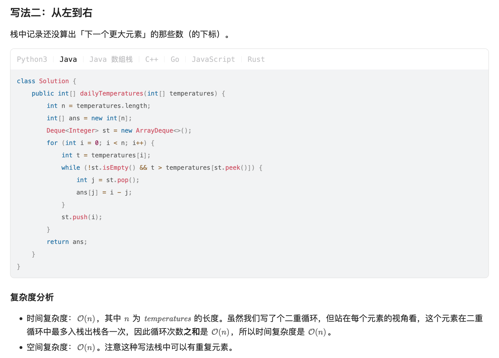

[739. Daily Temperatures](https://leetcode.com/problems/daily-temperatures/)

* Amazon, Facebook, Apple, LinkedIn, Expedia, Cisco
* Array, Stack, Monotonic Stack (单调栈)
* Similar Questions:
    * [496. Next Greater Element I](https://leetcode.com/problems/next-greater-element-i/)
    * [901. Online Stock Span](https://leetcode.com/problems/online-stock-span/description/)
* Hints:
    * If the temperature is say, 70 today, then in the future a warmer temperature must be 71, 72, 73, ..., 99, or 100.
    We could remember when all of then occur next.
    

## ✅⭐ Method 1. Monotonic Stack (从左到右)

```java
class Solution {
    public int[] dailyTemperatures(int[] temperatures) {
        int[] res = new int[temperatures.length];

        Deque<Integer> stack = new ArrayDeque<>();  // Monotonic descending
        for(int i=0; i<temperatures.length; i++) {
            int temp = temperatures[i];

            // 保持 stack 单调递减
            // 如果 stack 中有元素是增序的，则说明已经找到 warmer date
            while(!stack.isEmpty() && temp > temperatures[stack.peek()]) {
                int j = stack.pop();
                res[j] = i - j;
            }

            stack.push(i);
        }

        return res;
    }
}
```

    
## Method 1. 
```java 
class Solution {
    public int[] dailyTemperatures(int[] T) {
        int[] res = new int[T.length];
        
        for(int i=res.length-2; i>=0; i--) {
            res[i] = dailyTemperatures(res, T, i, i+1);
        }
        return res;
    }
    
    private int dailyTemperatures(int[] res, int[] T, int cur, int next) {
        if(T[next] > T[cur]) {
            return next - cur;
        } else if(T[next] == T[cur]) {
            return (res[next] == 0) ? 0 : res[next] + next - cur;
        }
        return (res[next] == 0) ? 0 : dailyTemperatures(res, T, cur, res[next] + next);
    }
}
```


## Method 2. Next Array
```java 
class Solution {
    public int[] dailyTemperatures(int[] T) {
        int[] res = new int[T.length];
        int[] next = new int[101];
        Arrays.fill(next, Integer.MAX_VALUE);
        for(int i=T.length-1; i>=0; i--) {
            int idx = Integer.MAX_VALUE;
            for(int t=T[i]+1; t<=100; t++) {
                if(next[t] < idx) {
                    idx = next[t];
                }
            }
            if(idx < Integer.MAX_VALUE) {
                res[i] = idx - i;
            }
            next[T[i]] = i;     // Update the most recent appearance of temperature T[i]
        }
        return res;
    }
}
```
**Complexity Analysis:**
1. Time Complexity: O(NW), where NNN is the length of T and W is the number of allowed values for T[i]. Since W=71, we can consider this complexity O(N).
2. Space Complexity: O(N+W), the size of the answer and the next array.


## Method 3. Stack
```java 
class Solution {
    public int[] dailyTemperatures(int[] T) {
        int[] res = new int[T.length];
        Stack<Integer> stack = new Stack<Integer>();
        for(int i=T.length-1; i>=0; i--) {
            while(!stack.isEmpty() && T[i]>=T[stack.peek()]) {
                stack.pop();
            }
            res[i] = stack.isEmpty() ? 0 : stack.peek() - i;
            stack.push(i);
        }
        return res;
    }
}
```
Example:        
     0   1   2   3   4   5   6   7      
T = [73, 74, 75, 71, 69, 72, 76, 73]        
* When i = 7, stack.isEmpty() ==> `res[7] = 0`, stack = [7(73)]
* When i = 6, 因为 T[6] 要比 stack 中 idx 对应的温度高，所以将 stack 中的 idx pop出来，==> `res[6] = 0`, stack = [6(76)]
* When i = 5, T[5]=72 < T[6]=76, ==> `res[5]=6-5=1`, stack = [5(72), 6(76)]
* When i = 4, T[4]=69, ==> `res[4]=5-4=1`, stack = [4 (69), 5 (72), 6 (76)]
* When i = 3, ==> `res[i] = 2`, stack = [3 (71), 5 (72), 6 (76)]. .
* When i = 2, stack = [2 (75), 6 (76)]. ans[i] = 4.
* When i = 1, stack = [1 (74), 2 (75), 6 (76)]. ans[i] = 1.
* When i = 0, stack = [0 (73), 1 (74), 2 (75), 6 (76)]. ans[i] = 1.

即，stack 中保存的是一个递增的序列，越往 stack 底部，温度越高。


## Method 4. Monotonic Stack
```Java
class Solution {
    public int[] dailyTemperatures(int[] temperatures) {
        int N = temperatures.length;
        int[] result = new int[N];
        Deque<Integer> stack = new ArrayDeque<>();
        for(int currDay=0; currDay<N; currDay++) {
            int currTemp = temperatures[currDay];
            // Pop until the currTemp is not warmer than the temperature at the top of the stack
            while(!stack.isEmpty() && temperatures[stack.peek()] < currTemp) {
                result[stack.peek()] = currDay - stack.pop();
            }
            stack.push(currDay);
        }
        return result;
    }
}
```
**Complexity Analysis:**
Given `N` as the length of temperatures,
1. Time complexity: `O(N)`. At first glance, it may look like the time complexity of this algorithm should be `O(N^2)`, because there is a nested while loop inside the for loop. However, each element can only be added to the stack once, which means the stack is limited to `N` pops. Every iteration of the while loop uses 1 pop, which means the while loop will not iterate more than `N` times in total, across all iterations of the for loop.
An easier way to think about this is that in the worst case, every element will be pushed and popped once. This gives a time complexity of `O(2⋅N)=O(N)`.
2. Space complexity: `O(N)`. If the input was non-increasing, then no element would ever be popped from the stack, and the stack would grow to a size of `N` elements at the end.

Note: answer does not count towards the space complexity because space used for the output format does not count.


## Method 5. Array, Optimized Space (0ms, 100%)
* With the monotonic stack, we iterated forward through the array and moved backwards when we found a warmer day. 通过**单调堆栈**，我们向前迭代数组，并在发现温暖的一天时向后移动。
* In this approach (Method 5), we'll do the reverse - iterate backwards through the array, and move forwards to find the number of days until a warmer day.
```Java
class Solution {
    public int[] dailyTemperatures(int[] temperatures) {
        int N = temperatures.length;
        int[] answer = new int[N];
        int hottest = 0;
        for(int currDay=N-1; currDay>=0; currDay--) {
            int currTemp = temperatures[currDay];
            if(currTemp >= hottest) {
                hottest = currTemp;
                continue;
            }
            int days = 1;
            while(temperatures[currDay + days] <= currTemp) {
                days += answer[currDay + days];
            }
            answer[currDay] = days;
        }
        return answer;
    }
}
```
**Complexity Analysis:**
Given `N` as the length of temperatures,
1. Time complexity: `O(N)`.
2. Space complexity: `O(1)`


## Reference
* https://leetcode.com/problems/daily-temperatures/editorial/
* 灵茶山艾府: [【视频】讲清楚为什么要用单调栈！两种写法：从右到左/从左到右（Python/Java/C++/Go/JS/Rust）](https://leetcode.cn/problems/daily-temperatures/solutions/2470179/shi-pin-jiang-qing-chu-wei-shi-yao-yao-y-k0ks/)
* 灵茶山艾府: [单调栈【基础算法精讲 26】](https://www.bilibili.com/video/BV1VN411J7S7?spm_id_from=333.788.videopod.sections&vd_source=bd5e1cdd20d83feef8e77a781b33f083)