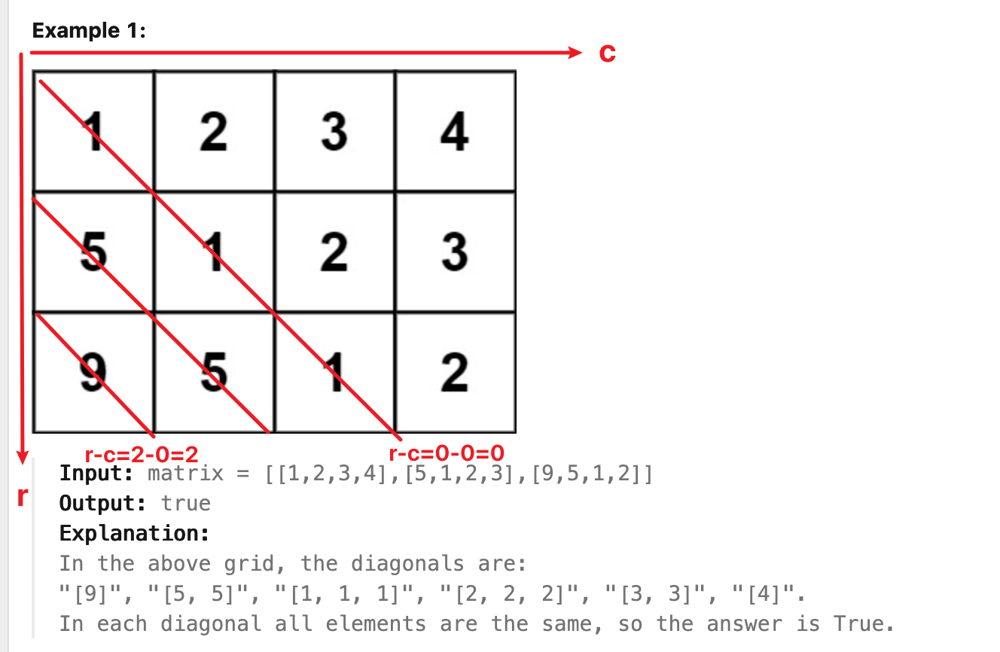

[766. Toeplitz Matrix](https://leetcode.com/problems/toeplitz-matrix/description/)

* Array, Matrix
* Facebook, tcs, Bloomberg, Google


## Method 1. Group by Category
What feature makes two coordinates `(r1, c1)` and `(r2, c2)` belong to the same diagonal?
* It turns out that two coordinates are on the same diagonal if and only if `r1 - c1 == r2 - c2`



```Java
class Solution {
    public boolean isToeplitzMatrix(int[][] matrix) {
        Map<Integer, Integer> groups = new HashMap<>();
        for(int r=0; r<matrix.length; r++) {
            for(int c=0; c<matrix[0].length; c++) {
                if(!groups.containsKey(r-c)) {
                    groups.put(r-c, matrix[r][c]);
                } else if(groups.get(r-c) != matrix[r][c]) {
                    return false;
                }
            }
        }
        return true;
    }
}
```
**Complexity Analysis:**
1. Time Complexity: `O(M*N)`. (Recall in the problem statement that `M, N` are the number of rows and columns in matrix.)
2. Space Complexity: `O(M+N)`.


## Method 2. Compare With Top-Left Neighbor
比较每一个元素与其左上角的元素
> Every element belongs to some diagonal, and it's previous element (if it exists) is it's top-left neighbor.

```Java
class Solution {
    public boolean isToeplitzMatrix(int[][] matrix) {
        for(int r=0; r<matrix.length; r++) {
            for(int c=0; c<matrix[0].length; c++) {
                if(r > 0 && c > 0 && matrix[r-1][c-1] != matrix[r][c]) {
                    return false;
                }
            }
        }
        return true;
    }
}
```
**Complexity Analysis:**
1. Time Complexity: `O(M*N)`, as defined in the problem statement.
2. Space Complexity: `O(1)`.


## Reference
* https://leetcode.com/problems/toeplitz-matrix/editorial/
