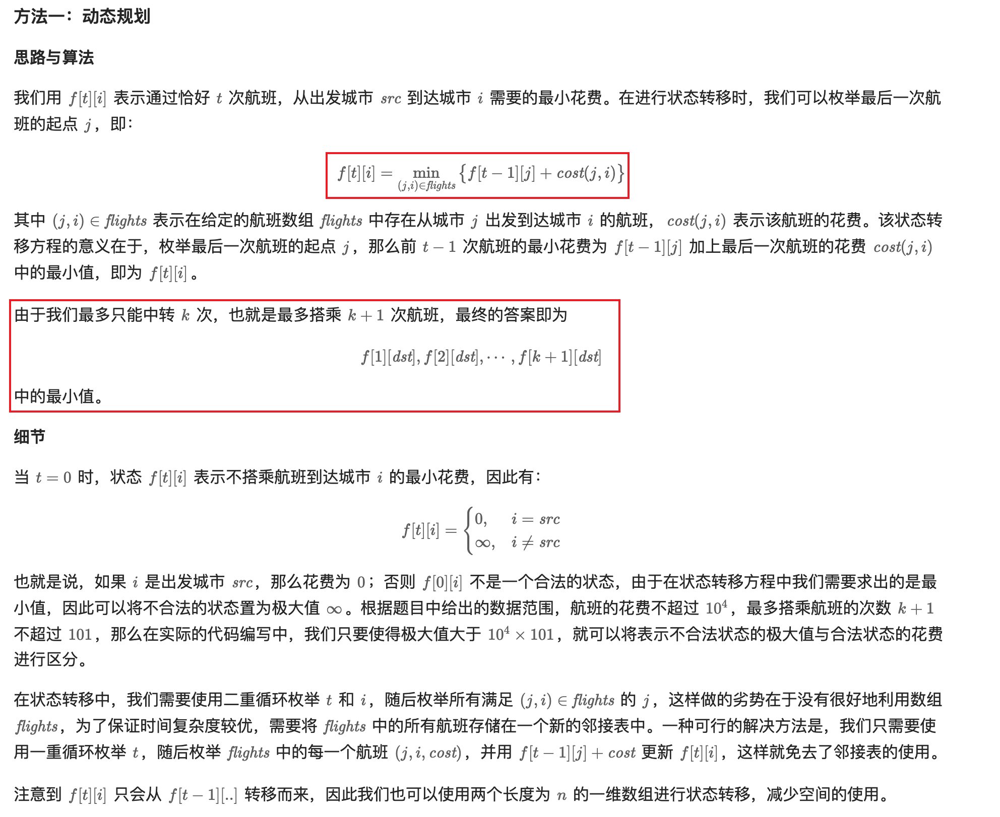

[787. Cheapest Flights Within K Stops](https://leetcode.com/problems/cheapest-flights-within-k-stops/description/)

* Graph, Heap(PriorityQueue), Dynamic Programming, DFS, BFS, Shortest Path
* Amazon, MakeMyTrip, Meta, Airbnb, Google, TikTok, Snap, Adobe, Apple, Bloomberg, Microsoft, Oracle, Uber, Snowflake
* Similar Questions:
  * Maximum Vacation Days
  * Minimum Cost to Reach City With Discounts


## 题意分析
1. You are also given three integers src, dst, and k, return the cheapest price from src to dst with at most `k` stops. If there is no such route, return -1.
    > 「限制最多经过不超过 k 个点」等价于「限制最多不超过 k+1 条边」
2. `roads[t][dst]`表示经过`t`次航班，到达`dst`的最小花费 
3. return the cheapest price from src to dst with at most k stops. If there is no such route, return -1.
   * at most `k` stops, 也就是最多停`k`站，有`k+1`次航班，因此`roads = new int[k+2][n]`


## Method 1. Bellman Ford算法 (7ms, beats 49%)

```java
/*
1. k stops, i.e. k+1 flights, therefore we need an array of size k+2, 
i.e. [0, 1, 2, ..., k+1]

2. dp[i][city] represents the min cost after i flight and arrive city
*/

class Solution {
    private static final int INF = 10000 * 101 + 1;

    public int findCheapestPrice(int n, int[][] flights, int src, int dst, int k) {
        // dp[i][city]
        int[][] dp = new int[k+2][n];
        for(int i=0; i<k+2; i++) {
            Arrays.fill(dp[i], INF);
        }
        dp[0][src] = 0; // If the dst is src, then we don't need to fly
        for(int i=1; i<=k+1; i++) {
            for(int[] flight: flights) {
                int from = flight[0];
                int to = flight[1];
                int cost = flight[2];
                dp[i][to] = Math.min(dp[i][to], dp[i-1][from] + cost);
            }
        }

        int res = INF;
        for(int i=1; i<=k+1; i++) {
            res = Math.min(res, dp[i][dst]);
        }
        return res == INF ? -1 : res;
    }
}
```


## Method 2. Bellman Ford算法, 优化空间复杂度 (5ms, beats 97%)
```java
class Solution {
    private static final int INF = 10000 * 101 + 1;

    public int findCheapestPrice(int n, int[][] flights, int src, int dst, int k) {
        int[] dp = new int[n];
        Arrays.fill(dp, INF);
        dp[src] = 0;

        int res = INF;
        for(int i=1; i<=k+1; i++) {
            int[] curr = new int[n];    // curr represents row i+1, dp represent row i
            Arrays.fill(curr, INF);

            for(int[] flight: flights) {
                int from = flight[0];
                int to = flight[1];
                int cost = flight[2];

                curr[to] = Math.min(curr[to], dp[from] + cost);
            }
            dp = curr;
            res = Math.min(res, dp[dst]);
        }
        return res == INF ? -1 : res;
    }
}
```


## Reference
* LeetCodeCN: https://leetcode.cn/problems/cheapest-flights-within-k-stops/solutions/954402/k-zhan-zhong-zhuan-nei-zui-bian-yi-de-ha-abzi/
