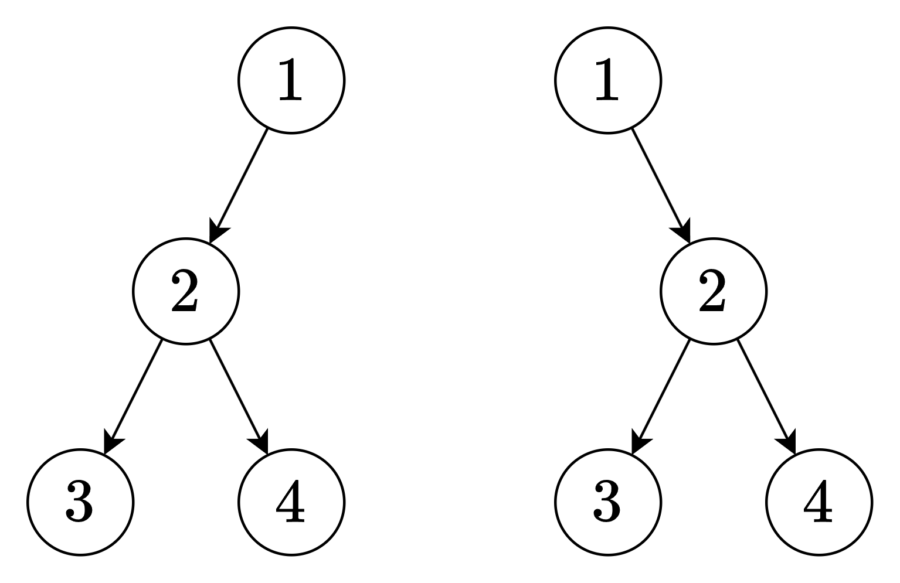

[889. Construct Binary Tree from Preorder and Postorder Traversal](https://leetcode.com/problems/construct-binary-tree-from-preorder-and-postorder-traversal/)

* Google, Bloomberg, Amazon
* Tree


1. Preorder:  `root + (left branch) + (right branch)`
2. Postorder: `(left branch) + (right branch) + root`
## Method 1.
```java
class Solution {
    public TreeNode constructFromPrePost(int[] pre, int[] post) {
        int N = pre.length;
        if(N == 0) {
            return null;
        }
        TreeNode root = new TreeNode(pre[0]);
        if(N == 1) {
            return root;
        }
        int L = 0;
        for(int i=0; i<N; i++) {    // []
            if(pre[1] == post[i]) {
                L = i + 1;
            }
        }
        root.left = constructFromPrePost(Arrays.copyOfRange(pre, 1, L+1), Arrays.copyOfRange(post, 0, L));
        root.right = constructFromPrePost(Arrays.copyOfRange(pre, L+1, N), Arrays.copyOfRange(post, L, N-1));
        return root;
    }
}
```
Complexity Analysis

    Time Complexity: O(N^2), where N is the number of nodes.
    Space Complexity: O(N^2).


## Method 2. There could be multiple results

```java
/**
Preorder: root --> left --> right
Postorder: left --> right --> root
*/
class Solution {
    public TreeNode constructFromPrePost(int[] preorder, int[] postorder) {
        int n = postorder.length;
        Map<Integer, Integer> index = new HashMap<>(n);
        for(int i=0; i<n; i++) {
            index.put(postorder[i], i);
        }
        return dfs(preorder, 0, n, 0, index);   // [left, right)
    }

    private TreeNode dfs(int[] preorder, int preL, int preR, int postL, Map<Integer, Integer> index) {
        if(preL == preR) {
            return null;
        }
        if(preL + 1 == preR) {
            return new TreeNode(preorder[preL]);
        }

        int leftSize = index.get(preorder[preL+1]) - postL + 1; // [postL, ..., index.get(preorder[preL+1]))
        TreeNode root = new TreeNode(preorder[preL]);
        root.left = dfs(preorder, preL + 1, preL + 1 + leftSize, postL, index);
        root.right = dfs(preorder, preL + 1 + leftSize, preR, postL + leftSize, index);
        return root;
    }
}
```


## Method 2. Still do not understand
```java
class Solution {
    int preIndex = 0;
    int posIndex = 0;
    public TreeNode constructFromPrePost(int[]pre, int[]post) {
        TreeNode root = new TreeNode(pre[preIndex++]);
        if (root.val != post[posIndex])
            root.left = constructFromPrePost(pre, post);
        if (root.val != post[posIndex])
            root.right = constructFromPrePost(pre, post);
        posIndex++;
        return root;
    }
}
```


## Reference
* ✅灵茶山艾府: [【图解】从 O(n^2) 到 O(n)（Python/Java/C++/Go/JS/Rust）](https://leetcode.cn/problems/construct-binary-tree-from-preorder-and-postorder-traversal/solutions/2649218/tu-jie-cong-on2-dao-onpythonjavacgojsrus-h0o5/)