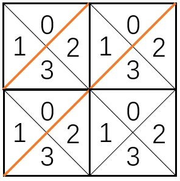

[959. Regions Cut By Slashes](https://leetcode.com/problems/regions-cut-by-slashes/)

* Array, Hash Table, Matrix, Depth-First Search, Breadth-First Search, Union Find
* Google, Meta, Microsoft, Amazon, Uber, Bloomberg


## Method 1. Union-Find, 
Key Points:
1. The main difficulty with this problem is in specifying the graph.
2. Use four smaller nodes to represent a cell.
    
3. 注意要用 ` c != '\\'` or `c != '/'`
4. **要用两个单独的 `if` statement 判断。**
5. `N = grid.length`, and this is also the number of columns.

```java
class Solution {
    public int regionsBySlashes(String[] grid) {
        if(grid == null || grid.length == 0) {
            return 0;
        }
        
        int N = grid.length;
        DSU dsu = new DSU(4 * N * N);
        for(int r = 0; r < N; r++) {
            for(int c = 0; c < N; c++) {
                int root = 4 * (r * N + c);
                char val = grid[r].charAt(c);
                if(val != '\\') {
                    dsu.union(root+0, root+1);
                    dsu.union(root+2, root+3);
                }
                if(val != '/') {
                    dsu.union(root+0, root+2);
                    dsu.union(root+1, root+3);
                }
                
                // north south
                if(r + 1 < N) {
                    dsu.union(root+3, (root + 4 * N) + 0);
                }
                if(r - 1 >= 0) {
                    dsu.union(root+0, (root - 4 * N) + 3);
                }
                // east west
                if(c + 1 < N) {
                    dsu.union(root+2, (root+4)+1);
                }
                if(c - 1 >= 0) {
                    dsu.union(root+1, (root-4)+2);
                }
            }
        }
        
        int res = 0;
        for(int x=0; x<4*N*N; x++) {
            if(dsu.find(x) == x) {
                res++;
            }
        }
        return res;
    }
}

class DSU {
    int[] parent;
    
    public DSU(int N) {
        parent = new int[N];
        for(int i=0; i<N; i++) {
            parent[i] = i;
        }
    }
    
    public int find(int x) {
        if(parent[x] != x) {
            parent[x] = find(parent[x]);
        }
        return parent[x];
    }
    
    public void union(int x, int y) {
        parent[find(x)] = find(y);
    }
}
```
**Complexity Analysis:**
1. Time Complexity: O(N∗N∗α(N)), where N is the length of the grid, and α is the Inverse-Ackermann function (if we were to use union-find by rank.)
2. Space Complexity: O(N∗N). 


## 🟩 Method 2. Union Find (from LeetCodeCN, 4ms, beats 85%)
```java
class Solution {
    public int regionsBySlashes(String[] grid) {
        int N = grid.length;
        int size = 4 * N * N;

        UnionFind uf = new UnionFind(size);
        for(int i=0; i<N; i++) {
            char[] row = grid[i].toCharArray();
            for(int j=0; j<N; j++) {
                // 二维网格转换为一维表格，index表示将单元格拆分成4个小三角形以后，编号为0的小三角形的在并查集中的下标
                int index = 4 * (i * N + j);
                char c = row[j];
                
                // 单元格内合并, internal merge
                if(c == '/') {
                    // merge 0 and 3, 1 and 2
                    uf.union(index, index + 3);
                    uf.union(index + 1, index + 2);
                } else if(c == '\\') {
                    // merge 0 and 1, 2 and 3
                    uf.union(index, index + 1);
                    uf.union(index + 2, index + 3);
                } else {
                    uf.union(index, index + 1);
                    uf.union(index, index + 2);
                    uf.union(index, index + 3);
                }

                // 单元格间合并, external merge
                // 左右之间合并, 向右合并
                if(j + 1 < N) {
                    uf.union(index + 1, 4 * (i * N + j + 1) + 3);
                }

                // 上下之间合并， 向下合并
                if(i + 1 < N) {
                    uf.union(index + 2, 4 * ((i + 1) * N + j));
                }
            }
        }
        return uf.getCount();
    }
}

class UnionFind {
    private int[] parent;
    private int count;

    public UnionFind(int n) {
        this.count = n;
        this.parent = new int[n];
        for(int i=0; i<n; i++) {
            parent[i] = i;
        }
    }

    public int getCount() {
        return count;
    }

    public int find(int x) {
        while(x != parent[x]) {
            parent[x] = parent[parent[x]];
            x = parent[x];
        }
        return x;
    }

    public void union(int x, int y) {
        int rootX = find(x);
        int rootY = find(y);
        if(rootX == rootY) {
            return;
        }
        parent[rootX] = rootY;
        count--;
    }
}
```
**复杂度分析:**
1. 时间复杂度：`O(N^2·logN)`，其中`N`是网格的长度，`O(N^2·logN^2)=O(2N^2·logN)`；
2. 空间复杂度：`O(N^2)`。


## Reference
1. [Solution](https://leetcode.com/problems/regions-cut-by-slashes/solution/)
2. LeetCodeCN: https://leetcode.cn/problems/regions-cut-by-slashes/solutions/571382/you-xie-gang-hua-fen-qu-yu-by-leetcode-67xb/
3. LeetCodeCN: https://leetcode.cn/problems/regions-cut-by-slashes/solutions/574992/you-xie-gang-hua-fen-qu-yu-by-leetcode-s-ztob/
