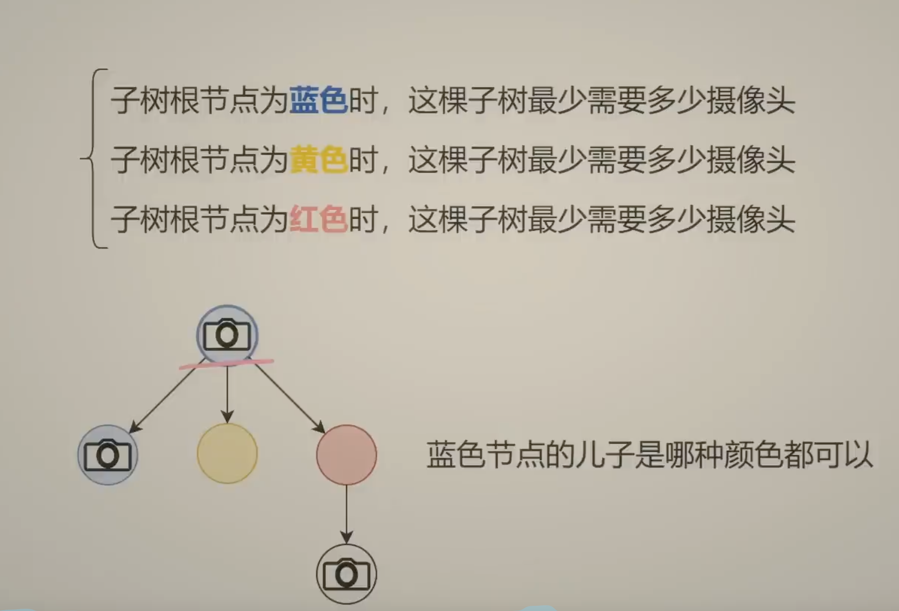
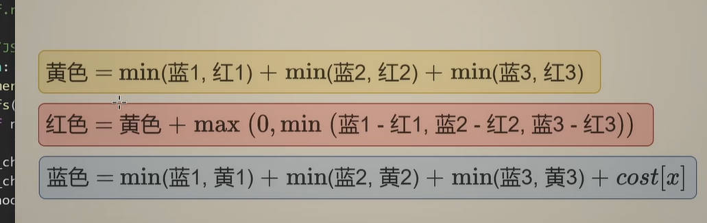

[968. Binary Tree Cameras](https://leetcode.com/problems/binary-tree-cameras/description/)


## 分析

* 蓝色：在当前节点安装 camera，则其子节点可以为蓝、黄、红
* 黄色：当前节点不安装 camera，但是其父节点安装 camera
* 红色：当前节点不安装 camera，但其子节点中至少有一个安装 camera

则可以推倒出以上公式
1. 蓝色 = min(左蓝、左黄、左红) + min(右蓝、右黄、右红) + 1
2. 黄色 = min(左蓝、左红) + min(右蓝、右红)
   * 因为当前节点没有安装 camera，其子节点就不存在被父节点 monitor 的可能，因此其子节点不存在黄色状态
3. 红色 = min(左红+右蓝，左蓝+右红，左蓝+右蓝)
   * 红色节点的子节点不可能为黄色，并且至少要有一个子节点为蓝色

由于 root 没有父节点，因此它只有蓝色和红色两个状态，因此最终答案为: min(根蓝，根红)

边界条件：null 节点: 
   * 不能装 camera：蓝色=INF
   * 不用监控，即不用装 camera：黄色=0，红色=0；


## Method 1. DFS
```java
/**
1. Install camera in current node
2. Not install camera in current node
    * Monitored by parent，then its direct children must have camera
    * Monitored by direct child
 */
class Solution {
    public int minCameraCover(TreeNode root) {
        int[] res = dfs(root);
        return Math.min(res[0], res[2]);
    }

    private int[] dfs(TreeNode node) {
        if(node == null) {
            return new int[]{Integer.MAX_VALUE / 2, 0, 0};
        }

        int[] left = dfs(node.left);
        int[] right = dfs(node.right);
        int installCurrent = Math.min(left[0], left[1]) + Math.min(right[0], right[1]) + 1;
        int byParent = Math.min(left[0], left[2]) + Math.min(right[0], right[2]);
        int byChildren = Math.min(Math.min(left[0] + right[2], left[2] + right[0]), left[0] + right[0]);

        return new int[]{installCurrent, byParent, byChildren};
    }
}
```
**Complexity Analysis:**
* Time Complexity: O(N), where N is the number of nodes in the given tree.
* Space Complexity: O(H), where H is the height of the given tree.


## Reference
* [【视频】一个思路解决两种变形：一般树 / 点权树（Python/Java/C++/Go/JS/Rust）](https://leetcode.cn/problems/binary-tree-cameras/solutions/2452795/shi-pin-ru-he-si-kao-shu-xing-dpgai-chen-uqsf/)


扩展到一般树

