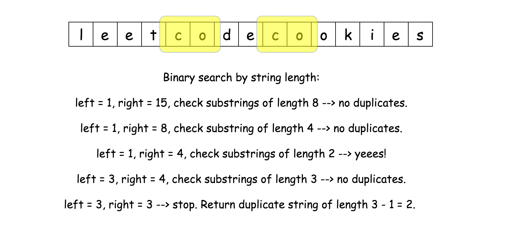

[1062. Longest Repeating Substring](https://leetcode.com/problems/longest-repeating-substring/)

* Google, Facebook
* String
* Hints:
    * Generate all substrings in `O(N^2)` time with hashing;
    * Choose those hashing of strings with the largest length.
    

Split into two subtasks:        
* Subtask one: Binary search by a substring length. [即先搜索长度为 L 的 substring，如果有重复的，则搜索更长的 substring；如果没有重复的，则减少搜索长度。]
A naive solution would be to check all possible string length one by one starting from `N-1`: if there are no duplicate substrings of length `N-1`, then of length `N-2`, etc.
Hence one could use a binary search by string length here, and have the first problem solved in `O(logN)` time.
[如果有长度为 L 的 substring 有重复，则肯定有 `L-1` 的、重复的 substring，则不再搜索更短的 substring，而是去搜索更长的 substring。]        
     

从图中可以看出，
1. minLen=1, maxLen=15；则搜索长度为 8 的 substring，no duplicates；
2. minLen=1, maxLen=8；则搜索长度为 4 的 substring，no duplicates；
3. minLen=1, maxLen=4；则搜索长度为 2 的 substring，yes；
4. minLen=3, maxLen=4；则搜索长度为 3 的 substring，no duplicates；
5. minLen=3, maxLen=3；STOP ==> Return duplicate string of length 3-1=2.

* Subtask two: Check if there is a duplicate substring of length L. [检测长度为 L 的 substring 是否有重复的。]

Three different ideas to proceed: they are all based on sliding window + hashset.
1. Linear-time + hashset of already seen strings: O((N-L)L) time complexity and huge space consumption in the case of large strings; 
2. Linear-time + hashset of **hashes** of already seen strings: O((N-L)L) time complexity and moderate space consumption even in the case of large strings;
[与 Method 1 相比，不再用 hashset 保存 strings，而是 strings 的 hashes，时间复杂度上没有太大改进，但是空间有节省。]
3. Rabin-Karp = constant-time slice + hashset of **hashes** of already seen strings. Hashes are computed with the rolling hash algorithm. O(N-L) time complexity and moderate space consumption even in the case of large strings.      


## Method 1. Binary Search + Hashset of Already seen strings
先 search 长度为 L 的 substring，经过遍历 search 之后，如果没有 duplicate，则考虑更短的 substring；如果有 duplicate 的，则考虑更长的 substring。
```java
class Solution {
    public int longestRepeatingSubstring(String S) {
        int N = S.length();
        
        // Binary search, L = length of repeating string
        int left = 1;   // the minimum length
        int right = N;  // the maximum length
        int L = 0;
        while(left <= right) {
            L = left + (right - left) / 2;
            if(search(L, N, S) != -1) {
                left = L + 1;   // Length L is not considered again
            } else {
                right = L - 1;  // length L is not considered again
            }
        }
        return left - 1;
    }
    
    /* 
    * Search a substring of given length that occurs at least 2 times.
    * Return start position if the substring exist and -1 otherwise.
    */
    private int search(int L, int N, String S) {
        HashSet<String> seen = new HashSet<String>();
        String tmp = "";
        for(int start=0; start<N-L+1; start++) {
            tmp = S.substring(start, start+L);
            if(seen.contains(tmp)) {
                return start;
            }
            seen.add(tmp);
        }
        return -1;
    }
}
/*
* Time: O(NlogN) in the average case for search and O(N^2) in the worst case.
* Each duplicate check needs O((N-L)L).
* Together that results in O(L∑​(N−L)L), i.e. in in O(Nlog⁡N) in the average case and in O(N^2) in the worst case of L close to N/2.
* Space: O(N^2) to keep the hashset.
*/
```


## Method 2. Binary Search + Hashset of Hashes of Already Seen Strings
To reduce the memory consumption by the hashset structure, one could store not the full strings, but their hashes.
```java 
class Solution {
    public int longestRepeatingSubstring(String S) {
        int N = S.length(); // length of string S
        int left = 1;
        int right = N;
        while(left <= right) {
            int L = left + (right - left) / 2;
            if(search(S, N, L) != -1) {
                left = L + 1;
            } else {
                right = L - 1;
            }
        }
        return left - 1;
    }
    
    private int search(String s, int N, int L) {
        HashSet<Integer> seen = new HashSet<Integer>();
        String tmp = "";
        int h;
        for(int start=0; start<N-L+1; start++) {
            tmp = s.substring(start, start+L);
            h = tmp.hashCode();
            if(seen.contains(h)) {
                return start;
            }
            seen.add(h);
        }
        return -1;
    }
}
/*
* Time: O(NlogN) in the average case for search and O(N^2) in the worst case.
* Each duplicate check needs O((N-L)L).
* Together that results in O(L∑​(N−L)L), i.e. in in O(Nlog⁡N) in the average case and in O(N^2) in the worst case of L close to N/2.
* Space: O(N) to keep the hashset.
*/
```


## Method 3. Binary Search + Rabin-Karp
Rabin-Karp algorithm is used to perform a multiple pattern search in a linear time and with a moderate memory consumption suitable for the large strings.

Rolling hash: hash generation in a constant time. Use the advantage of slice: only one integer in, and only one out.

Overflow: `aL` could be a large number and hence the idea is to set limits to avoid the overflow. To set limits means to limit a hash by a given number called modulus and use everywhere not hash itself but `h % modulus`.
[避免 Overflow 的基本方法是设置一个很大的 limit。设置这个 limit 就是设置一个很大的模(modulus)，然后并不用 hash 本身，而是 `h % modulus`。]

[How large should the modulus be?](https://en.wikipedia.org/wiki/Linear_congruential_generator#Parameters_in_common_use)
```java 
h = (h * a - nums[start - 1] * aL % modulus + modulus) % modulus;
h = (h + nums[start + L - 1]) % modulus;
```

```java 
class Solution {
    public int longestRepeatingSubstring(String S) {
        int N = S.length();     // length of the string
        // Convert string to array of integers to implement constant time slice
        int[] nums = new int[N];
        for(int i=0; i<N; i++) {
            nums[i] = S.charAt(i) - 'a';
        }
        
        // Base value for the rolling hash function
        int a = 26;
        // Modulus value for the rolling hash function to avoid overflow
        long modulus = (long)Math.pow(2, 24);
        
        // Binary search, L = repeating string length
        int left = 1;
        int right = N;
        int L;
        while(left <= right) {
            L = left + (right - left) / 2;
            if(search(L, a, modulus, N, nums) != -1) {
                left = L + 1;
            } else {
                right = L - 1;
            }
        }
        return left - 1;
    }
    
    /*
    * Rabin-Karp with polynomial rolling hash.
    * Search a substring of given length that occurs at least 2 times.
    * Return start position if the substring exits and -1 otherwise.
    */ 
    public int search(int L, int a, long modulus, int N, int[] nums) {
        long h = 0;
        for(int i=0; i<L; i++) {
            h = (h * a + nums[i]) % modulus;
        }
        
        // Already seen hashes of strings of length L
        HashSet<Long> seen = new HashSet<Long>();
        seen.add(h);
        // Const value to be used often: a**L % modulus
        long aL = 1;
        for(int i=1; i<=L; i++) {
            aL = (aL * a) % modulus;
        }
        
        for(int start=1; start<N-L+1; start++) {
            // Compute rolling hash in O(1) time
            h = (h * a - nums[start - 1] * aL % modulus + modulus) % modulus;
            h = (h + nums[start + L - 1]) % modulus;
            if(seen.contains(h)) {
                return start;
            }
            seen.add(h);
        }
        return -1;
    }
}
```


