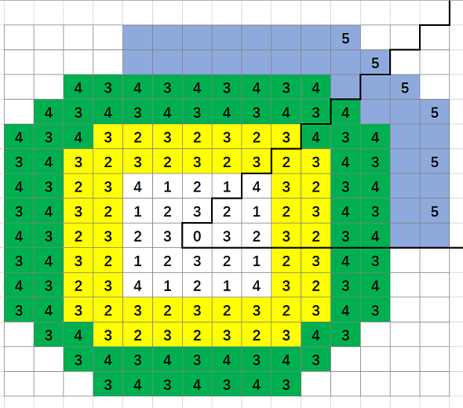
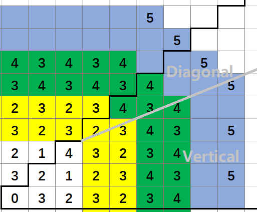

[1197. Minimum Knight Moves](https://leetcode.com/problems/minimum-knight-moves/)

* Facebook, Mathworks, Amazon, Google, Indeed, DoorDash, Qualtrics
* Breadth-First Search
* Hints
    * You can simulate the movements since the limits are low.
    * Is there a search algorithm applicable to this problem?
    * Since we want the minimum number of moves, we can use Breadth First Search.
    
    
## Method 1. Formular

Key Points:
1. 从上图来看，是水平、垂直和斜对角对称的，因此可以把所有的点映射到黑线包括的区域中；
2. 黑线定义的区域可以由下面公式定义

    ```java
    x = Math.abs(x);
    y = Math.abs(y);
    if (x < y) {
        int tmp = x;
        x = y;
        y = tmp;
    }
    ```
3. 对于白色的区域，可以直接给出对应的值：
    ```java
    private static int[][] localRegion = {
            {0, 3, 2},
            {3, 2, 1},
            {2, 1, 4}
    };
    ```
   当 `x <= 2 && y <= 2` 的时候，可以直接给出结果。
4. 对于染色的区域，可以根据颜色归类成同一个 pattern。 比如黄色、绿色分别代表一种模式。则在 Group T 中有 T
和 T+1 相互交替出现。比如黄色区域中 2 和 3 的相互交替，绿色区域中的 3 和 4。
对于一个 block `(x, y)`，它的值应该是
```java
groupID + ((x + y + groupdID) % 2)
```
5. 那么剩下的问题就是如何确定 `groupID`。 



其中 diagonal region 和 vertical region 的 groupID 的定义方式不同。
In vertical region: `groupID = (x - 1) / 2 + 1`
In diagonal region: `groupID = (x + y - 2) / 3 + 1`
```java
int groupId;
if ((x - 3) >= (y - 3) * 2)
    groupId = (x - 1) / 2 + 1;
else 
    groupId = (x + y - 2) / 3 + 1;
```
 
```java
class Solution {
    public int minKnightMoves(int x, int y) {
        x = Math.abs(x);
        y = Math.abs(y);
        
        if(x < y) {
            int tmp = x;
            x = y;
            y = tmp;
        }
        
        if(x==1 && y==0) {
            return 3;
        }
        if(x==2 && y==2) {
            return 4;
        }
        
        int firstMove = (int)Math.max(Math.ceil(x / 2.), Math.ceil((x + y) / 3.));
        return firstMove + (firstMove + x + y) % 2;
    }
}
```


## Method 2. BFS
```java
class Solution {
    private final int[][] DIRECTIONS = new int[][] {{2, 1}, {1, 2}, {-1, 2}, {-2, 1}, {-2, -1}, {-1, -2}, {1, -2}, {2, -1}};
    
    public int minKnightMoves(int x, int y) {
        x = Math.abs(x);
        y = Math.abs(y);
        
        Queue<int[]> queue = new LinkedList<>();
        queue.add(new int[] {0, 0});
        
        Set<String> visited = new HashSet<>();
        visited.add("0,0");
        
        int result = 0;
        while (!queue.isEmpty()) {
            int size = queue.size();
            for (int i = 0; i < size; i++) {
                int[] cur = queue.remove();
                int curX = cur[0];
                int curY = cur[1];
                if (curX == x && curY == y) {
                    return result;
                }
                
                for (int[] d : DIRECTIONS) {
                    int newX = curX + d[0];
                    int newY = curY + d[1];
                    if (!visited.contains(newX + "," + newY) && newX >= -1 && newY >= -1) {
                        queue.add(new int[] {newX, newY});
                        visited.add(newX + "," + newY);
                    }
                }
            }
            result++;
        }
        return -1;
    }
}
```


## Reference
1. [Here is how I get the formula (with graphs)](https://leetcode.com/problems/minimum-knight-moves/discuss/392053/Here-is-how-I-get-the-formula-(with-graphs))
2. [Clean Java BFS solution](https://leetcode.com/problems/minimum-knight-moves/discuss/401580/Clean-Java-BFS-solution)
3. [O(1) formula.](https://leetcode.com/problems/minimum-knight-moves/discuss/387036/O(1)-formula.)
4. [minimum number of steps for knight in chess](https://math.stackexchange.com/questions/1135683/minimum-number-of-steps-for-knight-in-chess)