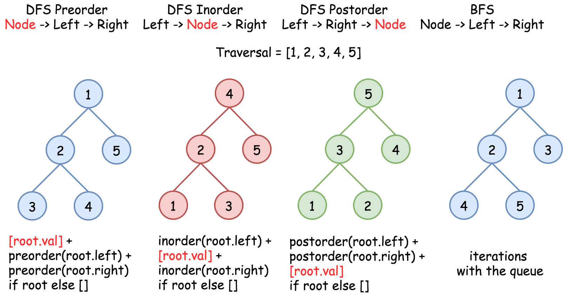

[129. Sum Root to Leaf Numbers](https://leetcode.com/problems/sum-root-to-leaf-numbers/)

* Facebook, Microsoft, Amazon, eBay
* Tree, Depth-First Search
* Similar Questions:
    * 112.Path Sum
    * 124.Binary Tree Maximum Path Sum
    * Smallest String Starting From Leaf
    
[Javadocs recommends to use ArrayDeque, and not Stack as a stack implementation](https://docs.oracle.com/javase/8/docs/api/java/util/ArrayDeque.html)
    
## Method 1. Iterative Preorder Traversal
> Here we implement standard iterative preorder traversal with stack:
> * Push root into stack;
> * While stack is not empty:
>   * Pop out a node from stack and update the current number
>   * If the node is a leaf, update root-to-leaf sum
>   * Push right and left child nodes into stack
> * Return root-to-leaf sum

```java 
class Solution {
    
    public int sumNumbers(TreeNode root) {
        int res = 0;
        int curr = 0;
        Deque<Pair<TreeNode, Integer>> stack = new ArrayDeque<>();
        stack.push(new Pair(root, 0));
        
        TreeNode node;
        while(!stack.isEmpty()) {
            Pair<TreeNode, Integer> p = stack.pop();
            node = p.getKey();
            curr = p.getValue();
            
            if(node != null) {
                curr = curr * 10 + node.val;
                // If this is a leaf, update root-to-leaf sum
                if(node.left == null && node.right == null) {
                    res += curr;
                } else {
                    stack.push(new Pair(node.right, curr));
                    stack.push(new Pair(node.left, curr));
                }
            }
        }
        return res;
    }
}
```
Complexity Analysis

    Time complexity: O(N) since one has to visit each node.
    Space complexity: up to O(H) to keep the stack, where H is a tree height.


## Method 2. Recursive Preorder Traversal
> Recursive preorder traversal is extremely simple: follow `Root -> Left -> Right` direction, i.e. do all the business with the node
> (i.e. update the current number and root-to-leaf sum), and then do the recursive calls for the left and right child nodes.
>
> Here is the difference between **preorder** and the other **DFS** recursive traversals. On the following figure the nodes are numerated in the order you visit them.

```java 
class Solution {
    private int res = 0;
    
    public int sumNumbers(TreeNode root) {
        preorder(root, 0);
        return res;
    }
    
    private void preorder(TreeNode node, int curr) {
        if(node != null) {
            curr = curr * 10 + node.val;
            // If this node is a leaf, update res
            if(node.left == null && node.right == null) {
                res += curr;
            }
            preorder(node.left, curr);
            preorder(node.right, curr);
        }
    }
}
```
Complexity Analysis

    Time complexity: O(N) since one has to visit each node.
    Space complexity: up to O(H) to keep the recursion stack, where H is a tree height.
    
    
## Method 3. Morris Preorder Traversal
> The idea of **Morris** algorithm is to set teh *temporary link* between the node the its predecessor: 
> `predecessor.right = root`. So one starts from the node, computes its predecessor and verifies if the link is present:
> * There is no link, then set it and go to the left subtree;
> * There is a link, then break it and go to the right subtree.
> There is one small issue to deal with: what if there is no left child, i.e. there is no left subtree? Then go straightforward to the right subtree.
