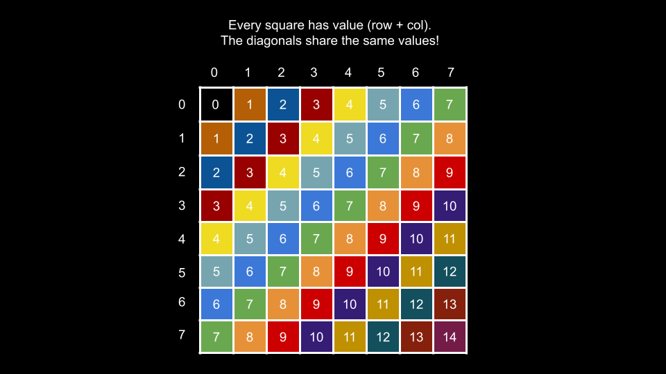
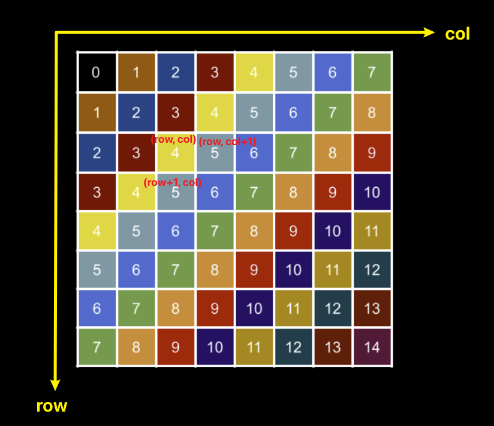

[1424. Diagonal Traverse II](https://leetcode.com/problems/diagonal-traverse-ii/description/)

* Array, Sorting, Heap (Priority Queue)
* Facebook, Google


## Method 1. HashMap (Group Elements by the Sum of Row and Column Indices) (38ms, beats 36%)
因为在同一条对角线上的元素的`i+j`的值是相同的，所以可以把`i+j`当作key放入到一个HashMap中。

```java
class Solution {
    public int[] findDiagonalOrder(List<List<Integer>> nums) {
        Map<Integer, List<Integer>> map = new HashMap<>();
        int count = 0;  // Count the number of elements in nums
        for(int i=0; i<nums.size(); i++) {
            for(int j=0; j<nums.get(i).size(); j++) {
                map.putIfAbsent(i+j, new ArrayList<>());
                map.get(i+j).add(0, nums.get(i).get(j));
                count++;
            }
        }

        int[] res = new int[count];
        int idx = 0;
        for(int key=0; key<map.size(); key++) {
            if(map.containsKey(key)) {
                for(int val: map.get(key)) {
                    res[idx++] = val;
                }
            }
        }
        return res;
    }
}
```
**Note:** 在这种方法中，需要两次passes。第一次是遍历`nums`，根据key `i+j`去填充`map`。第二次是遍历`map`得到最后的结果`res`。

**Complexity Analysis:**
Given `n` as the number of integers in grid,
1. Time complexity: `O(n)`
    * We iterate over each of the nnn integers to populate groups, then we iterate over them again to populate ans.
2. Space complexity: `O(n)`
    * The values of groups are lists that together will store exactly `n` integers, thus using `O(n)` space.


## Method 2. Breadth First Search (24ms, beats 80%)

```java
class Solution {
    public int[] findDiagonalOrder(List<List<Integer>> nums) {
        Queue<int[]> queue = new LinkedList<>();
        queue.offer(new int[]{0, 0});
        List<Integer> res = new ArrayList<>();

        while(!queue.isEmpty()) {
            int[] curr = queue.poll();
            int row = curr[0];
            int col = curr[1];
            res.add(nums.get(row).get(col));

            // Add the one below the current one only when it is in the first column
            if(col == 0 && row+1 < nums.size()) {
                queue.offer(new int[]{row+1, col});
            }
            // Add right side one
            if(col+1 < nums.get(row).size()) {
                queue.offer(new int[]{row, col+1});
            }
        }

        int[] ans = new int[res.size()];
        int i = 0;
        for(int num: res) {
            ans[i++] = num;
        }
        return ans;
    }
}
```
**Complexity Analysis:**
Given `n` as the number of integers in grid,
1. Time complexity: `O(n)`
   * During the BFS, we visit each square once, performing O(1)O(1)O(1) work at each iteration.
2. Space complexity: `O(n)`
   * The extra space we use is for queue. The largest size queue will be is proportional to the size of the largest diagonal.


## Reference
* [CNoodle: [LeetCode] 1424. Diagonal Traverse II](https://www.cnblogs.com/cnoodle/p/17855126.html)
* https://leetcode.com/problems/diagonal-traverse-ii/editorial/