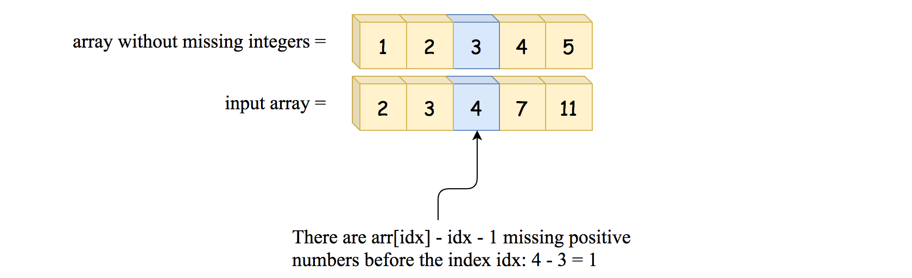

[1539. Kth Missing Positive Number](https://leetcode.com/problems/kth-missing-positive-number/description/)

* Array, Binary Search
* Facebook, Amazon, Adobe, Google, Microsoft
* Similar Questions:
  * Append K Integers With Minimal Sum


## Method 1. My Solution (Brute Force)
```java
class Solution {
    public int findKthPositive(int[] arr, int k) {
        int[] res = new int[k];
        Set<Integer> set = new HashSet<>();
        for(int num: arr) {
            set.add(num);
        }

        int idx = 0;
        for(int i=1; i<=set.size()+k; i++) {
            if(!set.contains(i)) {
                res[idx++] = i;
                if(idx == k) {
                    break;
                }
            }
        }
        return res[k-1];
    }
}
```
**Complexity Analysis:**
1. Time complexity: `O(N)` because in the worst case, we have to parse all array elements.
2. Space complexity: `O(1)`, we don't allocate any additional data structures.


## Method 2. Binary Search (0ms, beats 100%) [Lower Bound]
* We need a way to check on how many positive integers are missing before the given array element to use binary search. 我们需要一种方法来检查给定数组元素之前缺少多少正整数，如何做呢？就是用Binary Search。


* Before 2, there is 2 - 1 = 1 missing integer.
  * `arr[idx]-idx-1, idx=0 --> arr[0]-0-1=2-0-1=1` (missing 1)
* Before 3, there is 3 - 2 = 1 missing integer.
  * `arr[idx]-idx-1, idx=1 --> arr[1]-1-1=3-1-1=1` (missing 1)
* Before 4, there is 4 - 3 = 1 missing integer.
  * `arr[idx]-idx-1, idx=2 --> arr[2]-2-1=4-2-1=1` (missing 1)
* Before 7, there are 7 - 4 = 3 missing integers.
  * `arr[idx]-idx-1, idx=3 --> arr[3]-3-1=7-3-1=3` (missing 1, 5, 6)
* Before 11, there are 11 - 5 = 6 missing integers.
  * `arr[idx]-idx-1, idx=4 --> arr[4]-4-1=11-4-1=7` (missing 1, 5, 6, 8, 9, 10)
* > The number of positive integers which are missing before the arr[idx] is equal to arr[idx] - idx - 1.

**如何进行Binary Search？**
* left, right, pivot
  * `left, right`是array `arr`的index，范围是`[0, arr.length-1]`
* If the number of positive integers, which are missing, is less than `k`, continue to search on the right side of the array:
  * i.e. `arr[pivot]-pivot-1 < k`, then `left = pivot + 1`
* Otherwise, continue to search on the left: `right = pivot - 1`.
```java
class Solution {
    public int findKthPositive(int[] arr, int k) {
        int left = 0;   // Note: left=0. If we set left=1, then the first element will be missed.
        int right = arr.length - 1;
        while(left <= right) {
            int pivot = left + (right - left) / 2;
            // If number of positive integers which are missing before arr[pivot] is less than k,
            // then continue to search on the right
            if(arr[pivot] - pivot - 1 < k) {
                left = pivot + 1;
            } else {    // Go to left
                right = pivot - 1;
            }
        }
        // At the end of the loop, left=right+1, and the k-th missing is in-between arr[left] and arr[right].
        // The number of integers missing before arr[right] is arr[right]-right-1, 
        // --> the number to return is arr[right]+k-(arr[right]-right-1)=k+left
        return left + k;
    }
}
```
**Complexity Analysis:**
1. Time complexity: `O(logN)`, where `N` is a number of elements in the input array.
2. Space complexity: `O(1)`, we don't allocate any additional data structures.


### 分析
> The number of positive integers which are missing before the `arr[idx]` is equal to `arr[idx] - idx - 1`.

把这个问题转换成一个 lower bound Binary Search 问题:

目标：Find the first index, which satisfying `arr[idx] - (idx+1) < k < arr[idx+1] - (idx+2)`, i.e. the left boundary


## Reference
* https://leetcode.com/problems/kth-missing-positive-number/editorial/
