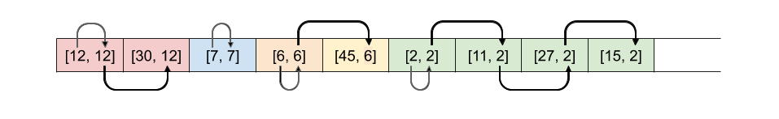
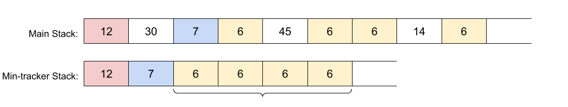
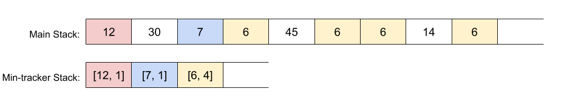

[155. Min Stack](https://leetcode.com/problems/min-stack/)

* Amazon, Bloomberg, Microsoft, Apple, Oracle, Google, Facebook, Walmart Labs, Netflix
* Stack, Design
* Similar Questions:
    * [239. Sliding Window Maximum](https://leetcode.com/problems/sliding-window-maximum/)
    * [716. Max Stack](https://leetcode.com/problems/max-stack/)
* Hints:
    * Consider each node in the stack having a minimum value
    

## Analysis
* The `getMin(...)` operation only needs to return the value of the minimum, it *does not* remove 
  items from the `minStack`.
* All operations on `minStack` must run in constant time, i.e. O(1). Core operations of `Binary Search 
  Tree` or `Heap` (`find`, `and`, and `remove`) are O(logN). 
  

## Method 1. Stack of Value/Minimum Pairs


```java
class MinStack {

    private Stack<int[]> stack;
    
    /** initialize your data structure here. */
    public MinStack() {
        stack = new Stack<int[]>();
    }
    
    public void push(int x) {
        // If the stack is empty, then the min value must be the first value we add.
        if(stack.isEmpty()) {
            stack.push(new int[]{x, x});
            return;
        }
        int currMin = stack.peek()[1];
        stack.push(new int[]{x, Math.min(x, currMin)});
    }
    
    public void pop() {
        stack.pop();
    }
    
    public int top() {
        return stack.peek()[0];
    }
    
    public int getMin() {
        return stack.peek()[1];
    }
}

/**
 * Your MinStack object will be instantiated and called as such:
 * MinStack obj = new MinStack();
 * obj.push(x);
 * obj.pop();
 * int param_3 = obj.top();
 * int param_4 = obj.getMin();
 */
```
Complexity Analysis:
Let `n` be the total number of operations performed.
* Time: O(1) for all operations;
* Space: O(n). Worst case is that all the operations are push. In this case, there will be `O(2n) = O(n)`.


## Method 3. Two Stacks
Key Points:
1. Only update the `minStack` when needed.

```java
class MinStack {

    private Stack<Integer> stack;
    private Stack<Integer> minStack;
    
    /** initialize your data structure here. */
    public MinStack() {
        stack = new Stack<Integer>();
        minStack = new Stack<Integer>();
    }
    
    public void push(int x) {
        stack.push(x);
        // Only update the minStack when needed
        if(minStack.isEmpty() || x <= minStack.peek()) {
            minStack.push(x);
        }
    }
    
    public void pop() {
        if(stack.peek().equals(minStack.peek())) {
            minStack.pop();
        }
        stack.pop();
    }
    
    public int top() {
        return stack.peek();
    }
    
    public int getMin() {
        return minStack.peek();
    }
}

/**
 * Your MinStack object will be instantiated and called as such:
 * MinStack obj = new MinStack();
 * obj.push(x);
 * obj.pop();
 * int param_3 = obj.top();
 * int param_4 = obj.getMin();
 */
```

or

```java
class MinStack {
    
    private Deque<Integer> stack;
    private Deque<Integer> minStack;

    /** initialize your data structure here. */
    public MinStack() {
        stack = new ArrayDeque<>();
        minStack = new ArrayDeque<>();
    }
    
    public void push(int x) {
        stack.push(x);
        if(minStack.isEmpty() || x < minStack.peek()) {
            minStack.push(x);
        } else {
            minStack.push(minStack.peek());
        }
    }
    
    public void pop() {
        stack.pop();
        minStack.pop();
    }
    
    public int top() {
        return stack.peek();
    }
    
    public int getMin() {
        return minStack.peek();
    }
}

/**
 * Your MinStack object will be instantiated and called as such:
 * MinStack obj = new MinStack();
 * obj.push(x);
 * obj.pop();
 * int param_3 = obj.top();
 * int param_4 = obj.getMin();
 */
```


## Method 3. Improved Two Stacks
Key Points:
1. Push a new number onto the `minStack` if, and only if, it was `less than or equal to` the current minimum.
   只在需要的时候向 `minStack` 中加入最新的最小值。
2. One downside of this solution is that if the *same number* is pushed repeatedly onto `minStack`, 
   and that number also happens to be the current mininum, there will be a lost of needless 
   repetion on the `minStack`.
   
3. An improvement is to put *pairt* onto the `minStack`. The first value of the pair would be 
   the current min value, and the second value would be how many times the minimum was repeated.
   
   
```java
class MinStack {

    private Stack<Integer> stack = new Stack<>();
    private Stack<int[]> minStack = new Stack<>();
    
    
    public MinStack() { }
    
    
    public void push(int x) {
        
        // We always put the number onto the main stack.
        stack.push(x);
        
        // If the min stack is empty, or this number is smaller than
        // the top of the min stack, put it on with a count of 1.
        if (minStack.isEmpty() || x < minStack.peek()[0]) {
            minStack.push(new int[]{x, 1});
        }
        
        // Else if this number is equal to what's currently at the top
        // of the min stack, then increment the count at the top by 1.
        else if (x == minStack.peek()[0]) {
            minStack.peek()[1]++;
        }
    }
    
    
    public void pop() {
        
        // If the top of min stack is the same as the top of stack
        // then we need to decrement the count at the top by 1.
        if (stack.peek().equals(minStack.peek()[0])) {
            minStack.peek()[1]--;
        }
        
        // If the count at the top of min stack is now 0, then remove
        // that value as we're done with it.
        if (minStack.peek()[1] == 0) {
            minStack.pop();
        }
        
        // And like before, pop the top of the main stack.
        stack.pop();
    }
    
    
    public int top() {
        return stack.peek();
    }

    
    public int getMin() {
        return minStack.peek()[0];
    }
}
```


## Method 4. One Integer for min value
Key Points:
1. Update the `minStack` when `curr <= min`, including `==`. 包括 `==`！！！
2. In `getMin()` operation, when `stack.pop() == min`, this means the latest min value is popped,
   and we need to update the min value to previous min value, therefore we need pop once more.
   
```java
class MinStack {

    private Stack<Integer> stack;
    private int min;
    /** initialize your data structure here. */
    public MinStack() {
        stack = new Stack<Integer>();
        min = Integer.MAX_VALUE;
    }
    
    public void push(int x) {
        if(x <= min) {
            stack.push(min);
            min = x;
        }
        stack.push(x);
    }
    
    public void pop() {
        if(stack.pop() == min) {
            min = stack.pop();
        }
    }
    
    public int top() {
        return stack.peek();
    }
    
    public int getMin() {
        return min;
    }
}

/**
 * Your MinStack object will be instantiated and called as such:
 * MinStack obj = new MinStack();
 * obj.push(x);
 * obj.pop();
 * int param_3 = obj.top();
 * int param_4 = obj.getMin();
 */
```