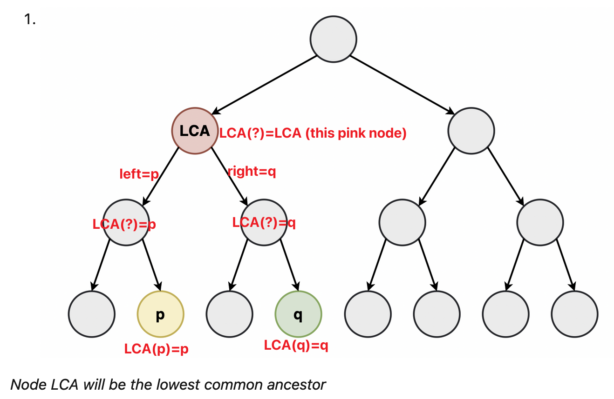
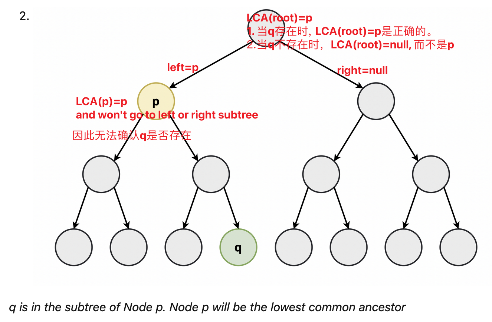
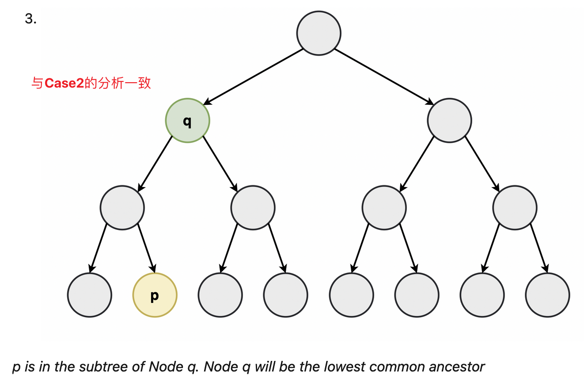
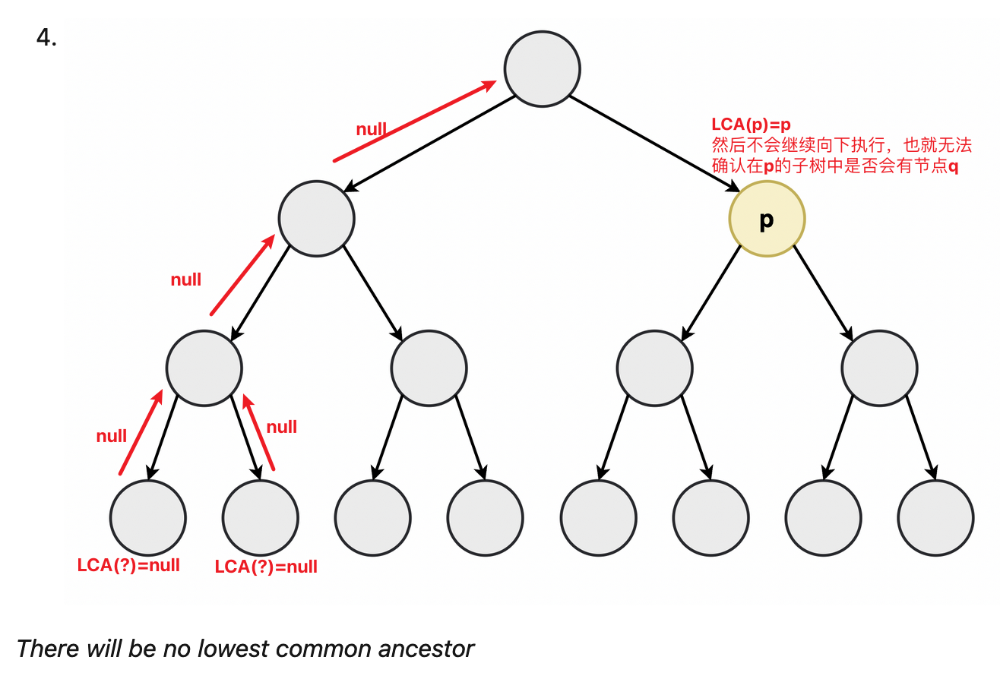
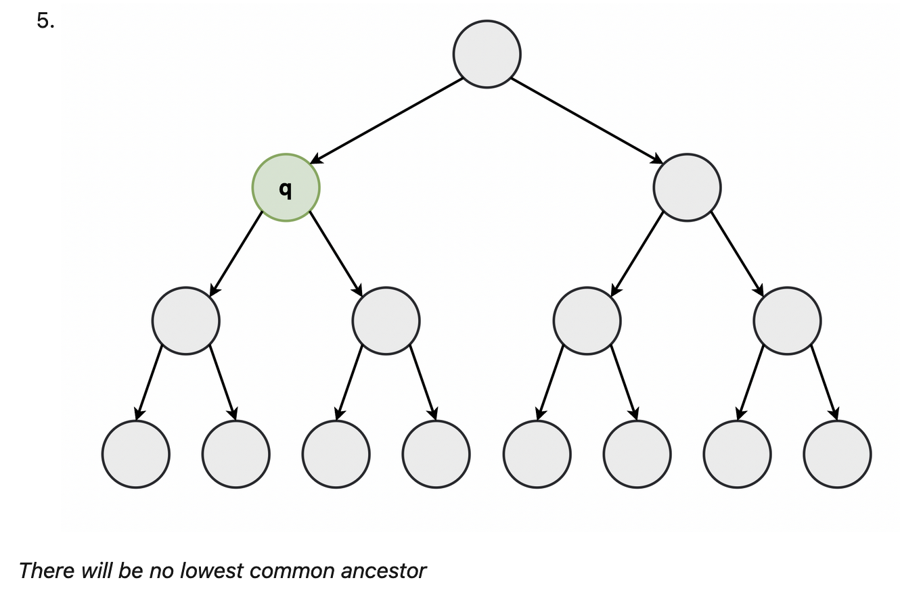
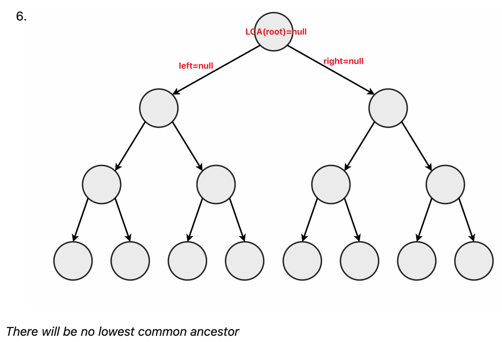

[1644. Lowest Common Ancestor of a Binary Tree II](https://leetcode.com/problems/lowest-common-ancestor-of-a-binary-tree-ii/)

* Facebook, Microsoft, LinkedIn, 
* Tree, Depth-First Search, Binary Tree


**Note:**
1. All `node.val` are unique.
2. `p != q`

以上两个条件说明，`p` or `q` 可能根本就不在Tree中。但是在题目LC 236中，both `p` and `q` exist。

## Analysis
给定一棵二叉树(Binary Tree)和两个可为空的节点(`p` and `q`)，找出Lowest Common Ancestor。根据`p`和`q`的情况，有6种cases。

下面的代码片段来自[LC 1644 Editorial](https://leetcode.com/problems/lowest-common-ancestor-of-a-binary-tree-ii/editorial/)，
```Java
private TreeNode LCA(TreeNode node, TreeNode p, TreeNode q) {
    if (node == null || node == p || node == q)
        return node;
    TreeNode left = LCA(node.left, p, q);
    TreeNode right = LCA(node.right, p, q);
    if (left != null && right != null)
        return node;
    else if (left != null)
        return left;
    else
        return right;
}
```
This solution doesn't account for the cases where `p` or `q` are not in the binary tree. [即该方法无法解释当`p` or `q`不存在的情况]。
In this solution, the stopping condition is `if(root == null || root == p || root == q) return root`. This means if we encounter `p`, we won't explore the subtrees as we immediately return. If `q` does not exist in the subtree of `p`, we will never know. For cases 4 and 5, this method will return p and q respectively, which is incorrect as we should be returning null instead. [参考以下对6 cases的分析]

**Case1:** `p` and `q`都存在，切能找到LCA。


**Case2:** `q`在以`p`为根节点的subtree中


**Case3:** `p`在以`q`为根节点的subtree中


**Case4:** `p`存在，但是`q`是`null`

When returning `p` as the lowest common ancestor, we can check for `q` in the subtree of `p` to ensure that both the nodes are present. 即当返回`p`作为LCA时，继续检查`q`是否在`p`的子树种。

**Case5:** `q`存在，但是`p`是`null`。与Case4的情况一致。

Likewise, for the case where this method returns `q` as the lowest common ancestor we can check for `p` in the subtree of `q` to ensure that both nodes are present.

**Case6:** `p`和`q`都不存在。

If this method returns `null`, it indicates that neither `p` nor `q` are present in the tree.


## Method 1. LCA + dfs (16ms)
```Java
/**
 * Definition for a binary tree node.
 * public class TreeNode {
 *     int val;
 *     TreeNode left;
 *     TreeNode right;
 *     TreeNode(int x) { val = x; }
 * }
 */
class Solution {
    public TreeNode lowestCommonAncestor(TreeNode root, TreeNode p, TreeNode q) {
        TreeNode res = LCA(root, p, q);
        if(res == p) {  
            return dfs(p, q) ? p : null;   // Check if q is in the subtree of p
        } else if(res == q) {   
            return dfs(q, p) ? q : null;   // Check if p is in the subtree of q
        } 
        return res;
    }

    private TreeNode LCA(TreeNode node, TreeNode p, TreeNode q) {
        if(node == null || node == p || node == q) {
            return node;
        }

        TreeNode left = LCA(node.left, p, q);
        TreeNode right = LCA(node.right, p, q);

        if(left != null && right != null) {
            return node;
        } else if(left != null) {
            return left;
        } else {
            return right;
        }
    }

    private boolean dfs(TreeNode node, TreeNode target) {
        if(node == target) {
            return true;
        }
        if(node == null) {
            return false;
        }
        return dfs(node.left, target) || dfs(node.right, target);
    }
}
```
**Complexity Analysis:**
Let `N` be the total number of nodes in the tree.
1. Time complexity: `O(N)`. In the worst case we will go over the whole tree, for example when both `p` and `q` are not present in the tree.
2. Space complexity: `O(N)`. This is the stack space used by the solution when performing depth first search over the tree. The max depth will be the height of the tree. In the worst case, height will be `N` when all the nodes form a chain.


## Method 2. Depth First Search - 2/3 Conditions
**Intuition:**
How can we confirm that `p` and `q` are present in the tree? 
For any given node, if any two of the following three conditions hold true, we can say that p and q are both present in the tree.
    1. node is either `p` or `q`
    2. `p` or `q` is in the left subtree of node
    3. `p` or `q` is in the right subtree of node

```Java
/**
 * Definition for a binary tree node.
 * public class TreeNode {
 *     int val;
 *     TreeNode left;
 *     TreeNode right;
 *     TreeNode(int x) { val = x; }
 * }
 */
class Solution {
    private boolean nodesFound = false;

    public TreeNode lowestCommonAncestor(TreeNode root, TreeNode p, TreeNode q) {
        TreeNode res = dfs(root, p, q);
        return nodesFound ? res : null;
    }

    private TreeNode dfs(TreeNode node, TreeNode p, TreeNode q) {
        if(node == null) {
            return null;
        }

        TreeNode left = dfs(node.left, p, q);
        TreeNode right = dfs(node.right, p, q);
        
        int conditions = 0;
        if(node == p || node == q) {
            conditions++;
        }
        if(left != null) {
            conditions++;
        }
        if(right != null) {
            conditions++;
        }
        if(conditions == 2) {
            nodesFound = true;
        }

        if((left != null && right != null) || node == p || node == q) {
            return node;
        }
        return left != null ? left : right;    
    }
}
```
**Complexity Analysis:**
Let `N` be the total number of nodes in the tree.
1. Time complexity: `O(N)`. In the worst case we will go over the whole tree, for example when both `p` and `q` are not present in the tree.
2. Space complexity: `O(N)`. This is the stack space used by the solution when performing depth first search over the tree. The max depth will be the height of the tree. In the worst case, height will be `N` when all the nodes form a chain.


## Method 3. 7ms
```Java
/**
 * Definition for a binary tree node.
 * public class TreeNode {
 *     int val;
 *     TreeNode left;
 *     TreeNode right;
 *     TreeNode(int x) { val = x; }
 * }
 */
class Solution {

    int count = 0;

    public TreeNode lowestCommonAncestor(TreeNode root, TreeNode p, TreeNode q) {
        if(p == q) return p;
        TreeNode res = lca(root, p, q);
        return count == 2? res : null;
    }

    public TreeNode lca(TreeNode node, TreeNode p, TreeNode q){
        if(node == null) return null;
        int flag = 0;
        if(node == p || node == q){ // 标记但不返回，因为另一个p/q可能是他的子节点，所以要继续遍历
            count += 1;
            flag = 1;
        }

        TreeNode left = lca(node.left, p, q);
        TreeNode right = lca(node.right, p, q);

        if((left != null && right != null) || flag == 1) return node;
        if(left != null) return left;
        return right; // 这里跳步了哈
    }
}
```
* https://leetcode.com/problems/lowest-common-ancestor-of-a-binary-tree-ii/submissions/1134036677/


## Reference
1. https://leetcode.com/problems/lowest-common-ancestor-of-a-binary-tree-ii/editorial/
2. https://leetcode.com/problems/lowest-common-ancestor-of-a-binary-tree-ii/submissions/1134036677/