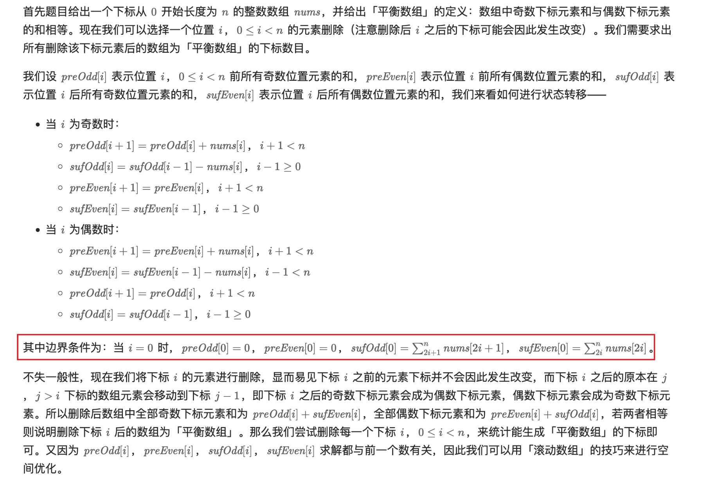

[1664. Ways to Make a Fair Array](https://leetcode.com/problems/ways-to-make-a-fair-array/)

* Array, Prefix Sum
* DoorDash, Dunzo, DoorDash

## Method 1. 动态规划

```java
class Solution {
    public int waysToMakeFair(int[] nums) {
        int preOdd = 0;
        int sufOdd = 0;
        int preEven = 0;
        int sufEven = 0;

        for(int i=0; i<nums.length; i++) {
            if(i % 2 == 1) {
                sufOdd += nums[i];
            } else {
                sufEven += nums[i];
            }
        }

        int res = 0;
        for(int i=0; i<nums.length; i++) {
            if(i % 2 == 1) {
                sufOdd -= nums[i];
            } else {
                sufEven -= nums[i];
            }
            // 删除nums[i]之后，后面的偶数和-->奇数和，后面的奇数和-->偶数和
            if(preOdd + sufEven == sufOdd + preEven) {
                res++;
            }

            if(i % 2 == 1) {
                preOdd += nums[i];
            } else {
                preEven += nums[i];
            }
        }
        return res;
    }
}
```
**复杂度分析:**
* 时间复杂度：O(n)，其中 n 为数组 nums 的长度。
* 空间复杂度：O(1)，仅使用常量空间。


## Reference
* LeetCodeCN: [生成平衡数组的方案数](https://leetcode.cn/problems/ways-to-make-a-fair-array/solutions/2078340/sheng-cheng-ping-heng-shu-zu-de-fang-an-0mkaj/)