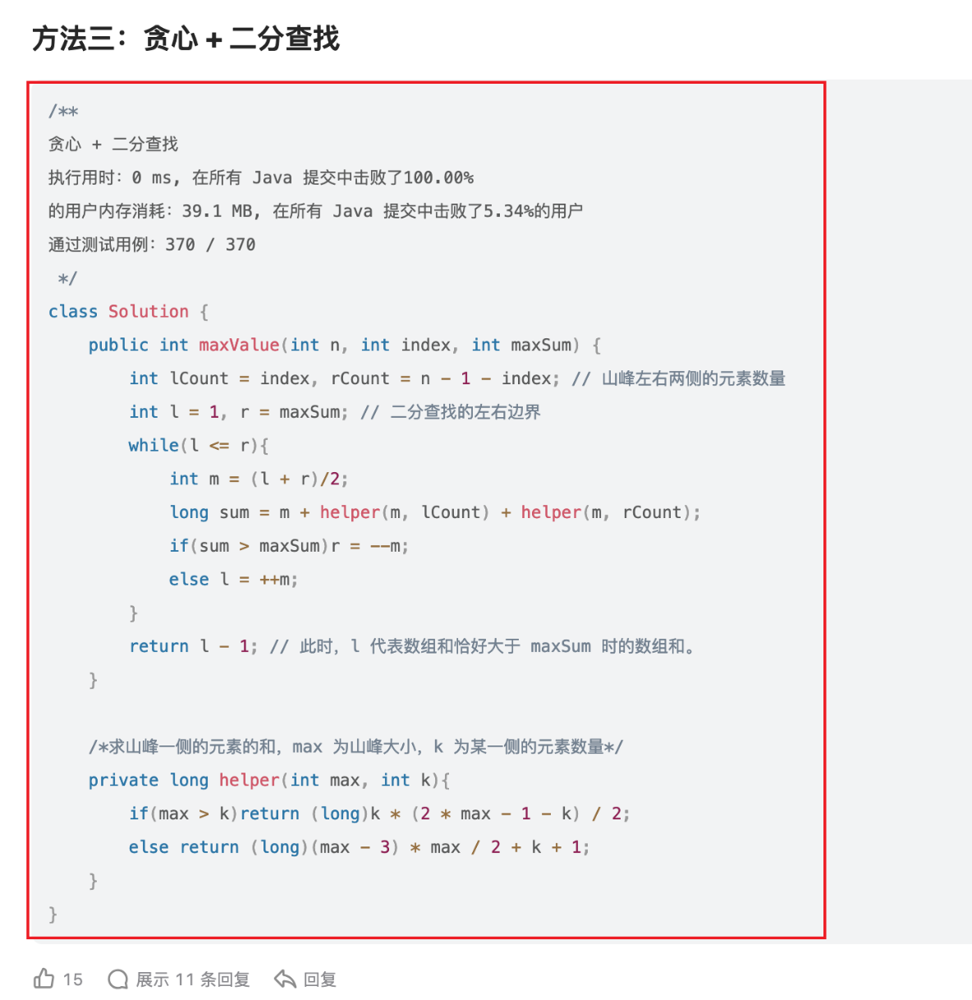

[1802. Maximum Value at a Given Index in a Bounded Array](https://leetcode.com/problems/maximum-value-at-a-given-index-in-a-bounded-array/description/?envType=company&envId=tiktok&favoriteSlug=tiktok-thirty-days)

* Binary Search, Greedy, Math
* TikTok, Microsoft, Adobe, Apple, Amazon

## Method 1. Greedy + Binary Search

```java
/*
index: 0    1   2   ... index-1 index index+1 ...   n-1
num:                             mid
lCount: (index - 1) - 0 + 1 = index
rCount: (n-1)-(index+1)+1 = n - index - 1

lPart: length = lCount = (mid-1) - start + 1 = index --> start = mid - index
start = mid - index
end = mid - 1
sum = (start + end) * length / 2
    = (mid - index + mid - 1) * index / 2
    = (2 * mid - index - 1) / 2
    = (2 * mid - lCount - 1) / 2
*/
class Solution {
    public int maxValue(int n, int index, int maxSum) {
        int lCount = index;         // count of elements in the left side
        int rCount = n - index - 1; // count of elements in the right side
        int left = 1;
        int right = maxSum;
        while(left <= right) {
            int mid = left + (right - left) / 2;
            long sum = mid + sum(mid, lCount) + sum(mid, rCount);
            if(sum > maxSum) {
                right = mid - 1;
            } else {
                left = mid + 1;
            }
        }
        return left - 1;
    }

    //要保证所有元素都为 positive
    private long sum(int num, int length) {
        if(num > length) {
            return (long)(num + num - length - 1) * length / 2;
        } else {
            return (long)(num - 3) * num / 2 + length + 1;
        }
        
    }
}
```