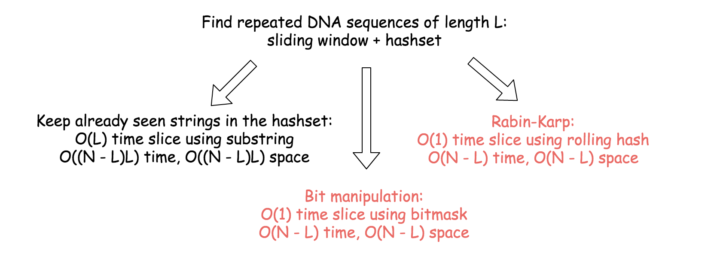

[187. Repeated DNA Sequences](https://leetcode.com/problems/repeated-dna-sequences/)

* Amazon
* Hash Table, Bit Manipulation


题意：     
Write a function to find all 10-letter-long sequences (substrings) that occur more than once in a DNA molecule.

Follow-up here is to solve the same problem for arbitrary sequence length L, and to check the situation when L is quite large.

> Three different ideas are all based on `sliding-window` and `hashset`. The key point is to implement a window slice.

Linear-time window slice `O(L)` is easy stupid, just take a substring.      

Constant-time slice `O(1)` is where the func starts:
* Rabin-Karp = constant-time slice using rolling hash algorithm;
* Bit Manipulation = constant-time using bitmasks.




## Method 0. Fastest
```java 
class Solution {
    public List<String> findRepeatedDnaSequences(String s) {
        List<String> res = new ArrayList<String>();
        int L = 10;
        int N = s.length();
        if(N <= L) {
            return res;
        }
        
        int a = 1 << (2 * L);
        a--;    // a = 1 << 2, i.e. 100; then a-- is 011
        char[] str = s.toCharArray();
        byte[] hashset = new byte[a];
        byte[] map = new byte['T' + 1];
        map['A'] = 0;
        map['C'] = 1;
        map['G'] = 2;
        map['T'] = 3;
        
        int hash = 0;
        for(int i=0; i<L; i++) {
            hash = hash << 2 | map[str[i]];
        }
        hashset[hash] = 1;  // already seen this sequence
        
        for(int i=1; i<N-L+1; i++) {
            hash = hash << 2 & a | map[str[i+L-1]];
            if(hashset[hash] == 0) {
                hashset[hash]++;
            } else if(hashset[hash] == 1) {
                hashset[hash]++;
                res.add(s.substring(i, i+L));
            }
        }
        return res;
    }
}
```

## Method 1. Linear-time Slice using substring + HashSet
The idea is straightforword: Move a sliding window of length L along the string of Length N.

```java 
class Solution {
    public List<String> findRepeatedDnaSequences(String s) {
        int L = 10;
        int N = s.length();
        Set<String> seen = new HashSet<>();
        Set<String> res = new HashSet<>();
        
        // Iterate over all sequences of length L.
        for(int i=0; i<N-L+1; i++) {
            String tmp = s.substring(i, i+L);   // s[i, i+L)
            if(seen.contains(tmp)) {
                res.add(tmp);
            }
            seen.add(tmp);
        }
        
        return new ArrayList<String>(res);
    }
}
```
> Complexity Analysis:
>   * Time complexity : O((N−L)L), that is O(N) for the constant L=10. In the loop executed N−L+1 one builds a substring of length L. 
>   Overall that results in O((N−L)L) time complexity.
>   * Space complexity : O((N−L)L) to keep the hashset, that results in O(N) for the constant L=10. 

* `for(int i=0; i<N-L+1; i++)`
    * The first substring: `s[0, L)`, 左闭右开, and length equals `L - 0 = L`;
    * The last substring: `s[N-L , N)` ==> The left index should be `N - x = L`, therefore `x = N - L`;
    * Therefore, `i` should be in the range `[0, N-L]` ==> `[0, N-L+1)`
* `String tmp = s.substring(i, i+L)` ==> `s[i, i+L)`


## Method 2. Rabin-Karp: Constant-time Slice using Rolling Hash
> Rabin-Karp algorithm is used to perform a multiple pattern search. 
> It's used for plagiarism detection and in bioinformatics to look for similarities in two or more proteins.
>
> [Ref: Longest Duplicate Substring](https://leetcode.com/articles/longest-duplicate-substring/)
>
> The idea is to slice over the string and to compute the hash of the sequence in the sliding window, both in a constant time.

```java 
class Solution {
    public List<String> findRepeatedDnaSequences(String s) {
        int L = 10;
        int N = s.length();
        if(N <= L) {
            return new ArrayList<String>();
        }
        
        // Rolling hash parameters: the base is a
        int a = 4;
        int aL = (int)Math.pow(a, L);
        
        // Convert string to array of integers
        Map<Character, Integer> toInt = new HashMap<>(){{
            put('A', 0);
            put('C', 1);
            put('G', 2);
            put('T', 3);
        }};
        int[] nums = new int[N];
        for(int i=0; i<N; i++) {
            nums[i] = toInt.get(s.charAt(i));
        }
        
        // Rolling hash
        int h = 0;
        Set<Integer> seen = new HashSet<Integer>();
        Set<String> res = new HashSet<String>();
        // Iterate over all sequences of length L
        for(int i=0; i<N-L+1; i++) {
            if(i != 0) {    // Compute hash of the current sequence in O(1) time
                h = h * a - nums[i-1]*aL + nums[i-1+L];
            } else {        // Compute hash of the first sequence in O(L) time
                for(int j=0; j<L; j++) {
                    h = h * a + nums[j];
                }
            }
            // Update hashset of seen sequences and res
            if(seen.contains(h)) {
                res.add(s.substring(i, i+L));
            }
            seen.add(h);
        }
        return new ArrayList<String>(res);
    }
}
```
Complexity Analysis

    Time complexity : O(N−L), that is O(N) for the constant L=10. In the loop executed N−L+1 one builds a hash in a constant time, that results in O(N−L) time complexity.
    Space complexity : O(N−L) to keep the hashset, that results in O(N) for the constant L=10. 


## Method 3. Bit Manipulation: Constant-time Slice Using Bitmask
> The idea is to slice over the string and to compute the bitmask of sequence in the sliding window, both in a constant time.
>
> A -> 0 == 00_{2}
> C -> 1 == 01_{2}
> G -> 2 == 10_{2}
> T -> 3 == 11_{2}
>
> To add trailing 1 is simple, the idea is as below:
> 1. Do left shift to free the last two bits: `bitmask << 2`; [将整个 bitmask 向左边移动两位，最右侧会补 0，也就是最右侧两位空出来了]
> 2. Save 1 to these last two bits: `bitmask |= 1`; [通过 or operation 将要添加的 digit 添加到最后两个空位]
>
> To remove two leading bits. In other words, the problem is to set `2L-bit` and `(2L+1)-bit` to zero.
> * Use bitwise trick to unset n-th bit: `bitmask &= ~(1 << n)`
>   * E.g. `(1 << 4) = 10000`, then `~(1 << 4) = 01111` 
> * Straightforward trick usage is to unset `2L-bit` and then `(2L+1)-bit`: `bitmask &= ~(1 << 2 * L) & ~(1 << (2 * L + 1)`. That could be simplified as `bitmask &= ~(3 << 2 * L)`

Algorithm:
1. Iterate over the start position of sequence: from 0 to N-L
    1. If `start == 0`, compute the bitmask of the first sequence `s[0:L]`, i.e. `s[0, L)`
    Otherwise, compute bitmask from the previous bitmask.
    2. If bitmask is in the hashset, one met a repeated sequence, then it's time to update the res.
    3. Otherwise, add bitmask in the hashset.
2. Return res list.

```java 
class Solution {
    public List<String> findRepeatedDnaSequences(String s) {
        int L = 10;
        int N = s.length();
        if(N <= L) {
            return new ArrayList<String>();
        }
        
        // Rolling hash parameters: the base is a
        int a = 4;
        int aL = (int)Math.pow(a, L);
        
        // Convert string to array of integers
        Map<Character, Integer> toInt = new HashMap<>(){{
            put('A', 0);
            put('C', 1);
            put('G', 2);
            put('T', 3);
        }};
        int[] nums = new int[N];
        for(int i=0; i<N; i++) {
            nums[i] = toInt.get(s.charAt(i));
        }
        
        
        int bitmask = 0;
        Set<Integer> seen = new HashSet<Integer>();
        Set<String> res = new HashSet<String>();
        // Iterate over all sequences of length L
        for(int i=0; i<N-L+1; i++) {
            if(i != 0) {    // Compute bitmask of the current sequence in O(1) time
                bitmask <<= 2;              // left shift to free the last two bits
                bitmask |= nums[i+L-1];     // add a new 2-bits number in the last tow bits
                bitmask &= ~(3 << 2 * L);   // unset first two bits: 2L-bit and (2L+1)-bit
            } else {
                for(int j=0; j<L; j++) {
                    bitmask <<= 2;
                    bitmask |= nums[j];
                }
            }
            // Update res and hashset of seen sequences
            if(seen.contains(bitmask)) {
                res.add(s.substring(i, i+L));
            } 
            seen.add(bitmask);
        }
        return new ArrayList<String>(res);
    }
}
```

Complexity Analysis

    Time complexity : O(N−L) , that is O(N) for the constant L=10. In the loop executed N−L+1 one builds a bitmask in a constant time, that results in O(N−L) time complexity.
    Space complexity : O(N−L) to keep the hashset, that results in O(N) for the constant L=10 .


## Reference:
1. [Ref: Longest Duplicate Substring](https://leetcode.com/articles/longest-duplicate-substring/)
2. [Numeral system](https://en.wikipedia.org/wiki/Numeral_system)