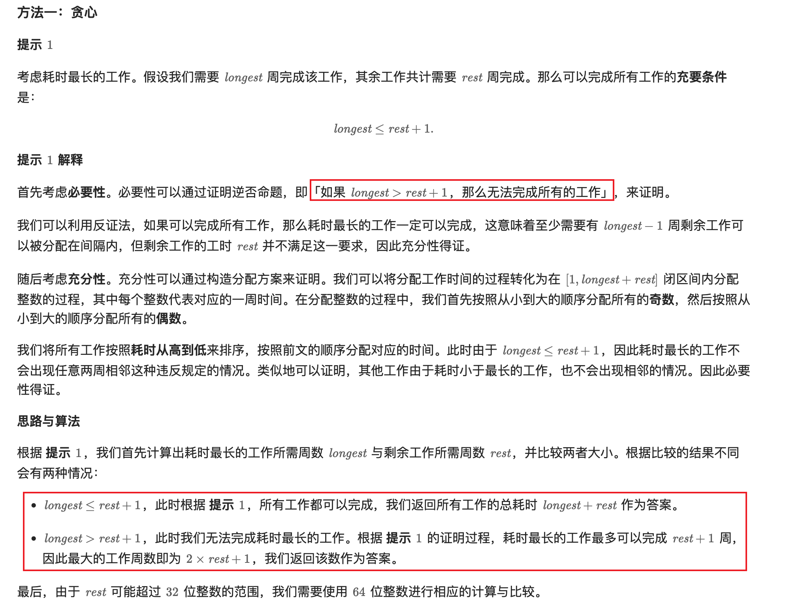

[1953. Maximum Number of Weeks for Which You Can Work](https://leetcode.com/problems/maximum-number-of-weeks-for-which-you-can-work/description/)

* Array, Greedy
* SAP


## Method 1. Greedy

```java
class Solution {
    public long numberOfWeeks(int[] milestones) {
        int longest = milestones[0];
        long rest = 0;
        for(int milestone: milestones) {
            longest = Math.max(longest, milestone);
            rest += milestone;
        }
        rest -= longest;
        if(longest > rest + 1) {
            return 2 * rest + 1;
        } else {
            return longest + rest;
        }
    }
}
```
**复杂度分析:**
* 时间复杂度：O(n)，其中 n 为 milestones 的长度。即为遍历数组计算耗时总和与最大值的时间复杂度。
* 空间复杂度：O(1)。


## Reference
* LeetCodeCN: https://leetcode.cn/problems/maximum-number-of-weeks-for-which-you-can-work/solutions/908442/ni-ke-yi-gong-zuo-de-zui-da-zhou-shu-by-rbidw/