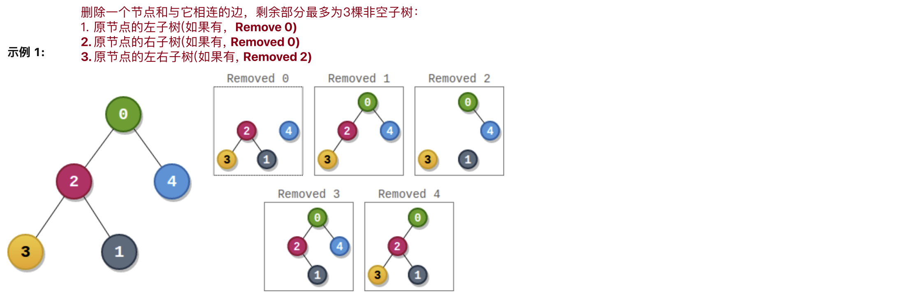

[2049. Count Nodes With the Highest Score](https://leetcode.com/problems/count-nodes-with-the-highest-score/description/)


* Array, Tree, Binary Tree, Depth-First Search
* Amazon, Visa, DoorDash
* Similar Questions:
  * [1110. Delete Nodes And Return Forest](https://leetcode.com/problems/delete-nodes-and-return-forest)

Each node has a score. To find the score of a node, consider if the node and the edges connected to it were removed. The tree would become one or more non-empty subtrees. The **size** of a subtree is the number of the nodes in it. The **score** of the node is the product of the sizes of all those subtrees.
* The **size** of a subtree is the number of nodes in it. 每个子树的**大小**是这棵子树中节点数目。比如，以`2`为节点的子树，size为3，因为有3个节点。
* The **score** of the node is the product of the sizes of all those subtrees.


## 🟩Method 1. From LeetCodeCN 官方题解
```java
class Solution {
    private long maxScore = 0;  // 记录最高分
    private int cnt = 0;        // 最高分的节点数目,count的缩写
    private int n;              // 节点数目
    List<Integer>[] children;   // 每个节点的子节点列表

    public int countHighestScoreNodes(int[] parents) {
        n = parents.length;     // 因为要用到n,所以在方法内初始化
        children = new List[n];
        for(int i=0; i<n; i++) {
            children[i] = new ArrayList<Integer>();
        }
        for(int i=0; i<n; i++) {
            int p = parents[i]; // 需要判断父节点是否是-1
            if(p != -1) {       // 如果是-1，会超出children数组的边界
                children[p].add(i); // 找到每个节点的所有子节点
            }
        }
        dfs(0);     // 深度优先搜索，以返回的是0节点为根的树的节点数目
        return cnt; // 返回最高分的节点数目
    }

    // Calculate the size of subtree rooted at node
    private int dfs(int node) {
        long score = 1;
        int size = n - 1;   // size用于记录除了左右子树和当前节点，第三部分的节点数目
        for(int c: children[node]) {
            int t = dfs(c);
            score *= t;
            size -= t;
        }
        if(node != 0) { // `node` is not a root
            score *= size;  // 如果不是根节点，则表示还有第三部分，需要再乘。
        }
        if(score == maxScore) {
            cnt++;
        } else if(score > maxScore) {
            maxScore = score;
            cnt = 1;
        }
        return n - size;    // 以当前节点为根的树的节点数目
    }
}
```
Reference: 
* https://leetcode.cn/problems/count-nodes-with-the-highest-score/solutions/1323769/tong-ji-zui-gao-fen-de-jie-dian-shu-mu-b-n810/
* https://leetcode.cn/problems/count-nodes-with-the-highest-score/solutions/1323769/tong-ji-zui-gao-fen-de-jie-dian-shu-mu-b-n810/comments/1431003


## Method 2.
```java
class Solution {
    public int countHighestScoreNodes(int[] parents) {
        int[] numOfNodes = new int[parents.length];
        List<Integer>[] children = new List[parents.length];

        for(int i=0; i<parents.length; i++) {
            children[i] = new ArrayList<>();
        }
        for(int i=1; i<parents.length; i++) {
            children[parents[i]].add(i);
        }

        findNumOfNodes(0, numOfNodes, children);

        int res = 1;
        long maxScore = 0;
        for(int i=0; i<parents.length; i++) {
            long score = 1;
            int remainingNodes = parents.length;
            for(int j: children[i]) {
                score *= numOfNodes[j];
                remainingNodes -= numOfNodes[j];
            }
            if(remainingNodes > 1) {
                score *= (remainingNodes - 1);
            }
            if(score == maxScore) {
                res++;
            } else if(score > maxScore) {
                maxScore = score;
                res = 1;
            }
        }
        return res;
    }

    private void findNumOfNodes(int k, int[] numOfNodes, List<Integer>[] children) {
        numOfNodes[k] = 1;
        for(int child: children[k]) {
            findNumOfNodes(child, numOfNodes, children);
            numOfNodes[k] += numOfNodes[child];
        }
    }
}
```
Reference:
* https://leetcode.cn/problems/count-nodes-with-the-highest-score/solutions/1323769/tong-ji-zui-gao-fen-de-jie-dian-shu-mu-b-n810/comments/1427788


## Reference
* 🟩 LeetCodeCN: [统计最高分的节点数目](https://leetcode.cn/problems/count-nodes-with-the-highest-score/solutions/1323769/tong-ji-zui-gao-fen-de-jie-dian-shu-mu-b-n810/)
* CNoodle: [[LeetCode] 2049. Count Nodes With the Highest Score](https://www.cnblogs.com/cnoodle/p/16971156.html)