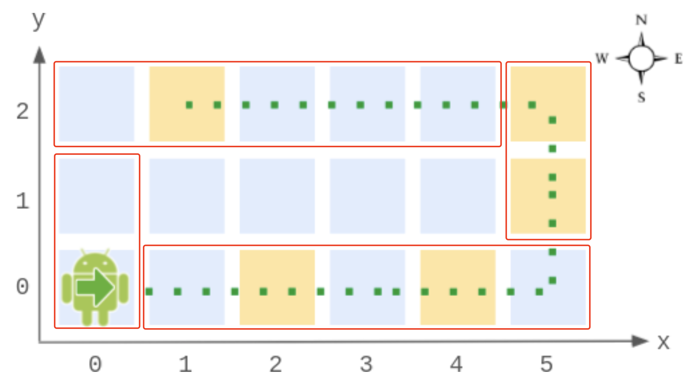

[2069. Walking Robot Simulation II](https://leetcode.com/problems/walking-robot-simulation-ii/)


## Method 1

```java
/*
1. The robot only moves on the boundary
2. Perimeter = 2 * (width - 1 + height - 1)
3. Initial direction: East; After moving one round: dir=South ==> Need a flag to tell whether the robot has moved
4. (0, 0, 0): Initially East; after moved, face to south
*/
class Robot {

    private static final String[] DIRS = {"East", "North", "West", "South"};

    private int w;
    private int h;
    private int loc;    // effective steps
    private boolean moved;

    public Robot(int width, int height) {
        w = width;
        h = height;
    }
    
    public void step(int num) {
        moved = true;
        loc += num;
        loc %= 2 * (w - 1) + 2 * (h - 1);
    }
    
    public int[] getPos() {
        int[] info = move();
        return new int[]{info[0], info[1]};
    }
    
    public String getDir() {
        int[] info = move();
        int x = info[0];
        int y = info[1];
        int dir = info[2];
        if(x == 0 && y == 0) {
            return moved ? DIRS[3] : DIRS[0];
        }
        return DIRS[dir];
    }

    private int[] move() {
        if(loc <= w - 1) {
            // 当移动步数范围在 [0,w-1] 时，所在位置为外圈的下方，方向为 East
            return new int[]{loc, 0, 0};    // x, y, dir=East
        } else if(loc <= (w - 1) + (h - 1)) {
            // 当移动步数范围在 [w,(w-1)+(h-1)] 时，所在位置为外圈的右方，方向为 North
            return new int[]{w - 1, loc - (w - 1), 1};   // dir=North
        } else if(loc <= 2 * (w - 1) + (h - 1)) {
            // 当移动步数范围在 [(w-1)+(h-1)+1,2*(w-1)+(h-1)] 时，所在位置为外圈的上方，方向为 West
            return new int[]{(w - 1) - (loc - ((w - 1) + (h - 1))), h - 1, 2};  // dir = West
        } else {
            // 当移动步数范围在 [2*(w-1)+(h-1)+1,2*(w-1)+2*(h-1)] 时，所在位置为外圈的左方，方向为 South
            return new int[]{0, (h - 1) - (loc - 2 * (w - 1) - (h - 1)), 3};
        }
    }
}
```

## Method 2
```java
/*
1. The robot only moves on the boundary
2. Perimeter = 2 * (width - 1 + height - 1)
3. Intial direction: East; Move one round: dir=South ==> flag
*/
class Robot {

    private static final String[] DIRS = {"East", "North", "West", "South"};    // counterclockwise
    private int width;
    private int height;
    private int loc;
    private boolean moved;
    private int[] currPos = new int[]{0, 0, 0};

    public Robot(int width, int height) {
        this.width = width;
        this.height = height;
    }
    
    public void step(int num) {
        moved = true;
        loc += num;
        loc %= 2 * (width - 1 + height - 1);
        currPos = move();   // 将 move() 直接在 step() 中调用
    }
    
    public int[] getPos() {
        return new int[]{currPos[0], currPos[1]};
    }
    
    public String getDir() {
        if(currPos[0] == 0 && currPos[1] == 0) {
            return moved ? DIRS[3] : DIRS[0];
        }
        return DIRS[currPos[2]];
    }

    private int[] move() {
        if(loc <= width - 1) {
            return new int[]{loc, 0, 0};
        } else if(loc <= width - 1 + height - 1) {
            return new int[]{width - 1, loc - (width - 1), 1};
        } else if(loc <= 2 * (width - 1) + height - 1) {
            return new int[]{width - 1 - (loc - (width - 1) - (height - 1)), height - 1, 2};
        } else {
            return new int[]{0, (height - 1) - (loc - 2 * (width - 1) - (height - 1)), 3};
        }
    }
}
```

or
```java
class Robot {
    private static final String[] DIRS = {"East", "North", "West", "South"};

    private int w;
    private int h;
    private int loc;
    private int[] pos;
    private boolean moved;

    public Robot(int width, int height) {
        w = width;
        h = height;
        loc = 0;
        pos = new int[]{0, 0, 0};
        moved = false;
    }
    
    public void step(int num) {
        loc += num;
        loc %= 2 * (h - 1 + w - 1);
        pos = move();
        moved = true;
    }
    
    public int[] getPos() {
        return new int[]{pos[0], pos[1]};
    }
    
    public String getDir() {
        if(pos[0] == 0 && pos[1] == 0) {
            return moved ? DIRS[3] : DIRS[0];
        }
        return DIRS[pos[2]];
    }

    private int[] move() {
        if(loc <= w - 1) {
            return new int[]{loc, 0, 0};
        } else if(loc <= (w - 1 + h - 1)) {
            return new int[]{w - 1, loc - (w - 1), 1};
        } else if(loc <= 2 * (w - 1) + (h - 1)) {
            return new int[]{2 * (w - 1) + (h - 1) - loc, h - 1, 2};    // 更容易理解
        } else {
            return new int[]{0, 2 * (w - 1 + h - 1) - loc, 3};      // 更容易理解
        }
    }
}
```


## Reference
* [【宫水三叶】简单模拟题](https://leetcode.cn/problems/walking-robot-simulation-ii/solutions/1419977/by-ac_oier-6zib/)
