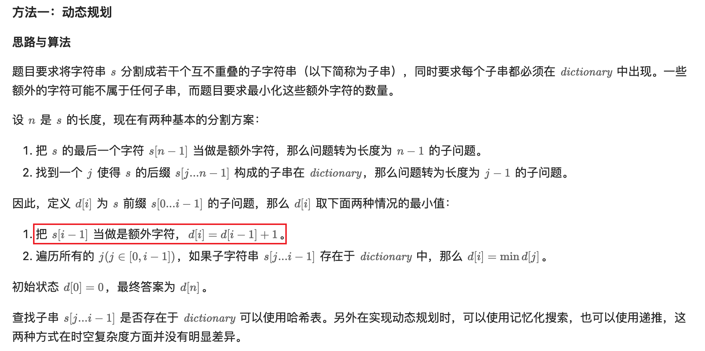

[2707. Extra Characters in a String](https://leetcode.com/problems/extra-characters-in-a-string/)

* Dynamic Programming, Memoization
* Google, Amazon, Meta, Bloomberg, Adobe, Uber, PornHub


## 题意分析


## Method 1. Dynamic Programming (43ms, beats 68%)

```java
class Solution {
    public int minExtraChar(String s, String[] dictionary) {
        int[] dp = new int[s.length() + 1];
        Arrays.fill(dp, Integer.MAX_VALUE);
        Set<String> set = new HashSet<>();
        for(String str: dictionary) {
            set.add(str);
        }

        dp[0] = 0;
        for(int i=1; i<=s.length(); i++) {
            dp[i] = dp[i-1] + 1;    // 初始化时，将 s.substring(i-1, i) 作为一个 extra character
            for(int j=i-1; j>=0; j--) {
                if(set.contains(s.substring(j, i))) {
                    dp[i] = Math.min(dp[i], dp[j]);
                }
            }
        }
        return dp[s.length()];
    }
}
```
**复杂度分析:**
* 时间复杂度：`O(n^3+ml)`，其中 n 是 s 的长度，m 是 dictionary 的长度，l 是 dictionary 中字符串的最大长度。
  * 动态规划递推过程中需要递推 O(n) 次，每次需要遍历 O(n) 个子问题，每次转移查询哈希表的时间复杂度为 O(n)，因此这部分总复杂度为 O(n3)。初始化哈希表的时间复杂度为 O(ml)。
* 空间复杂度：`O(n+ml)`。


## Reference
* LeetCodeCN: [字符串中的额外字符](https://leetcode.cn/problems/extra-characters-in-a-string/solutions/2590667/zi-fu-chuan-zhong-de-e-wai-zi-fu-by-leet-f0lu/)