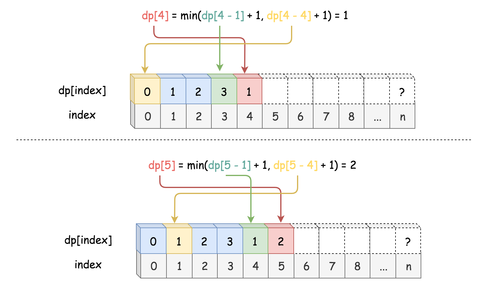

[279. Perfect Squares](https://leetcode.com/problems/perfect-squares/)

* Amazon, Google, Adobe, Yandex
* Math, Dynamic Programming, Breadth-First Search
* Similar Questions:
    * Count Primes
    * Ugly Number II
    
[Ref: Solution](https://leetcode.com/problems/perfect-squares/solution/)
    
## Method 1. Dynamic Programming
`numSquares(n) = min(numSquares(n-k) + 1)`, where `k` is a square number.
Now, it seems like a Fibonacci number problem.

> One of the ideas to solve the stack overflow issue in recursion is to apply teh **Dynamic Programming(DP)** technique.
>
> To calculate the value of `numSquares(n)`, first we need to calculate all the values before `n`, i.e. `numSquares(n - k)`, where `k` is a square number.

Algorithm:
1. Firstly, we need to create an array `dp` to hold the value of intermediate sub-solutions, as well as the final solution which is usually the last element in the array.
2. An additional preparation step, pre-calculate a list of square numbers that is less than then given number `n`;
3. As the main step, we then loop from the number `1` to `n`, to calculate the solution for each number `i`.
4. At the end of the loop, we then return the last element in the array as the result of the solution.

 

```java
class Solution {
    public int numSquares(int n) {
        int[] dp = new int[n + 1];
        Arrays.fill(dp, Integer.MAX_VALUE);
        // Bottom case
        dp[0] = 0;
        // pre-calculate the square numbers
        int maxSquareIndex = (int)Math.sqrt(n) + 1;
        int[] squareNumbers = new int[maxSquareIndex];
        for(int i=1; i<maxSquareIndex; i++) {
            squareNumbers[i] = i * i;
        }
        
        for(int i=1; i<=n; i++) {
            for(int s=1; s<maxSquareIndex; s++) {
                if(i < squareNumbers[s]) {
                    break;
                }
                dp[i] = Math.min(dp[i], dp[i-squareNumbers[s]] + 1);
            }
        }
        return dp[n];
    }
}
```

n = 13      
dp = [0, Inf, Inf, Inf, Inf, Inf, Inf, Inf, Inf, Inf, Inf, Inf, Inf, Inf]       
maxIdx = Math.sqrt(13) + 1 = 3 + 1 = 4      
squareNums = [0, 1, 4, 9]       
1. i = 1, dp[i] = Math.min(dp[i], dp[i-squareNums[1]]) = Math.min(dp[i], dp[0]) + 1 = 1
2. i = 2, dp[i] = Math.min(dp[i], dp[i-squareNums[1]]) = Math.min(dp[i], dp[1]) + 1 = 1 + 1 = 2;
3. i = 3, dp[i] = Math.min(dp[i], dp[i-squareNums[1]]) = Math.min(dp[i], dp[2]) + 1 = 2 + 1 = 3;
4. i = 4, dp[i] = Math.min(dp[i], dp[i-squareNums[1]]) = Math.min(dp[i], dp[3]) + 1 = 3 + 1 = 4;
          dp[i] = Math.min(dp[i], dp[i-squareNums[2]]) = Math.min(dp[i], dp[0]) + 1 = 0 + 1 = 1;
5. i = 2, dp[i] = Math.min(dp[i], dp[i-squareNums[1]]) = Math.min(dp[i], dp[4]) + 1 = 1 + 1 = 2;
          dp[i] = Math.min(dp[i], dp[i-squareNums[2]]) = Math.min(dp[i], dp[1]) + 1 = 1 + 1 = 2;
          
Complexity
1. Time complexity: `O(n⋅sqrt{n})`. In main step, we have a nested loop, where the outer loop is of nnn iterations and 
in the inner loop it takes at maximum `n*sqrt{n}` iterations.
2. Space Complexity: `O(n)`. We keep all the intermediate sub-solutions in the array `dp[]`. 