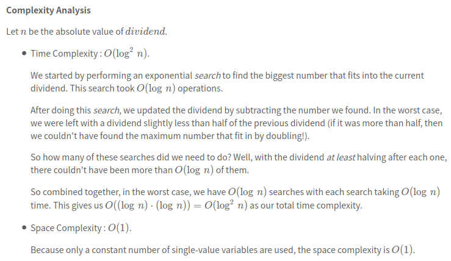
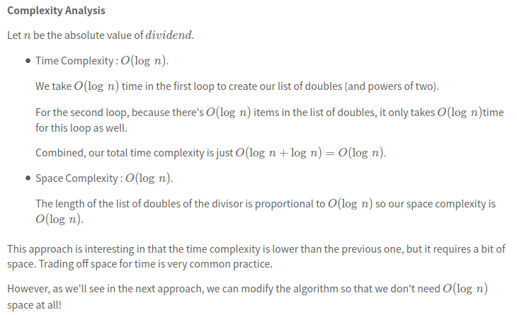
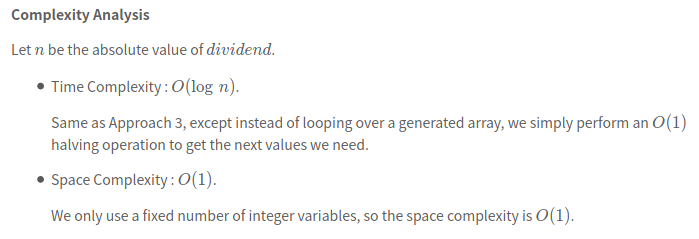

[29. Divide Two Integers](https://leetcode.com/problems/divide-two-integers/)


* Facebook, Amazon, Apple, Bloomberg
* Math, Binary Search


Read the question carefully: The question was designed with fixed-sized integers in mind.


Some problems:
* The use of `long` in Java is not allowed, because the question states that we only have integers within the range `[-2^31, 2^31 - 1]`。
* The use of `abs` in Python should be carefully, because `abs(-2^31) = 2^31`, which is outside the allowed range(`[-2^31, 2^31 - 1]`) by 1.
* While you might be tempted to use multiplication and division for a few `simple` tasks, this is unnecessary. Hear are some alternatives:
    * Instead of `a = a * -1` for making numbers negative, use `a = -a`
    * Instead of using `a / 2` for dividing by `2`, use the right shift operator: `a >> 1`
    * Instead of using `a * 2` for doubling, use `a = a + a, a += a` or even the left shift operator: `a << 1`


## Method 1. Repeated Subtraction
* In what cases will the final result be out of range? (The divisor will never be 0)
    * Keeping in mind that our integer range is `[-2^31, 2^31-1]`, in what cases could we have an end result **outside** of this range?
        1. When we do `a / b = c`, where a and b are both positive integers, we know that `c <= a`. In other words, the answer c cannot end up bigger than the thing we divided (i.e. the dividend a).
        2. Something similar happens even when one or both of them are negative. In that case, `abs(c) <= abs(a)`. Another way of thinking about it is that `c` will always be closer to zero than `a` is (or they could be equal).     

    Therefore, for `a` and `b` within the range `[-2^31+1, 2^31-1]`, the result `a/b` will be closer to zero.       
    We left `-2^31` out of the range. This is because there is a special case of `-2^31 / -1`, which has an answer of `2^31`. But `2^31` is outside of the integer range. So instead we return `2^31 - 1` fot this case (which is in range).

* The result of dividing the `dividend` by the `divisor` is the number of times we could substract the `divisor` from the `dividend`. A commonly used name for this result is the `quotient`. 
   
* The best solution is to work with negative, instead of positive numbers. This allows us to use the largest possible range of numbers, and it covers all the ones we needed.

* We convert the inputs to `negative` numbers. This is because we don't want separate code for all the possible combinations of positive/negative divisor and dividend. 
We converted them to negative instead of positive because the range of valid negative numbers is bigger, and therefore overflows can be cleanly avoided.

* The looping condition is `while(dividend - divisor) <= 0` because the difference is moving towards zero from the negative side.
Therefore, we want to continue while it is still under it. Once it goes over, we know we're done.


## Method 2. Repeated Exponential Searches
Linear Search is too slow because at each step, we only subtract one copy of the divisor from the dividend.
A better way would be to try and subtract multiple copies of the divisor each time.

One way of quickly increasing numbers, without using multiplication, is to double them repeatedly.

It'll be easiest to understand with an example, so let's say we have a dividend of `93706` and a divisor of `157`. 
We'll now just see what happens when we repeatedly double `157` until it's bigger than `93706`.
```java 
157
314
628
1256
2512
5024
10048
20096
40192
80384
160768 # Too big
```
```java
class Solution {
    private static int HALF_INT_MIN = Integer.MIN_VALUE / 2;
    
    public int divide(int dividend, int divisor) {
        // Special case: Overflow
        if(dividend == Integer.MIN_VALUE && divisor == -1) {
            return Integer.MAX_VALUE;
        }
        
        /* We need to convert both numbers to negatives.
         * Also, we count the number of negatives signs. 
         */
        int negatives = 2;
        if(dividend > 0) {
            negatives--;
            dividend = -dividend;
        }
        if(divisor > 0) {
            negatives--;
            divisor = -divisor;
        }
        
        int quotient = 0;
        /* Once the divisor is bigger than the current dividend,
        * we can't fit any more copies of the divisor into it. 
        */
        while(divisor >= dividend) {
            /* We know it'll fit at least once as divivend >= divisor.
            * Note: We use a negative powerOfTwo as it's possible we might have
            * the case divide(INT_MIN, -1). */
            int powerOfTwo = -1;
            int value = divisor;
            /* Check if double the current value is too small or not. If current < Integer.MIN_VALUE /2, then we cannot double, otherwise, continue doubling.
             * If it is too big, stop doubling and continue with the next step */
            while (value >= HALF_INT_MIN && value + value >= dividend) {
                value += value;
                powerOfTwo += powerOfTwo;
            }
            // We have been able to subtract divisor another powerOfTwo times.
            quotient += powerOfTwo;
            // Remove value so far so that we can continue the process with remainder.
            dividend -= value;
        }
        /* If there was originally one negative sign, then the quotient remains negative. 
        * Otherwise, switch it to positive. */
        if (negatives != 1) {
            return -quotient;
        }
        return quotient;
    }
}
```

Keep in mind that `powerOfTwo` is negative.
* If `negatives == 2`, `dividend < 0` and `divisor < 0`, then `quotient` should be positive, then we should `return -quotient`. 
* If `negatives == 1`, one of `dividend` and `divisor` will be negative, then `quotient` should be negative, and we need to `return quotient` directly.
* If `negatives == 0`, both `dividend` and `divisor` are positive, then `quotient` should be positive, then we should `return -quotient`. 

Complexity:     



## Method 3. Adding Powers of Two
> In Method 2, Repeated Exponential Searches, we did repeated exponentional searches for the largest value that would fit into current dividend.
> However, notice that each time we do a search, we repeatedly go through the same doubles to find the largest.

```java
class Solution {
    
    private static int HALF_INT_MIN = Integer.MIN_VALUE / 2;
    
    public int divide(int dividend, int divisor) {
        // Special case: Overflow
        if(dividend == Integer.MIN_VALUE && divisor == -1) {
            return Integer.MAX_VALUE;
        }
        
        // We need to convert both numbers to negatives.
        // Also, we count the number of negatives signs.
        int negatives = 2;
        if(dividend > 0) {
            negatives--;
            dividend = -dividend;
        }
        if(divisor > 0) {
            negatives--;
            divisor = -divisor;
        }
        
        ArrayList<Integer> doubles = new ArrayList<>();
        ArrayList<Integer> powersOfTwo = new ArrayList<>();
        
        // Nothing too exciting here, we are just making a list of doubles of 1 and the divisor.
        // THis is pretty much the same as Repeated Exponential Searches, except we are actually storing 
        // the values this time.
        int powerOfTwo = -1;
        while(divisor >= dividend) {
            doubles.add(divisor);
            powersOfTwo.add(powerOfTwo);
            // Prevent needless overflows from occurring
            if(divisor < HALF_INT_MIN) {
                break;
            }
            divisor += divisor;
            powerOfTwo += powerOfTwo;
        }
        
        int quotient = 0;
        // Go from largest double to smallest, checking if the current double fits into the remainder of the dividend
        for(int i=doubles.size()-1; i>=0; i--) {
            if(doubles.get(i) >= dividend) {
                // If it does fit, add the current powerOfTwo to the quotient
                quotient += powersOfTwo.get(i);
                // Update dividend to take into account the bit we have now removed.
                dividend -= doubles.get(i);
            }
        }
        
        // If there was originally one negative sign, then the quotient remains negative.
        // Otherwise, switch it to positive.
        if(negatives != 1) {
            return -quotient;
        }
        return quotient;
    }
}
```




## Method 4. Adding Powers of Two with Bit-Shifting
> In Method 3, we put doubles of the divisor and powers of two into lists. 
> However, we don't need to save them -- we can simply find the largest double, along with it's corresponding power of two, and then generate the rest by dividing by two repeatedly.

```java
class Solution {
    private static int HALF_INT_MIN = Integer.MIN_VALUE / 2;
    
    public int divide(int dividend, int divisor) {
        // Special case: overflow
        if(dividend == Integer.MIN_VALUE && divisor == -1) {
            return Integer.MAX_VALUE;
        }
        
        // We need to convert both numbers to negatives.
        // Also, we count the number of negatives signs.
        int negatives = 2;
        if(dividend > 0) {
            negatives--;
            dividend = -dividend;
        }
        if(divisor > 0) {
            negatives--;
            divisor = -divisor;
        }
        
        // In the first loop, we simply find the largest double of divisor that fits into the dividend.
        // The >= is because we are working in negatives. 
        // In essence, that piece of code is checking that we are still nearer to 0 than we are to INT_MIN.
        int highestDouble = divisor;
        int highestPowerOfTwo = -1;
        while(highestDouble >= HALF_INT_MIN && dividend <= highestDouble + highestDouble) {
            highestPowerOfTwo += highestPowerOfTwo;
            highestDouble += highestDouble;
        }
        
        // In the second loop, we work out which powers of two fit in, by halving highestDouble and highestPowerOfTwo repeatedly.
        // We can do this using bit shifting so that we don't break the rules of the question
        int quotient = 0;
        while(dividend <= divisor) {
            if(dividend <= highestDouble) {
                quotient += highestPowerOfTwo;
                dividend -= highestDouble;
            }
            // We know that these are always even, so no need to worry about the annoying "bit-shift-odd-negative-number" case
            highestPowerOfTwo >>= 1;
            highestDouble >>= 1;
        }
        
        // If there was originally one negative sign, then the quotient remains negative.
        // Otherwise, switch it to positive.
        if(negatives != 1) {
            return -quotient;
        }
        return quotient;
    }
}
```


