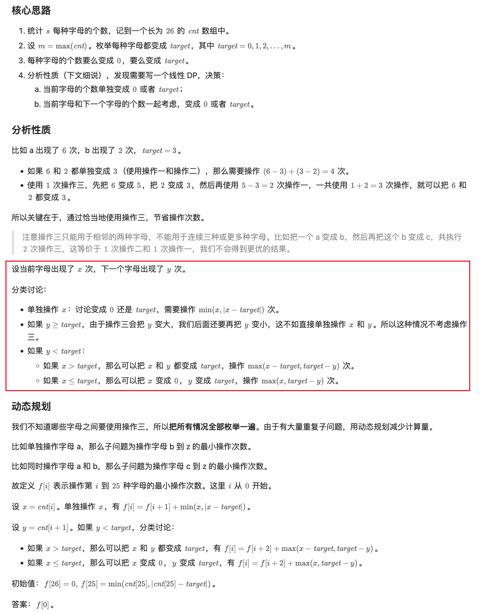

[3389. Minimum Operations to Make Character Frequencies Equal](https://leetcode.com/problems/minimum-operations-to-make-character-frequencies-equal/)


## Method 1. 思维分析 + DP

```java
class Solution {
    public int makeStringGood(String s) {
        int[] cnt = new int[26];
        for(char c: s.toCharArray()) {
            cnt[c - 'a']++;
        }

        int max = Arrays.stream(cnt).max().getAsInt();
        int res = s.length();   // target = 0
        int[] f = new int[27];
        for(int target=1; target<=max; target++) {
            f[25] = Math.min(cnt[25], Math.abs(cnt[25] - target));
            for(int i=24; i>=0; i--) {
                int x = cnt[i];
                if(x == 0) {
                    f[i] = f[i+1];
                    continue;
                }
                // 单独操作 x（变成 target 或 0）
                f[i] = f[i+1] + Math.min(x, Math.abs(x - target));

                // x 变成 target 或 0，y 变成 target
                int y = cnt[i+1];
                if(0 < y && y < target) {
                    int t = x > target ? target : 0;
                    f[i] = Math.min(f[i], f[i+2] + Math.max(x - t, target - y));
                }
            }
            res = Math.min(res, f[0]);
        }
        return res;
    }
}
```
**复杂度分析:**
* 时间复杂度：O(n∣Σ∣)，其中 n 是 s 的长度，∣Σ∣=26 是字符集合的大小。
* 空间复杂度：O(∣Σ∣)。


## Reference
* LeetCodeCN: 灵茶山艾府: [枚举+DP+分类讨论+优化（Python/Java/C++/Go）](https://leetcode.cn/problems/minimum-operations-to-make-character-frequencies-equal/solutions/3020630/mei-ju-dpfen-lei-tao-lun-pythonjavacgo-b-ahfn/)
* 灵茶山艾府: [思维+DP【力扣周赛 428】](https://www.bilibili.com/video/BV1pnqZYKEqr/?t=40m52s)
