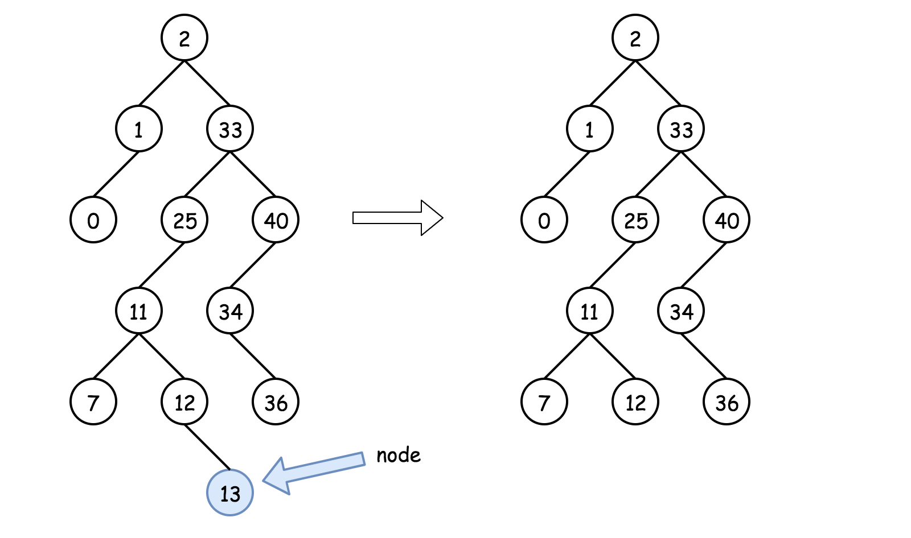
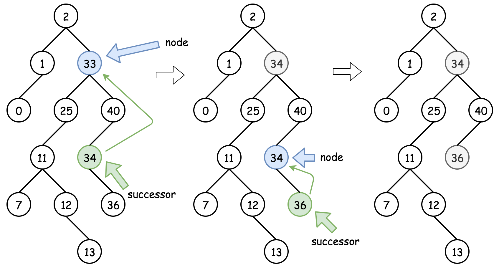
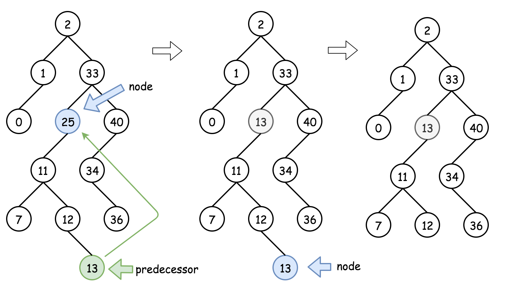

[450. Delete Node in a BST](https://leetcode.com/problems/delete-node-in-a-bst/)

* Microsoft, Amazon, Oracle, Cisco
* Tree
* Similar Questions:
    * 776.Split BST
    
    
* Three facts to know about BST:
    1. Inorder traversal of BST is an array sorted in the ascending order.  `left -> node -> right`
    2. Successor = "after node", i.e. the next node, or the smallest node *after* the current one.
        ```java 
        public int successor(TreeNode root) {
            root = root.right;
            while (root.left != null) root = root.left;
            return root;
        } 
        ```
    3. Predecessor = "before node", i.e. the previous node, or the largest node *before* the current one.
 
Algorithm:
These are three possible situations:
1. Node is a leaf, and one could delete it straightforward: `node = null`;

2. Node is not a leaf and has a right child. Then the node could be replaced by its **successor** which is somewhere lower in the right subtree. Then one could proceed down recursively to delete the curccessor.

3. Node is not a leaf, has no right child and has a left child. That means that its **successor** is somewhere upper in the tree but we don't want to go back. Let's use the **predecessor** here which is somewhere lower in the left subtree. The node could be replaced by its **predecessor** and then one could proceed down recursively to delete the predecessor.


## Method 1. [Solution](https://leetcode.com/problems/delete-node-in-a-bst/solution/)
```java 
class Solution {
    public TreeNode deleteNode(TreeNode root, int key) {
        if(root == null) {
            return null;
        }
        
        if(root.val < key) {        // The node need to delete is in right subtree
            root.right = deleteNode(root.right, key);
        } else if(root.val > key) { // The node need to delete is in left subtree
            root.left = deleteNode(root.left, key);
        } else {                    // Need to delete curr root
            if(root.left == null && root.right == null) {   // If the node is a leaf
                root = null;
            } else if(root.right != null) { // The root node has right subtree
                root.val = successor(root);
                root.right = deleteNode(root.right, root.val);
            } else {                        // The root node only has left subtree
                root.val = predecessor(root);
                root.left = deleteNode(root.left, root.val);
            }
        }
        return root;
    }
    
    // One step right and then always left
    private int successor(TreeNode node) {
        node = node.right;
        while(node.left != null) {
            node = node.left;
        }   // after the while loop, node.left = null
        return node.val;
    }
    
    // One step left and then always right
    private int predecessor(TreeNode node) {
        node = node.left;
        while(node.right != null) {
            node = node.right;
        }   // after the while loop, node.right = null
        return node.val;
    }
}
```
Complexity:

    Time complexity: Time complexity : O(log N). During the algorithm execution we go down the tree all the time - on the left or on the right, first to search the node to delete (O(H1) time complexity as already discussed) and then to actually delete it, delete process takes O(H2) time,
    Space complexity : O(H) to keep the recursion stack, where H is a tree height. H=log N for the balanced tree.
