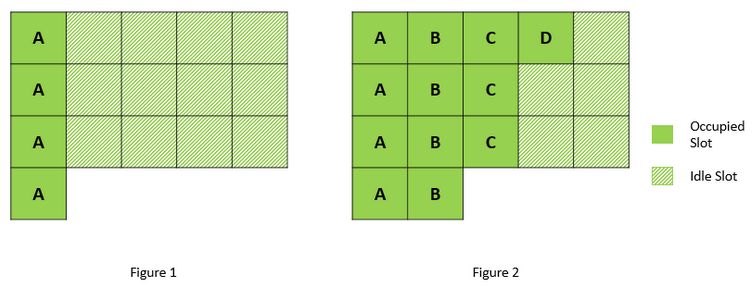

[621. Task Schedule](https://leetcode.com/problems/task-scheduler/)

* Facebook, Microsoft, Amazon, Bloomberg
* Array, Greedy, Queue
* Similar Questions:
    * [358. Rearrange String k Distance Apart](https://leetcode.com/problems/rearrange-string-k-distance-apart/)
    * [767. Reorganize String](https://leetcode.com/problems/reorganize-string/)
    

## Method 1. Greedy
The total number of CPU intervals we need consists of busy and idle slots. Number of busy slots 
is defined by the number of tasks to execute, i.e. `len(tasks)`. The rest problem is to compute 
a number of **idle slots**.


Key Points:
1. `maxVal = count[25] - 1`
2. `idleSlot -= Math.min(count[i], maxVal)`
```java
class Solution {
    public int leastInterval(char[] tasks, int n) {
        // Count the frequency of each task and then sort by frequency
        int[] count = new int[26];
        for(char c: tasks) {
            count[c-'A']++;
        }
        Arrays.sort(count);
        int maxVal = count[25] - 1;
        int idleSlot = maxVal * n;
        for(int i=24; i>=0; i--) {
            if(count[i] > 0) {
                idleSlot -= Math.min(count[i], maxVal);
            }
        }
        return (idleSlot > 0) ? idleSlot + tasks.length : tasks.length;
    }
}
```

Complexity Analysis:
1. Time Complexity: `O(N)`, where N is the number of tasks to execute. This time is needed to 
   iterate over the input array tasks and compute the array frequencies. Array frequencies 
   contains 26 elements, and hence all operations with it takes constant time.
2. Space Complexity: `O(1)`, to keep the array frequencies of 26 elements. 


## Method 2. [PriorityQueue](https://leetcode.com/problems/task-scheduler/discuss/104493/C%2B%2B-Java-Clean-Code-Priority-Queue)
Key Points:
1. To work on the same task again, CPU has to wait for time `n`, therefore, we can think of as 
   if there is a `cycle` of time `n + 1`, regardless whether you schedule some other task or not.
   假设每个大 cycle 是 `n + 1`，因为每个相同的任务之间需要 `n` 个间隔。
2. To avoid leave the CPU with limited choice of tasks and having to sit there cooling down 
   frequently at the end, it is critical to keep the diversity of the task pool for as long as 
   possible. 
3. In order to do that, we should try to schedule the CPU to **always try round robin between 
   the most popular tasks at any time**. 
```java
public class Solution {
    public int leastInterval(char[] tasks, int n) {
        Map<Character, Integer> counts = new HashMap<Character, Integer>();
        for (char t : tasks) {
            counts.put(t, counts.getOrDefault(t, 0) + 1);
        }

        PriorityQueue<Integer> pq = new PriorityQueue<Integer>((a, b) -> b - a);
        pq.addAll(counts.values());

        int alltime = 0;
        int cycle = n + 1;
        while (!pq.isEmpty()) {
            List<Integer> tmp = new ArrayList<Integer>();
            for (int i = 0; i < cycle; i++) {
                if (!pq.isEmpty()) {
                    tmp.add(pq.poll());
                }
            }
            for (int cnt : tmp) {
                if (--cnt > 0) {
                    pq.offer(cnt);
                }
            }
            alltime += !pq.isEmpty() ? cycle : tmp.size();
        }
        
        return alltime;
    }
}
```
