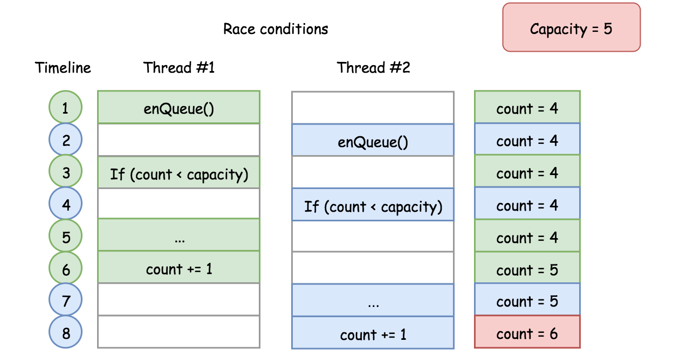
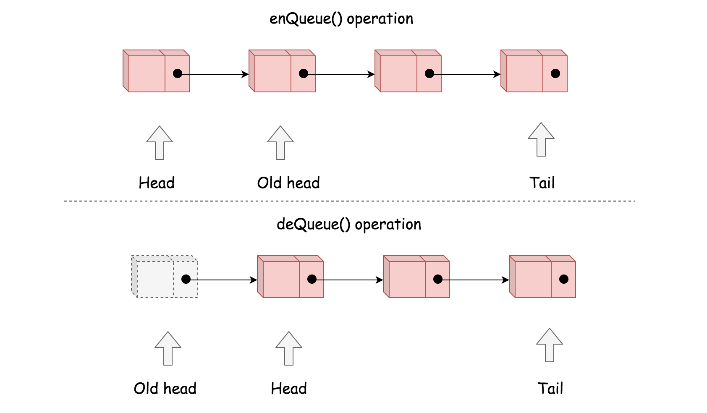

[622. Design Circular Queue](https://leetcode.com/problems/design-circular-queue/)

* Amazon, Facebook, Google, Apple
* Design, Queue
* Similar Questions
    * [641. Design Circular Deque](https://leetcode.com/problems/design-circular-deque/)
    * [1670. Design Front Middle Back Queue](https://leetcode.com/problems/design-front-middle-back-queue/)
    

## Method 1. Array
* When `startIdx == endIdx`, then empty;
* When `(endIdx + 1) % size == startIdx`, then full.
* To build a circular queue, we could form a virtual structure with the Array, via the 
  manipulation of index.
* Given a fixed size array, any of the elements could be considered as a head in a queue. As 
  long as we know the length of the queue, we then can instantly locate its tail, based on the 
  following formula:
  `tailIndex = (headIndex + count - 1) % capacity`
  * the `capacity` is the size of the array;
  * the `count` is the length of the queue;
  * the `headIndex` and `tailIndex` are the indice of head and tail elements respectively in the 
    array.
  

    
```java
class MyCircularQueue {
    
    private int[] queue;
    private int startIdx;
    private int capacity;
    private int count;
    
    // Initialize the data structure here. Set the size of the queue to be k.
    public MyCircularQueue(int k) {
        queue = new int[k];
        capacity = k;
        startIdx = 0;
        count = 0;
    }
    
    // Insert an element into the circular queue. Return true if the operation is successful.
    public boolean enQueue(int value) {
        if(count == capacity) {
            return false;
        }
        queue[(startIdx + count) % capacity] = value;
        count++;
        return true;
    }
    
    // Delete an element from the circular queue. Return true if the operation is successful.
    public boolean deQueue() {
        if(count == 0) {
            return false;
        }
        startIdx = (startIdx + 1) % capacity;
        count--;
        return true;
    }
    
    // Get the front element from the queue.
    public int Front() {
        if(count == 0) {
            return -1;
        } else {
            return queue[startIdx];
        }
    }
    
    // Get the last element from the queue.
    public int Rear() {
        if(count == 0) {
            return -1;
        } else {
            return queue[(startIdx + count - 1) % capacity];
            
        }
    }
    
    // Checks whether the circluar queue is empty or not.
    public boolean isEmpty() {
        return this.count == 0;
    }
    
    // Checks whether the circular queue is full or not.
    public boolean isFull() {
        return this.count == this.capacity;
    }
}

/**
 * Your MyCircularQueue object will be instantiated and called as such:
 * MyCircularQueue obj = new MyCircularQueue(k);
 * boolean param_1 = obj.enQueue(value);
 * boolean param_2 = obj.deQueue();
 * int param_3 = obj.Front();
 * int param_4 = obj.Rear();
 * boolean param_5 = obj.isEmpty();
 * boolean param_6 = obj.isFull();
 */
```
Complexity:
* Time complexity: O(1). All of the methods in circular data structure is of constant time 
  complexity.
* Space complexity: O(N). The overall space complexity of the data structure is linear, where N 
  is the pre-assigned capacity of the queue. However, it is worth that the memory consumption of 
  the data structure remains as its pre-assigned capacity during its entire life cycle.
  

### Improvement: Thread-Safe
A potnetial defect about above implementation is **concurrency**. One could end up with 
**corrupting** the data structure in a multi-threaded environment.


Take the function `enQueue(int value)` as an example, the following shows how we can make the 
function thread-safe in the following implementation.
```java
class MyCircularQueue {

  private Node head, tail;
  private int count;
  private int capacity;
  // Additional variable to secure the access of our queue
  private ReentrantLock queueLock = new ReentrantLock();

  /** Initialize your data structure here. Set the size of the queue to be k. */
  public MyCircularQueue(int k) {
    this.capacity = k;
  }

  /** Insert an element into the circular queue. Return true if the operation is successful. */
  public boolean enQueue(int value) {
    // ensure the exclusive access for the following block.
    queueLock.lock();
    try {
      if (this.count == this.capacity)
        return false;

      Node newNode = new Node(value);
      if (this.count == 0) {
        head = tail = newNode;
      } else {
        tail.nextNode = newNode;
        tail = newNode;
      }
      this.count += 1;

    } finally {
      queueLock.unlock();
    }
    return true;
  }
}
```


## Method 2. Singly-Linked List
Similar with Array, the **Linked List** is another common building block for more advanced data 
structures.
Different than a fixed size Array, a linked list could be more memory efficient, since it does 
not pre-allocated memory for unused capacity.



```java
class MyCircularQueue {
    
    private Node head;
    private Node tail;
    private int count;
    private int capacity;

    // Initialize the data structure. Set the size of the queue to be k.
    public MyCircularQueue(int k) {
        capacity = k;
    }
    
    // Insert an element into the circular queue. Return true if the operation is successful.
    public boolean enQueue(int value) {
        if(count == capacity) {
            return false;
        }
        Node newNode = new Node(value);
        if(count == 0) {
            head = tail = newNode;
        } else {
            tail.next = newNode;
            tail = newNode;
        }
        count++;
        return true;
    }
    
    // Delete an element from the circular queue. Return true if the operation is successfule.
    public boolean deQueue() {
        if(count == 0) {
            return false;
        }
        head = head.next;
        count--;
        return true;
    }
    
    // Get the front element from the queue
    public int Front() {
        if(count == 0) {
            return -1;
        } else {
            return head.value;
        }
    }
    
    // Get the last element from the queue.
    public int Rear() {
        if(count == 0) {
            return -1;
        } else {
            return tail.value;
        }
    }
    
    // Check whether the circular queue is empty or not.
    public boolean isEmpty() {
        return count == 0;
    }
    
    // Checks whether the circular queue is full or not.
    public boolean isFull() {
        return count == capacity;
    }
}

class Node {
    int value;
    Node next;
    
    public Node(int val) {
        value = val;
        next = null;
    }
}

/**
 * Your MyCircularQueue object will be instantiated and called as such:
 * MyCircularQueue obj = new MyCircularQueue(k);
 * boolean param_1 = obj.enQueue(value);
 * boolean param_2 = obj.deQueue();
 * int param_3 = obj.Front();
 * int param_4 = obj.Rear();
 * boolean param_5 = obj.isEmpty();
 * boolean param_6 = obj.isFull();
 */
```

Complexity
1. Time complexity: `O(1)` for each method in our circular queue. 
2. Space Complexity: The upper bound of the memory consumption for our circular queue would be 
   `O(N)`, same as the Array approach. However, it should be more memory efficient as we 
   discussed in the intuition section.   
