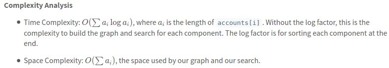

[721. Accounts Merge](https://leetcode.com/problems/accounts-merge/)

* Facebook, Amazon, Bloomberg, Google, Twitter
* Depth-First Search, Union Find
* Similar Questions
    * Redundant Connection
    * Sentence Similarity
    * Sentence Similarity II
* Hints:
    * For every pair of emails in the same account, draw an edge between those emails. The problem 
    is about enumerating the connected components of this graph.
    

1. Two accounts definitely belong to the same person if there is some email that is common to both accounts. 如果有人属于同一个 email，则是同一个 account。 
2. Note that even if two accounts have the same name, they may belong to different people as people could have the same name.
3. A person can have any number of accounts initially, but all of their accounts definitely have the same name.

Analysis:
1. HashMap: email -> name
2. HashMap: email -> primary email, i.e. the first email of each account

## Method 1. 
```java
class Solution {
    public List<List<String>> accountsMerge(List<List<String>> accounts) {
        Map<String, String> emailToName = new HashMap<>();
        Map<String, ArrayList<String>> graph = new HashMap<>();
        for(List<String> account: accounts) {
            String name = "";
            for(String email: account) {    // the first email actually is name
                if(name == "") {    // this si the first string, i.e. name
                    name = email;
                    continue;
                }
                // 1. map email to name
                emailToName.put(email, name);
                // 2. Connect all emails with the first email 
                graph.computeIfAbsent(email, x -> new ArrayList<String>()).add(account.get(1));
                // 3. Make sure the first email connect with all other emails.
                graph.computeIfAbsent(account.get(1), x -> new ArrayList<String>()).add(email);
            }
        }
        
        Set<String> seen = new HashSet<>();
        List<List<String>> res = new ArrayList<>();
        for(String email: graph.keySet()) {
            if(!seen.contains(email)) {
                seen.add(email);
                Deque<String> stack = new ArrayDeque<>();
                stack.push(email);
                List<String> component = new ArrayList<>();
                while(!stack.isEmpty()) {
                    String node = stack.pop();
                    component.add(node);
                    for(String nei: graph.get(node)) {
                        if(!seen.contains(nei)) {
                            seen.add(nei);
                            stack.push(nei);
                        }
                    }
                }
                Collections.sort(component);
                component.add(0, emailToName.get(email));
                res.add(component);
            }
        }
        return res;
    }
}
```

or more clear way

```java
class Solution {
    public List<List<String>> accountsMerge(List<List<String>> accounts) {
        
        Map<String, String> emailToName = new HashMap<>();
        Map<String, List<String>> graph = new HashMap<>();
        for(List<String> account: accounts) {
            String name = "";
            for(String email: account) {
                if(name == "") {
                    name = email;
                    continue;
                }
                // Email --> Name
                emailToName.put(email, name);
                // Build graph
                if(!graph.containsKey(account.get(1))) {
                    graph.put(account.get(1), new ArrayList<>());
                }
                graph.get(account.get(1)).add(email);
                if(!graph.containsKey(email)) {
                    graph.put(email, new ArrayList<>());
                }
                graph.get(email).add(account.get(1));
            }
        }
        
        // DFS to find component
        Set<String> seen = new HashSet<>();
        List<List<String>> res = new ArrayList<>();
        for(String email: graph.keySet()) {
            if(!seen.contains(email)) {
                List<String> component = new ArrayList<>();
                Deque<String> stack = new ArrayDeque<>();
                stack.push(email);
                seen.add(email);
                while(!stack.isEmpty()) {
                    String node = stack.pop();
                    component.add(node);
                    for(String nei: graph.get(node)) {
                        if(!seen.contains(nei)) {
                            stack.push(nei);
                            seen.add(nei);
                        }
                    }
                }
                Collections.sort(component);
                component.add(0, emailToName.get(email));
                res.add(component);
            }
        }
        return res;
    }
}
```



## Method 2. Union Find
Key Points:
1. Map each email to its owner, i.e. `email --> name`, each email just have one name, and more than one email could have the same name;
2. Map each email to a unique id;
3. Union email to the first email in its account, after union, the emails in the same component will have the same parent id;
4. Put the emails have the same parent id into the same account.
5. Sort and add name to each list.
6. 每个 email 只能有一个 unique id；
7. 每个 account 的第一个 email 是 primary email，i.e. 是这个 component 的 root。
```java
class Solution {
    public List<List<String>> accountsMerge(List<List<String>> accounts) {
        DSU dsu = new DSU();
        Map<String, String> emailToName = new HashMap<>();
        Map<String, Integer> emailToID = new HashMap<>();
        
        int id = 0;
        for(List<String> account: accounts) {
            String name = "";
            for(String email: account) {
                if(name == "") {
                    name = email;
                    continue;
                }
                emailToName.put(email, name);
                if(!emailToID.containsKey(email)) { // make sure each email just has one and only one ID
                    emailToID.put(email, id++);
                }
                dsu.union(emailToID.get(account.get(1)), emailToID.get(email));
            }
        }
        
        Map<Integer, List<String>> ans = new HashMap<>();
        for(String email: emailToName.keySet()) {   
            int idx = dsu.find(emailToID.get(email));   // The emails belong to one component have the same ID
            if(!ans.containsKey(idx)) {
                ans.put(idx, new ArrayList<>());
            }
            ans.get(idx).add(email);
        }
        
        for(List<String> component: ans.values()) {
            Collections.sort(component);
            component.add(0, emailToName.get(component.get(0)));
        }
        return new ArrayList(ans.values());
    }
}

class DSU {
    int[] parent;
    
    public DSU() {
        parent = new int[10001];
        for(int i=0; i<=10000; i++) {
            parent[i] = i;
        }
    }
    
    public int find(int x) {
        if(parent[x] != x) {
            parent[x] = find(parent[x]);
        }
        return parent[x];
    }
    
    public void union(int x, int y) {
        parent[find(x)] = find(y);
    }
}
```


