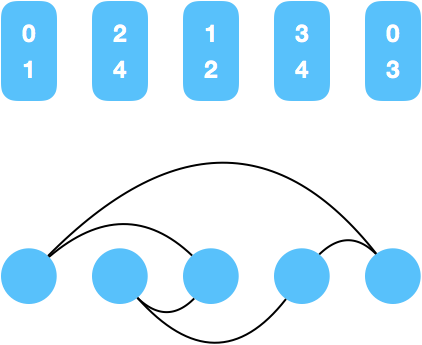

[765. Couples Holding Hands](https://leetcode.com/problems/couples-holding-hands/)

* Google, Amazon
* Greedy, Union Find, Graph
* Similar Questions:
    * First Missing Positive
    * Missing Number
    * K-Similar Strings
* Hints:
    * Say there are n two-seat couches. For each couple, draw an edge from the couch of one parter 
    to the couch of the other partner.
    
    
> Analysis:         
> Call a person happy if they are with their partner on the same couch. Intuitively, a swap 
> that keeps both persons swapped unhappy is not part of some optimal solution. We'll call this 
> the happy swap assumption (HSA).


## Method 1. Cycle Finding

Key Points:
1. **N Integers Problem** 
给定一个长度为 N 的 array `nums`，包含整数 `[0, N-1]`，但是随机排列。你可以随机选择两个数字并且交换他们的位置。
试问，最少需要多少次 swap，能保证 `i == nums[i]` for `0 <= i < N` (or equivalently, to sort this integer
array)?
**First**, 应用 cyclic swapping algorithm (循环交换算法)，我们需要将 N 个索引(indice)分成互斥的索引组，
其中每个索引组形成一个循环: `i0 --> i1 --> ... --> ik --> i0`，也就是在 swap process 结束后， `nums[i0]` 
应该出现在索引为 `i1` 的位置。
如下面的简单例子：
```
nums : 2, 3, 1, 0, 5, 4
idx  : 0, 1, 2, 3, 4, 5
```
从 index 0 开始，在 index 0 的数字最终应该放在什么地方？答案是 `nums[0]`，也就是数字 `2` 应该出现在 index 2 的
位置。同理，`nums[1]` 应该出现在 index `nums[i]` 的地方，...
最终我们可以得到两个相互分离的索引组：
`0 --> 2 --> 1 --> 3 --> 0`
`4 --> 5 --> 4`
根据上述两个例子，可以看出每个 list 首尾都是一样的，也就是形成了一个闭环。
**Next**, 索引组 g1 和 g2 应该是互斥的(mutually exclusive)。如果 index j 同时出现在 g1, g2 中，则 g1, g2
可以形成以 j 为 starting index 的闭环。
**Lastly**, 将一个 size 为 `k` 的 group 完成排序，最少需要 `k-1` 次 swap。 

    1. Size 1 groups: 0 --> 0, 2 --> 2, etc.
    2. Size 2 groups: 0 --> 3 --> 0, 2 --> 1 --> 2, etc.
    3. ......
    4. Size k groups: 0 --> 1 --> 2 --> ... --> (k-1) --> 0, etc.

2. `N couples problem`, 
N couples problem 可以使用与 N integers 相同的想法，除了对每个数字不同的放置要求: Instead of `i == row[i]`,
we require `i = ptn[pos[ptn[row[i]]]]`, where are have defined two additional arrays `ptn` and `pos`.

    1. `ptn[i]` denotes the partner of label `i` (`i` can be either a seat or person):
        * `ptn[i] = i + 1` if `i` is even, for example, `ptn[0] = 1`
        * `ptn[i] = i - 1` if `i` is odd, for example, `ptn[3] = 2`
    2. `pos[i]` denotes the index of the person with label `i` in the `row` array, `row[pos[i]] == i`.
   

The meaning of `i == ptn[pos[ptn[row[i]]]]` is as follows:
    
    1. The person sitting at seat `i` has a label `row[i]`, and we want to place him/her next to 
    his/her partner.
    2. So we first find the label of his/her partner, which is given by `ptn[row[i]]`, i.e. row[i]'s partner.
    3. We then find the seat of his/her partner, which is given by `pos[pnt[row[i]]]`.
    4. Lastly, we find the seat next to his/her partner's seat, which is given by `ptn[pos[pth[row[i]]]`

```java
class Solution {
    public int minSwapsCouples(int[] row) {
        int res = 0;
        int N = row.length;
        
        int[] ptn = new int[N];
        int[] pos = new int[N];
        
        for(int i=0; i<N; i++) {
            ptn[i] = (i % 2 == 0 ? i + 1 : i - 1);
            pos[row[i]] = i;
        }
        
        for(int i=0; i<N; i++) {
            for(int j=ptn[pos[ptn[row[i]]]]; i != j; j = ptn[pos[ptn[row[i]]]]) {
                swap(row, i, j);
                swap(pos, row[i], row[j]);
                res++;
            }
        }
        return res;
    }
    
    private void swap(int[] arr, int i, int j) {
        int t = arr[i];
        arr[i] = arr[j];
        arr[j] = t;
    }
}
```


## Method 2. 

Key Points:
1. 一个数 ‘异或’ 上1就是其另一个位，这个不难理解，如果是偶数的话，最后位是0，‘异或’上1等于加了1，变成了可以的成对奇数。如果是奇数的话，最后位是1，‘异或’上1后变为了0，变成了可以的成对偶数。
    `2 ^ 1 = 3`, `3 ^ 1 = 2`
2. 每次遇到不匹配的 couple 的时候，肯定需要进行一次交换，保证当前 couple 是成功配对的。
```java
class Solution {
    public int minSwapsCouples(int[] row) {
        int res = 0;
        int n = row.length;
        for(int i=0; i<n; i+=2) {
            if(row[i+1] == (row[i] ^ 1)) {
                continue;
            }
            res++;
            for(int j=i+1; j<n; j++) {
                if(row[j] == (row[i] ^ 1)) {
                    row[j] = row[i + 1];
                    row[i+1] = row[i] ^ 1;
                    break;
                }
            }
        }
        return res;
    }
}
```

## Reference
1. [Java/C++ O(N) solution using cyclic swapping](https://leetcode.com/problems/couples-holding-hands/discuss/113362/JavaC%2B%2B-O(N)-solution-using-cyclic-swapping)


1. For each couple sitting at couches X and Y (possibly the same), draw an undirected edge from X 
to Y. Call such a graph the **couple graph**. This graph is 2-regular (every node has degree 2), 
and it is easy to see that every connected component of this graph must be a cycle.