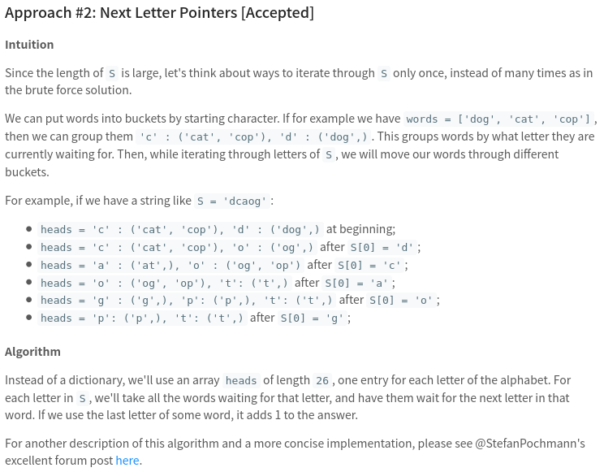

[792. Number of Matching Subsequences](https://leetcode.com/problems/number-of-matching-subsequences/)

* Google
* Array
* Similar Questions:
    * 392.Is Subsequence
    * Shortest Way to Form String
    
   
## Method 1. My Solution with Two Pointers 
```java
class Solution {
    public int numMatchingSubseq(String S, String[] words) {
        int res = 0;
        Map<String, Integer> map = new HashMap<>();
        for(String word: words) {
            map.put(word, map.getOrDefault(word, 0) + 1);
        }
        for(String word: map.keySet()) {
            if(isSubsequence(S, word)) {
                res += map.get(word);
            }
        }
        return res;
    }
    
    private boolean isSubsequence(String s, String t) {
        if(t.length() > s.length()) {
            return false;
        }
        int i = 0;  // index of s
        int j = 0;  // index of t
        while(i < s.length() && j < t.length()) {
            if(s.charAt(i) == t.charAt(j)) {
                j++;
            }
            i++;
        }
        return j == t.length();
    }
}
```


## Method 2. Next Letter Pointers

> Since the length of `S` is large, we may try to think about ways to iterate through `S` only once instead of many times.
>
> For each letter in `S`, we'll take all the words waiting for that letter, and have them wait for the next letter in that word. []
> If we use the last letter of some word, it adds 1 to the answer.
```java
class Solution {
    public int numMatchingSubseq(String S, String[] words) {
        Queue<Node>[] lists = new LinkedList[26];
        
        for(int i = 0; i < 26; i++){
            lists[i] = new LinkedList<>();
        }
        
        for(String word: words){
            lists[word.charAt(0) - 'a'].add(new Node(word, 0));
        }
        
        int res = 0;
        for(int i = 0; i < S.length(); i++){
            Queue<Node> list = lists[S.charAt(i) - 'a'];
            int size = list.size();
            for(int j = 0; j < size; j++){
                Node node = list.poll();
                node.index++;
                if(node.index == node.word.length()){
                    res++;
                }else{
                    lists[node.word.charAt(node.index) - 'a'].add(node);
                }
            }
        }
        
        return res;
        
    }
    
    private class Node{
        String word;
        int index;
        
        public Node(String word, int index){
            this.word = word;
            this.index = index;
        }
    }
}
```

