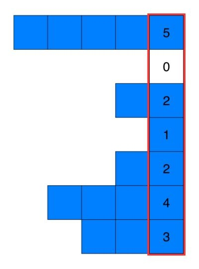

[85. Maximal Rectangle](https://leetcode.com/problems/maximal-rectangle/)

* Google, Amazon, Microsoft, Bloomberg, Uber, Wayfair, Citadel
* Array, Hash Table, Dynamic Programming, Stack
* Similar Questions:
    * [84. Largest Rectangle in Histogram](https://leetcode.com/problems/largest-rectangle-in-histogram/)
    * [221. Maximal Square](https://leetcode.com/problems/maximal-square/)
    

## Method 1. Dynamic Programming - Better Brute Force on Histograms
Intuition:
1. `maxWidth = min(maxWidth, widthHere)`
2. `curArea = maxWidth * (curRow - startRow + 1)`
3. `maxArea = max(maxArea, curArea)`

Key Points:
1. 当遇到 `1` 的时候，计算以这个 `1` 为右下角的定点的 Max Area。


```java
class Solution {
    public int maximalRectangle(char[][] matrix) {
        // Corner case.
        if(matrix == null || matrix.length == 0) {
            return 0;
        }
        
        // dp[i][j], represents the longest width ended at j-th index in i-th row
        int[][] dp = new int[matrix.length][matrix[0].length];
        int maxArea = 0;
        for(int i=0; i<matrix.length; i++) {
            for(int j=0; j<matrix[0].length; j++) {
                if(matrix[i][j] == '1') {   // Only proceed when matrix[i][j] == 1
                    dp[i][j] = (j == 0) ? 1 : dp[i][j-1] + 1;
                    
                    int width = dp[i][j];
                    for(int k=i; k>=0; k--) {   // width represents the minWidth
                        width = Math.min(width, dp[k][j]);
                        maxArea = Math.max(maxArea, width * (i - k + 1));
                    }
                }
            }
        }
        return maxArea;
    }
}
```

Complexity:
1. Time complexity : `O(N^2 * M)`. Computing the maximum area for one point takes `O(N)` time, since it iterates over the values in the same column. 
This is done for all `N∗M` points, giving `O(N)∗O(N M) = O(N^2 M)`.
2. Space complexity : `O(NM)`. We allocate an equal sized array to store the maximum width at each point.

 
## Method 2.
Intuition:
1. If we want to calculate the area of a rectangle, we need to know the height and width of this rectangle.
2. For the width, if the left and right boundary is `[left, right)`, then the `width = right - left`.
3. `if(matrix[i][j] == 0)`, then the possible left boundary for next `1` would be `j+1`, therefore, we set `leftBoundary = j + 1`. Because the element at `j` index is 0, the next possible non-zero could only start from `j+1`.
4. `if(matrix[i][j] == 0)`, then the possible right boundary for previous `1` could be `j-1`, therefore, we set `rightBoundary = j`.
 
```java
class Solution {
    public int maximalRectangle(char[][] matrix) {
        if(matrix == null || matrix.length == 0) {
            return 0;
        }
        
        int rows = matrix.length;
        int cols = matrix[0].length;
        int[] left = new int[cols];
        int[] right = new int[cols];
        int[] height = new int[cols];
        Arrays.fill(right, cols);
        
        int maxArea = 0;
        for(int i=0; i<rows; i++) {
            int leftBoundary = 0;
            int rightBoundary = cols;
            
            // Update height
            for(int j=0; j<cols; j++) {
                if(matrix[i][j] == '1') {
                    height[j]++;
                } else {
                    height[j] = 0;
                }
            }
            
            // Update left
            for(int j=0; j<cols; j++) {
                if(matrix[i][j] == '1') {
                    left[j] = Math.max(left[j], leftBoundary);      //(j == 0) ? 0 : leftBoundary;
                } else {
                    left[j] = 0;
                    leftBoundary = j + 1;   // since this is 0, the only possible boundary is j+1
                }
            }
            
            // Update right
            for(int j=cols-1; j>=0; j--) {
                if(matrix[i][j] == '1') {
                    right[j] = Math.min(right[j], rightBoundary);   //(j == cols-1) ? cols : rightBoundary;
                } else {
                    right[j] = cols;
                    rightBoundary = j;      // Since this is 0, the only possible boundary is j-1, using exclusion, i.e. j
                }
            }
            
            // Update max Area
            for(int j=0; j<cols; j++) {
                maxArea = Math.max(maxArea, height[j] * (right[j] - left[j]));
            }
        }
        return maxArea;
    }
}
```
Complexity Analysis
1. Time complexity : `O(NM)`. In each iteration over N we iterate over M a constant number of times.
2. Space complexity : `O(M)`. M is the length of the additional arrays we keep.


