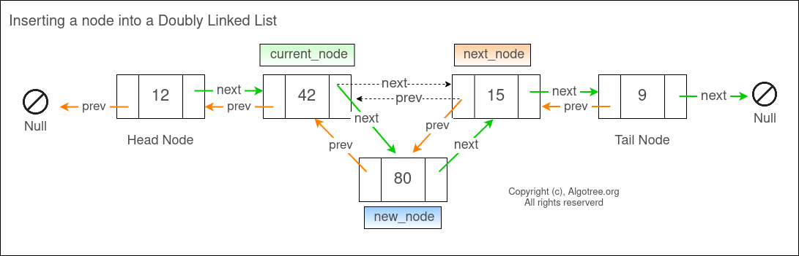
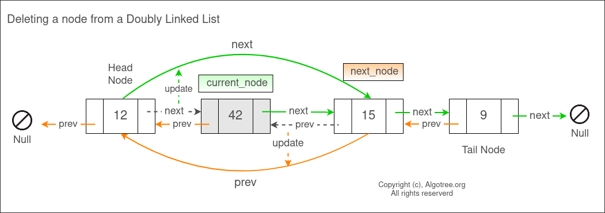

# 按照 Data Structure 和 Algorithm 归类

## 1. Data Structure

### String
* [8. String to Integer (atoi)](https://leetcode.com/problems/string-to-integer-atoi/)
* [65. Valid Number](https://leetcode.com/problems/valid-number/description/)
* [2914. Minimum Number of Changes to Make Binary String Beautiful](https://leetcode.com/problems/minimum-number-of-changes-to-make-binary-string-beautiful/)
* [824. Goat Latin](https://leetcode.com/problems/goat-latin/)
* [394. Decode String](https://leetcode.com/problems/decode-string/)
* [443. String Compression](https://leetcode.com/problems/string-compression/)
* [38. Count and Say](https://leetcode.com/problems/count-and-say/)
* [273. Integer to English Words](https://leetcode.com/problems/integer-to-english-words/)


### Array & Matrix --TODO
### Array: Intervals (Array, List) 🟨🌟
- [x] [56. Merge Intervals](https://leetcode.com/problems/merge-intervals)
- [x] [88. Merge Sorted Array](https://leetcode.com/problems/merge-sorted-array/)
- [x] [759. Employee Free Time](https://leetcode.com/problems/employee-free-time/)
- [x] [986. Interval List Intersections](https://leetcode.com/problems/interval-list-intersections)
- [x] [2410. Maximum Matching of Players With Trainers](https://leetcode.com/problems/maximum-matching-of-players-with-trainers/)
- [ ] [163. Missing Ranges](https://leetcode.com/problems/missing-ranges/)


### Matrix
* [766. Toeplitz Matrix](https://leetcode.com/problems/toeplitz-matrix/)
* [498. Diagonal Traverse](https://leetcode.com/problems/diagonal-traverse/)
* [529. Minesweeper](https://leetcode.com/problems/minesweeper/)
* [48. Rotate Image](https://leetcode.com/problems/rotate-image/)
* [296. Best Meeting Point](https://leetcode.com/problems/best-meeting-point/)

### List: ArrayList, LinkedList
* [2. Add Two Numbers](https://leetcode.com/problems/add-two-numbers/)
* [708. Insert into a Sorted Circular Linked List](https://leetcode.com/problems/insert-into-a-sorted-circular-linked-list/)
* [19. Remove Nth Node From End of List](https://leetcode.com/problems/remove-nth-node-from-end-of-list/)
* [143. Reorder List](https://leetcode.com/problems/reorder-list/)
* [21. Merge Two Sorted Lists](https://leetcode.com/problems/merge-two-sorted-lists/)
* 

### Doubly Linked List
<code style="color : Red">Doubly Linked List: Design Caches:</code>
使用 Doubly Linked List 是要用到带有前后指针（reference）的节点。
```java
class Node {
    int key;    // Normally, the key is optional. When we need use a map, it will be required.
    int value;
    Node prev;
    Node next;
}
```
- [ ] [146. LRU Cache](https://leetcode.com/problems/lru-cache/)
- [ ] [460. LFU Cache](https://leetcode.com/problems/lfu-cache/)
  - 要将obj放入集合中，并且可排序，需要实现Comparable接口
  - 要重写`equals()`方法

向 Doubly LinkedList 中添加一个新节点：


从 Doubly LinkedList 中删除一个节点：


- [ ] [146. LRU Cache](https://leetcode.com/problems/lru-cache/)
- 

### Queue & Stack

### Queue: ArrayDeque, LinkedList
- [ ] [621. Task Scheduler](https://leetcode.com/problems/task-scheduler/)
- [ ] [767. Reorganize String](https://leetcode.com/problems/reorganize-string/)
- [ ] [358. Rearrange String k Distance Apart](https://leetcode.com/problems/rearrange-string-k-distance-apart/)
- [ ] [353. Design Snake Game](https://leetcode.com/problems/design-snake-game/)
- [ ] 🟩⭐[346. Moving Average from Data Stream](https://leetcode.com/problems/moving-average-from-data-stream/)  **circular queue or array**
- [ ] [622. Design Circular Queue](https://leetcode.com/problems/design-circular-queue/)
- [ ] [641. Design Circular Deque](https://leetcode.com/problems/design-circular-deque/)
- [ ] [1670. Design Front Middle Back Queue](https://leetcode.com/problems/design-front-middle-back-queue/)
- [x] [933. Number of Recent Calls](https://leetcode.com/problems/number-of-recent-calls/)
- [x] [582.Kill Process](https://leetcode.com/problems/kill-process/)


(20200901)
- [x] 621.Task Schedule
  - [x] 358.Rearrange String k Distance Apart
  - [x] 767.Reorganize String
- [x] 363.Max Sum of Rectangle No Larger Than K
  [71. Simplify Path](https://leetcode.com/problems/simplify-path/)

### Queue: PriorityQueue
* [23. Merge k Sorted Lists](https://leetcode.com/problems/merge-k-sorted-lists/) [PriorityQueue]
* [253. Meeting Rooms II](https://leetcode.com/problems/meeting-rooms-ii/)
* [215. Kth Largest Element in an Array](https://leetcode.com/problems/kth-largest-element-in-an-array/description/)
* 🟨🌟[347. Top K Frequent Elements](https://leetcode.com/problems/top-k-frequent-elements/)
* 🟨🌟[973. K Closest Points to Origin](https://leetcode.com/problems/k-closest-points-to-origin/description/)
* 🟨🌟[692. Top K Frequent Words](https://leetcode.com/problems/top-k-frequent-words/description/)
* [295. Find Median from Data Stream](https://leetcode.com/problems/find-median-from-data-stream/)
* [703. Kth Largest Element in a Stream](https://leetcode.com/problems/kth-largest-element-in-a-stream/)
* [1845. Seat Reservation Manager](https://leetcode.com/problems/seat-reservation-manager/)


### Stack: ArrayDeque
* [20. Valid Parentheses](https://leetcode.com/problems/valid-parentheses/)
* [1047. Remove All Adjacent Duplicates In String](https://leetcode.com/problems/remove-all-adjacent-duplicates-in-string/)
* [636. Exclusive Time of Functions](https://leetcode.com/problems/exclusive-time-of-functions/)
* [735. Asteroid Collision](https://leetcode.com/problems/asteroid-collision/)
* [394. Decode String](https://leetcode.com/problems/decode-string/)

### Stack: Monotonic Stack
- [ ] [1762. Buildings With an Ocean View](https://leetcode.com/problems/buildings-with-an-ocean-view/)

### Hash Table: HashSet & HashMap
* An Anagram is a word or phrase formed by rearranging the letters of a different word or phrase, using all the original letters exactly once.
* "Anagrams"（字谜或字母重排）是指通过重新排列一个单词或短语中的字母，形成另一个具有不同意义的单词或短语。比如，“listen”这个词的字母可以重排为“silent”，两者是一个典型的字谜。

- [ ] [249. Group Shifted Strings](https://leetcode.com/problems/group-shifted-strings/description/) [HashTable, the way to generate hash key]
- [ ] [560. Subarray Sum Equals K](https://leetcode.com/problems/subarray-sum-equals-k/) [HashTable, Prefix Sum]
- [ ] [2744. Find Maximum Number of String Pairs](https://leetcode.com/problems/find-maximum-number-of-string-pairs/description/)


### Tree
🟩🌟[一篇文章解决所有二叉树路径问题（问题分析+分类模板+题目剖析）](https://leetcode.cn/problems/smallest-string-starting-from-leaf/solutions/1/yi-pian-wen-zhang-jie-jue-suo-you-er-cha-10sk/)

- [ ] [987. Vertical Order Traversal of a Binary Tree](https://leetcode.com/problems/vertical-order-traversal-of-a-binary-tree/description/)
- [ ] [314. Binary Tree Vertical Order Traversal](https://leetcode.com/problems/binary-tree-vertical-order-traversal/description/)

### Tree: Traversal
- [x] [94. Binary Tree Inorder Traversal](https://leetcode.com/problems/binary-tree-inorder-traversal/)  **recursion + iteration, morris**
- [x] [144. Binary Tree Preorder Traversal](https://leetcode.com/problems/binary-tree-preorder-traversal/) **recursion + iteration, morris**
- [x] [145. Binary Tree Postorder Traversal](https://leetcode.com/problems/binary-tree-postorder-traversal/)  **recursion + iteration**
- [x] [589. N-ary Tree Preorder Traversal](https://leetcode.com/problems/n-ary-tree-preorder-traversal/)  **1.注意 iterative 的写法，基于 Stack 实现；   2.recursion**
- [x] [590. N-ary Tree Postorder Traversal](https://leetcode.com/problems/n-ary-tree-postorder-traversal/)  **1.注意 iterative 的写法，基于 Stack 实现；   2.recursion**
- [x] [314. Binary Tree Vertical Order Traversal](https://leetcode.com/problems/binary-tree-vertical-order-traversal/)  **Pair; Two Queue**
- [x] [102. Binary Tree Level Order Traversal](https://leetcode.com/problems/binary-tree-level-order-traversal/)  **BFS; recursion**
- [x] [107. Binary Tree Level Order Traversal II](https://leetcode.com/problems/binary-tree-level-order-traversal-ii/)   **LinkedList.addFirst(); Collections.reverse()**
- [x] [103. Binary Tree Zigzag Level Order Traversal](https://leetcode.com/problems/binary-tree-zigzag-level-order-traversal/)
- [x] [429. N-ary Tree Level Order Traversal](https://leetcode.com/problems/n-ary-tree-level-order-traversal/) **BFS; Recursion**

- [x] [199. Binary Tree Right Side View](https://leetcode.com/problems/binary-tree-right-side-view/)
- [x] [124. Binary Tree Maximum Path Sum](https://leetcode.com/problems/binary-tree-maximum-path-sum/)
- [x] [236. Lowest Common Ancestor of a Binary Tree](https://leetcode.com/problems/lowest-common-ancestor-of-a-binary-tree/)
- [x] [297. Serialize and Deserialize Binary Tree](https://leetcode.com/problems/serialize-and-deserialize-binary-tree/)
- [x] [105. Construct Binary Tree from Preorder and Inorder Traversal](https://leetcode.com/problems/construct-binary-tree-from-preorder-and-inorder-traversal/)

* 

#### Path, Path Sum
* [129. Sum Root to Leaf Numbers](https://leetcode.com/problems/sum-root-to-leaf-numbers)
* [112. Path Sum](https://leetcode.com/problems/path-sum/)
* [124. Binary Tree Maximum Path Sum](https://leetcode.com/problems/binary-tree-maximum-path-sum/)
* [988. Smallest String Starting From Leaf](https://leetcode.com/problems/smallest-string-starting-from-leaf/)
* [124. Binary Tree Maximum Path Sum](https://leetcode.com/problems/binary-tree-maximum-path-sum/)


#### Diameter
- [ ] [543. Diameter of Binary Tree](https://leetcode.com/problems/diameter-of-binary-tree/)
- [ ] [1522. Diameter of N-Ary Tree](https://leetcode.com/problems/diameter-of-n-ary-tree/)

#### Balanced Search Tree
* [108. Convert Sorted Array to Binary Search Tree](https://leetcode.com/problems/convert-sorted-array-to-binary-search-tree/)
* [109. Convert Sorted List to Binary Search Tree](https://leetcode.com/problems/convert-sorted-list-to-binary-search-tree/)
* [1382. Balance a Binary Search Tree](https://leetcode.com/problems/balance-a-binary-search-tree/description/)

### Tree Traversal (树的遍历)  🟩🌟 
* 🟩🌟[102. Binary Tree Level Order Traversal](https://leetcode.com/problems/binary-tree-level-order-traversal/) [最直接的BFS]
* 🟩🌟[314. Binary Tree Vertical Order Traversal](https://leetcode.com/problems/binary-tree-vertical-order-traversal/) [垂直遍历, BFS]
* 🟩🌟[987. Vertical Order Traversal of a Binary Tree](https://leetcode.com/problems/vertical-order-traversal-of-a-binary-tree/)  [Traversal + Comparable]
* [103. Binary Tree Zigzag Level Order Traversal](https://leetcode.com/problems/binary-tree-zigzag-level-order-traversal/)

### Tree: Convert to Doubly LinkedList
- [ ] [426. Convert Binary Search Tree to Sorted Doubly Linked List](https://leetcode.com/problems/convert-binary-search-tree-to-sorted-doubly-linked-list/)

### Tree: Construct a Tree
* [536. Construct Binary Tree from String](https://leetcode.com/problems/construct-binary-tree-from-string/)
* [109. Convert Sorted List to Binary Search Tree](https://leetcode.com/problems/convert-sorted-list-to-binary-search-tree/)

### Tree: Search
- [x] 700.Search in a Binary Search Tree        : recuresion + iteration
- [x] 270.Closest Binary Search Tree Value      : recuresion + iteration
- [x] 272.Closest Binary Search Tree Value II   : stack
- [x] 230.Kth Smallest Element in a BST         : inorder traversal(recursion, iteration)
- [x] 671.Second Minimum Node in a Binary Tree  : 
- [x] 255.Verify Preorder Sequence in Binary Search Tree    : recuresion + iteration

### Tree: Merge, Split, Delete and Insert
- [x] 617.Merge Two Binary Trees    : recursion + iteration
- [x] 776.Split BST
- [x] 450.Delete Node in a BST      : predecessor & successor
- [x] 701.Insert into a Binary Search Tree  : recursion + iteration

### Tree: Depth & Distance
* [863. All Nodes Distance K in Binary Tree](https://leetcode.com/problems/all-nodes-distance-k-in-binary-tree/)
- [x] 104.Maximum Depth of Binary Tree      : BFS, DFS, Recursion
- [x] 111.Minimum Depth of Binary Tree      : BFS, Recursion
- [x] 110.Balanced Binary Tree              : top down approach + bottom up approach
- [x] 559.Maximum Depth of N-ary Tree       : recursion, DFS, BFS
- [x] 637.Average of Levels in Binary Tree  :
- [x] 993.Cousins in Binary Tree
- [ ] 222.Count Complete Tree Nodes         : Recursion, Binary Search 
* Others
- [x] 98.Validate Binary Search Tree
- [x] 501.Find Mode in Binary Tree          : Follow up, no extra space. Inorer traversal: 升序


- [x] 426.Convert Binary Search Tree to Sorted Doubly Linked List
- [x] 783.Minimum Distance Between BST Nodes
- [x] 285.Inorder Successor in BST
- [x] 173.Binary Search Tree Iterator       : essentially, this is about inorder traversal 

下面三道题都是将一个线性的array or list，创建成一个Balanced binary tree。思路都是取中间element创建root节点，然后以recursion的方式创建左右子树。
- [x] 🟩 [1382. Balance a Binary Search Tree](https://leetcode.com/problems/balance-a-binary-search-tree)
  - [ ] [108. Convert Sorted Array to Binary Search Tree](https://leetcode.com/problems/convert-sorted-array-to-binary-search-tree/description/)
  - [ ] [109. Convert Sorted List to Binary Search Tree](https://leetcode.com/problems/convert-sorted-list-to-binary-search-tree/description/)

 

### Trie, 字典树
- [ ] 692.Top K Frequent Words
- [ ] 211.Design Add and Search Words Data Structure
- [ ] 212.Word Search II
- [ ] 472.Concatenated Words
- [ ] 336.Palindrome Pairs
- [ ] 642.Design Search Autocomplete System
- [ ] 208.Implement Trie (Prefix Tree)
- [ ] 421.Maximum XOR of Two Numbers in an Array
- [ ] 720.Longest Word in Dictionary
- [x] 🟩🌟 [386. Lexicographical Numbers](https://leetcode.com/problems/lexicographical-numbers)

- [ ] [677. Map Sum Pairs](https://leetcode.com/problems/map-sum-pairs/)
- [ ] 648.Replace Words
- [ ] Add and Search Word -


* [208. Implement Trie (Prefix Tree)](https://leetcode.com/problems/implement-trie-prefix-tree/description/)
  * [CNoodle: [LeetCode] 208. Implement Trie (Prefix Tree)](https://www.cnblogs.com/cnoodle/p/12460150.html)
* [211. Design Add and Search Words Data Structure](https://leetcode.com/problems/design-add-and-search-words-data-structure/description/)
  * [CNoodle: [LeetCode] 211. Design Add and Search Words Data Structure](https://www.cnblogs.com/cnoodle/p/12460148.html)


Maximum XOR of Two Numbers in an Array
Word Search II
Word Square
Palindrome Pairs


## 2. Algorithm
### Sorting 排序


### Sorting: Bucket Sorting
- [ ] [56. Merge Intervals](https://leetcode.com/problems/merge-intervals/)


#### LeetCode题目
- [ ] ✅⭐ [215. Kth Largest Element in an Array](https://leetcode.com/problems/kth-largest-element-in-an-array/)
- [ ] ✅⭐ [347. Top K Frequent Elements](https://leetcode.com/problems/top-k-frequent-elements/)
- [ ] ✅⭐ [973. K Closest Points to Origin](https://leetcode.com/problems/k-closest-points-to-origin/)

### Sort: Topological Sort
* [269. Alien Dictionary](https://leetcode.com/problems/alien-dictionary/)
* [207. Course Schedule](https://leetcode.com/problems/course-schedule/)


### Backtracking
**Typical Problems**
* Subsets
* Combinations
* Combination Sum
* Permutation
* Parentheses
- [x] 🟩🌟 Parentheses
  - [x] [22. Generate Parentheses](https://leetcode.com/problems/generate-parentheses/)
  - [x] [20. Valid Parentheses](https://leetcode.com/problems/valid-parentheses/)
  - [x] [17. Letter Combinations of a Phone Number](https://leetcode.com/problems/letter-combinations-of-a-phone-number/)
  - [ ] [301. Remove Invalid Parentheses](https://leetcode.com/problems/remove-invalid-parentheses)
    - [ ] [20. Valid Parentheses](https://leetcode.com/problems/valid-parentheses/) [Stack]
    - [ ] 🟨🌟[1963. Minimum Number of Swaps to Make the String Balanced](https://leetcode.com/problems/minimum-number-of-swaps-to-make-the-string-balanced/) [Stack]
- [x] Permutations
  - [x] [46. Permutations](https://leetcode.com/problems/permutations/)           **Swap untill all**
  - [x] [47. Permutations II](https://leetcode.com/problems/permutations-ii/)     **Swap untill all, Pick and add one by one**
  - [x] [77. Combinations](https://leetcode.com/problems/combinations/)
  - [x] [31. Next Permutation](https://leetcode.com/problems/next-permutation/)
  - [x] [60. Permutation Sequence](https://leetcode.com/problems/permutation-sequence/)
  - [ ] [266. Palindrome Permutation](https://leetcode.com/problems/palindrome-permutation/)
  - [ ] [267. Palindrome Permutation II](https://leetcode.com/problems/palindrome-permutation-ii/)
- [x] Word Search
  - [x] [79. Word Search](https://leetcode.com/problems/word-search/)
  - [x] [212. Word Search II](https://leetcode.com/problems/word-search-ii/)
- [ ] [10. Regular Expression Matching](https://leetcode.com/problems/regular-expression-matching/)
- [x] [17. Letter Combinations of a Phone Number](https://leetcode.com/problems/letter-combinations-of-a-phone-number/)
  - [x] [22. Generate Parentheses](https://leetcode.com/problems/generate-parentheses/)
  - [x] [39. Combination Sum](https://leetcode.com/problems/combination-sum/)
  - [x] [401. Binary Watch](https://leetcode.com/problems/binary-watch/)
- [x] Subsets
  - [x] [78. Subsets](https://leetcode.com/problems/subsets/)
  - [x] [90. Subsets II](https://leetcode.com/problems/subsets-ii/)
  - [x] [320. Generalized Abbreviation](https://leetcode.com/problems/generalized-abbreviation/)
  - [x] [784. Letter Case Permutation](https://leetcode.com/problems/letter-case-permutation/)

- [x] Unique Paths
  - [x] [980. Unique Paths III](https://leetcode.com/problems/unique-paths-iii/)
  - [x] [212. Word Search II](https://leetcode.com/problems/word-search-ii/)
  - [x] [63. Unique Paths II](https://leetcode.com/problems/unique-paths-ii/)     : DP

- [x] 八皇后 N-Queens
  - [x] [51. N-Queens](https://leetcode.com/problems/n-queens/)
  - [x] [52. N-Queens II](https://leetcode.com/problems/n-queens-ii/)
  - [x] [1001. Grid Illumination](https://leetcode.com/problems/grid-illumination/)
- [ ] Sodoku
  - [x] [36. Valid Sudoku](https://leetcode.com/problems/valid-sudoku/)
  - [x] [37. Sudoku Solver](https://leetcode.com/problems/sudoku-solver/)
- [x] Combination Sum
  - [x] [39. Combination Sum](https://leetcode.com/problems/combination-sum/)
  - [x] [40. Combination Sum II](https://leetcode.com/problems/combination-sum-ii/)
  - [x] [216. Combination Sum III](https://leetcode.com/problems/combination-sum-iii/)
  - [x] [377. Combination Sum IV](https://leetcode.com/problems/combination-sum-iv/)

- [ ] Word Ladder
- [ ] Palindrome Partitioning
  - [ ] [131. Palindrome Partitioning](https://leetcode.com/problems/palindrome-partitioning/)
  - [ ] [132. Palindrome Partitioning II](https://leetcode.com/problems/palindrome-partitioning-ii/)
- [ ] 🟨🌟[140. Word Break II](https://leetcode.com/problems/word-break-ii/)
  - [ ] [139. Word Break](https://leetcode.com/problems/word-break/)

- [ ] [282. Expression Add Operators](https://leetcode.com/problems/expression-add-operators/)
* [494. Target Sum](https://leetcode.com/problems/target-sum/)
* [17. Letter Combinations of a Phone Number](https://leetcode.com/problems/letter-combinations-of-a-phone-number/)
* [22. Generate Parentheses](https://leetcode.com/problems/generate-parentheses/)
* [77. Combinations](https://leetcode.com/problems/combinations/)
* [489. Robot Room Cleaner](https://leetcode.com/problems/robot-room-cleaner/)


### Binary Search
* [34. Find First and Last Position of Element in Sorted Array](https://leetcode.com/problems/find-first-and-last-position-of-element-in-sorted-array/)
* [162. Find Peak Element](https://leetcode.com/problems/find-peak-element/)
* [1901. Find a Peak Element II](https://leetcode.com/problems/find-a-peak-element-ii/description/)
* [852. Peak Index in a Mountain Array](https://leetcode.com/problems/peak-index-in-a-mountain-array/)
* [2951. Find the Peaks](https://leetcode.com/problems/find-the-peaks/description/)
* [825. Friends Of Appropriate Ages](https://leetcode.com/problems/friends-of-appropriate-ages/)
* [4. Median of Two Sorted Arrays](https://leetcode.com/problems/median-of-two-sorted-arrays/)
* [378. Kth Smallest Element in a Sorted Matrix](https://leetcode.com/problems/kth-smallest-element-in-a-sorted-matrix/)

#### Missing Element
- [ ] ✅⭐[1539. Kth Missing Positive Number](https://leetcode.com/problems/kth-missing-positive-number/)
- [ ] ✅⭐[1060. Missing Element in Sorted Array](https://leetcode.com/problems/missing-element-in-sorted-array/)

### Quick Select (快排)
- [ ] [347. Top K Frequent Elements](https://leetcode.com/problems/top-k-frequent-elements/)


### BFS: Breadth First Search
- [x] [200. Number of Islands](https://leetcode.com/problems/number-of-islands/)
  - [x] [130. Surrounded Regions](https://leetcode.com/problems/surrounded-regions/)
- [ ] space
- [x] [127. Word Ladder](https://leetcode.com/problems/word-ladder/)    **BFS, Two Direction BFS**
- [x] [199.Binary Tree Right Side View](https://github.com/ylqi007/LeetCode/issues/new)     **BFS + sentinel**
- [x] 🟩🌟 [994. Rotting Oranges](https://leetcode.com/problems/rotting-oranges/)    **BFS, BFS 1ms 值得再看**
  - [x] 🟩🌟[286. Walls and Gates](https://leetcode.com/problems/walls-and-gates/) **BFS**
- [x] [1197. Minimum Knight Moves](https://leetcode.com/problems/minimum-knight-moves/)    **BFS + Formular**
- [x] [301. Remove Invalid Parentheses](https://leetcode.com/problems/remove-invalid-parentheses/)    **DFS, BFS**
- [x] [103. Binary Tree Zigzag Level Order Traversal](https://leetcode.com/problems/binary-tree-zigzag-level-order-traversal/)    **DFS, BFS**
- [ ] [1631. Path With Minimum Effort](https://leetcode.com/problems/path-with-minimum-effort/)
- [ ] [1091. Shortest Path in Binary Matrix](https://leetcode.com/problems/shortest-path-in-binary-matrix/)
- [ ] 🟥🌟[317. Shortest Distance from All Buildings](https://leetcode.com/problems/shortest-distance-from-all-buildings/) [BFS]
- [1091. Shortest Path in Binary Matrix](https://leetcode.com/problems/shortest-path-in-binary-matrix/)
- [ ] [129. Sum Root to Leaf Numbers](https://leetcode.com/problems/sum-root-to-leaf-numbers/)
- [ ] [827. Making A Large Island](https://leetcode.com/problems/making-a-large-island/)
- [ ] [529. Minesweeper](https://leetcode.com/problems/minesweeper/)
* [126. Word Ladder II](https://leetcode.com/problems/word-ladder-ii/)
* [545. Boundary of Binary Tree](https://leetcode.com/problems/boundary-of-binary-tree/)
* [1161. Maximum Level Sum of a Binary Tree](https://leetcode.com/problems/maximum-level-sum-of-a-binary-tree/)


### DFS: Depth First Search
DFS（深度优先搜索）通常是用在树或者图结构的问题上，然而有使用也可以用在**网格**结构上。岛屿问题是这类网格DFS问题的典型代表。

🟩🌟 [岛屿类问题的通用解法、DFS 遍历框架](https://leetcode.cn/problems/number-of-islands/solutions/211211/dao-yu-lei-wen-ti-de-tong-yong-jie-fa-dfs-bian-li-/)
- [x] [200.Number of Islands](https://leetcode.com/problems/number-of-islands/) **DFS, BFS, Union Find**
  - [x] [695. Max Area of Island](https://leetcode.com/problems/max-area-of-island/) **DFS, BFS**
- [x] [827. Making A Large Island](https://leetcode.com/problems/making-a-large-island)
- [x] [463. Island Perimeter](https://leetcode.com/problems/island-perimeter/) : Count, DFS
  - [x] [130. Surrounded Regions](https://leetcode.com/problems/surrounded-regions/)    : DFS, BFS
  - [x] 286.Walls and Gates       : BFS
  - [x] 695.Max Area of Island    : DFS
- [x] 🟩🌟 [339. Nested List Weight Sum](https://leetcode.com/problems/nested-list-weight-sum) **(DFS, BFS)**
  - [x] 🟩🌟 [364. Nested List Weight Sum II](https://leetcode.com/problems/nested-list-weight-sum-ii/)
  - [x] [565. Array Nesting](https://leetcode.com/problems/array-nesting/)
  - [x] [690. Employee Importance](https://leetcode.com/problems/employee-importance/)
- [ ] 🟨🌟[694. Number of Distinct Islands](https://leetcode.com/problems/number-of-distinct-islands/) **DFS + Hash**
- [ ] 🟥🌟[778. Swim in Rising Water](https://leetcode.com/problems/swim-in-rising-water/description/) [DFS最优，UF也可做]
- [ ] [1631. Path With Minimum Effort](https://leetcode.com/problems/path-with-minimum-effort/)
- [ ] [270. Closest Binary Search Tree Value](https://leetcode.com/problems/closest-binary-search-tree-value/)
- [ ] [129. Sum Root to Leaf Numbers](https://leetcode.com/problems/sum-root-to-leaf-numbers/)
- [ ] [827. Making A Large Island](https://leetcode.com/problems/making-a-large-island/) [DFS + Union Find or BFS + Union Find]
- [ ] [529. Minesweeper](https://leetcode.com/problems/minesweeper/)
* [721. Accounts Merge](https://leetcode.com/problems/accounts-merge/)
* [545. Boundary of Binary Tree](https://leetcode.com/problems/boundary-of-binary-tree/)
* [329. Longest Increasing Path in a Matrix](https://leetcode.com/problems/longest-increasing-path-in-a-matrix/)
* [1161. Maximum Level Sum of a Binary Tree](https://leetcode.com/problems/maximum-level-sum-of-a-binary-tree/)


### Dynamic Programming
* [53. Maximum Subarray](https://leetcode.com/problems/maximum-subarray/)
* [494. Target Sum](https://leetcode.com/problems/target-sum/)
* [691. Stickers to Spell Word](https://leetcode.com/problems/stickers-to-spell-word/)
* [983. Minimum Cost For Tickets](https://leetcode.com/problems/minimum-cost-for-tickets/)
* [62. Unique Paths](https://leetcode.com/problems/unique-paths/)
- [x] 🟩🌟[42. Trapping Rain Water](https://leetcode.com/problems/trapping-rain-water/) **DP; Two Pointers**
  - [x] 🟩🌟[11. Container With Most Water](https://leetcode.com/problems/container-with-most-water/)
  - [x] 🟩 [238. Product of Array Except Self](https://leetcode.com/problems/product-of-array-except-self/)
  - [ ] [407. Trapping Rain Water II](https://leetcode.com/problems/trapping-rain-water-ii/) [Hard]
  - [ ] [755. Pour Water](https://leetcode.com/problems/pour-water/)
- [x] 🟩🌟[121. Best Time to Buy and Sell Stock](https://leetcode.com/problems/best-time-to-buy-and-sell-stock/)
  - [x] [122. Best Time to Buy and Sell Stock II](https://leetcode.com/problems/best-time-to-buy-and-sell-stock-ii/)
  - [x] [123.Best Time to Buy and Sell Stock III](https://leetcode.com/problems/best-time-to-buy-and-sell-stock-iii/)
  - [x] [188. Best Time to Buy and Sell Stock IV](https://leetcode.com/problems/best-time-to-buy-and-sell-stock-iv/)
  - [x] [53. Maximum Subarray](https://leetcode.com/problems/maximum-subarray/)
- [x] 🟩🌟 [5. Longest Palindromic Substring](https://leetcode.com/problems/longest-palindromic-substring) [Not an obvious DP, extend from center]
  - [x] 🟥 🌟 [214. Shortest Palindrome](https://leetcode.com/problems/shortest-palindrome/)
  - [x] [266. Palindrome Permutation](https://leetcode.com/problems/palindrome-permutation/)
  - [ ] [336. Palindrome Pairs](https://leetcode.com/problems/palindrome-pairs/) [Not DP]
  - [x] 🟩🌟 [516. Longest Palindromic Subsequence](https://leetcode.com/problems/longest-palindromic-subsequence/) [**DP, 两种写法**]
  - [x] [647. Palindromic Substrings](https://leetcode.com/problems/palindromic-substrings/)
  - [ ] [2472. Maximum Number of Non-overlapping Palindrome Substrings](https://leetcode.com/problems/maximum-number-of-non-overlapping-palindrome-substrings/)
- [x] [70. Climbing Stairs](https://leetcode.com/problems/climbing-stairs/)
- [x] [53. Maximum Subarray](https://leetcode.com/problems/maximum-subarray/) **DP**
- [x] [1335. Minimum Difficulty of a Job Schedule](https://leetcode.com/problems/minimum-difficulty-of-a-job-schedule/)
- [x] [221. Maximal Square](https://leetcode.com/problems/maximal-square/)  **DP; 还有一个1ms的方法**
- [x] [139. Word Break](https://leetcode.com/problems/word-break/)  **DP with memoization**
- [ ] [312. Burst Balloons](https://leetcode.com/problems/burst-balloons/)  **DP, top-down, bottom-up**
- [x] [10. Regular Expression Matching](https://leetcode.com/problems/regular-expression-matching/) **DP, top-down, bottom-up**
- [ ] [1235. Maximum Profit in Job Scheduling](https://leetcode.com/problems/maximum-profit-in-job-scheduling/) **DP, TreeMap**
- [ ] [140. Word Break II](https://leetcode.com/problems/word-break-ii/)
- [ ] [322. Coin Change](https://leetcode.com/problems/coin-change/)
- [ ] [85. Maximal Rectangle](https://leetcode.com/problems/maximal-rectangle/)
- [ ] [741. Cherry Pickup](https://leetcode.com/problems/cherry-pickup/)
- [ ] 871
- [ ] [152. Maximum Product Subarray](https://leetcode.com/problems/maximum-product-subarray/)
- [ ] 1531
- [ ] [403. Frog Jump](https://leetcode.com/problems/frog-jump/)
- [ ] [72. Edit Distance](https://leetcode.com/problems/edit-distance/)
- [x] [91. Decode Ways](https://leetcode.com/problems/decode-ways/) **DP**
- [ ] 🟨🌟[139. Word Break](https://leetcode.com/problems/word-break/)
  - [ ] [140. Word Break II](https://leetcode.com/problems/word-break-ii/)
- [ ] [1216. Valid Palindrome III](https://leetcode.com/problems/valid-palindrome-iii/)
- [ ] [647. Palindromic Substrings](https://leetcode.com/problems/palindromic-substrings/)
* [121. Best Time to Buy and Sell Stock](https://leetcode.com/problems/best-time-to-buy-and-sell-stock/)
* [198. House Robber](https://leetcode.com/problems/house-robber/)


### Union Find
- [x] 🟨🌟[959. Regions Cut By Slashes](https://leetcode.com/problems/regions-cut-by-slashes/) [典型的UF]
- [ ] 🟩🌟[721. Accounts Merge](https://leetcode.com/problems/accounts-merge/) (UF, DFS)
  - [ ] [737. Sentence Similarity II](https://leetcode.com/problems/sentence-similarity-ii/) [UF]
    - [734. Sentence Similarity](https://leetcode.com/problems/sentence-similarity/) [Hash Table]
- [ ] [200. Number of Islands](https://leetcode.com/problems/number-of-islands) [DFS, BFS, UnionFind]
  - [ ] [130. Surrounded Regions](https://leetcode.com/problems/surrounded-regions/) [DFS, BFS, UnionFind, 但UF并不是最优解]
  - [ ] [286. Walls and Gates](https://leetcode.com/problems/walls-and-gates/) [BFS]
  - [x] 🟥🌟[305. Number of Islands II](https://leetcode.com/problems/number-of-islands-ii/) [典型的UF]
  - [x] 🟨🌟[323. Number of Connected Components in an Undirected Graph](https://leetcode.com/problems/number-of-connected-components-in-an-undirected-graph/) [典型的UF, DFS]
- [ ] 🟥🌟[778. Swim in Rising Water](https://leetcode.com/problems/swim-in-rising-water/description/) [DFS最优，UF也可做]
- [ ] [827. Making A Large Island](https://leetcode.com/problems/making-a-large-island/) [DFS/BFS + Union Find]

### Recursion, 递归
#### Lowest Common Ancestor
- [ ] [235. Lowest Common Ancestor of a Binary Search Tree](https://leetcode.com/problems/lowest-common-ancestor-of-a-binary-search-tree/) [Recursion递归, Iteration迭代]
- [ ] [236. Lowest Common Ancestor of a Binary Tree](https://leetcode.com/problems/lowest-common-ancestor-of-a-binary-tree/) [前提p != q，p and q will exist in the tree.]
- [ ] [1644. Lowest Common Ancestor of a Binary Tree II](https://leetcode.com/problems/lowest-common-ancestor-of-a-binary-tree-ii/) [前提p != q，p and q 可能为null.]
- [ ] [1650. Lowest Common Ancestor of a Binary Tree III](https://leetcode.com/problems/lowest-common-ancestor-of-a-binary-tree-iii/)
- [ ] [1676. Lowest Common Ancestor of a Binary Tree IV](https://leetcode.com/problems/lowest-common-ancestor-of-a-binary-tree-iv/)


[//]: # "TODO: 20201110, common factor"

- [x] [200. Number of Islands](https://leetcode.com/problems/number-of-islands/)    **DFS, BFS, UF**

  - [ ] [130. Surrounded Regions](https://leetcode.com/problems/surrounded-regions/)
  - [ ] [305. Number of Islands II](https://leetcode.com/problems/number-of-islands-ii/)

- [x] [128. Longest Consecutive Sequence](https://leetcode.com/problems/longest-consecutive-sequence/)    **Sort, Set, Map**

  * 记住 `currentLen` 的写法，出现连续相同数字的情况是，`currentLen` 没有改变

- [x] [547. Friend Circles](https://leetcode.com/problems/friend-circles/)     **Graph + DFS, UF**，此处的 graph 是用 adjacent matrix 表示的。

- [x] [399. Evaluate Division](https://leetcode.com/problems/evaluate-division/)   **Graph + DFS, UF**, `a/b = (a/c) / (b/c) = a/b`

- [x] [721. Accounts Merge](https://leetcode.com/problems/accounts-merge/)     **Graph+DFS, UF**， Graph represented by adjacent list.

- [x] [130. Surrounded Regions](https://leetcode.com/problems/surrounded-regions/)    **DFS, UF**

  - [ ] [200. Number of Islands](https://leetcode.com/problems/number-of-islands/)
  - [ ] [286. Walls and Gates](https://leetcode.com/problems/walls-and-gates/), **not related to UF**

- [x] [959. Regions Cut By Slashes](https://leetcode.com/problems/regions-cut-by-slashes/)    **UF**

- [x] [765. Couples Holding Hands](https://leetcode.com/problems/couples-holding-hands/)    **Cyclic Swapping (LC 41, 268)**

  - [ ] [268. Missing Number](https://leetcode.com/problems/missing-number/description/)
  - [ ] [41. First Missing Positive](https://leetcode.com/problems/first-missing-positive/description/)

- [x] [323. Number of Connected Components in an Undirected Graph](https://leetcode.com/problems/number-of-connected-components-in-an-undirected-graph/)    **UF, DFS**

  - [ ] [200. Number of Islands](https://leetcode.com/problems/number-of-islands/)
  - [ ] [261. Graph Valid Tree](https://leetcode.com/problems/graph-valid-tree/)   **UF, DFS**
  - [ ] [547. Friend Circles](https://leetcode.com/problems/friend-circles/)

- [x] [1202. Smallest String With Swaps](https://leetcode.com/problems/smallest-string-with-swaps/)    **UF + PriorityQueue**

- [ ] [305. Number of Islands II](https://leetcode.com/problems/number-of-islands-ii/)

- [ ] [1319. Number of Operations to Make Network Connected](https://leetcode.com/problems/number-of-operations-to-make-network-connected/)

- [ ] [839. Similar String Groups](https://leetcode.com/problems/similar-string-groups/)

- [ ] **hard** : [685. Redundant Connection II](https://leetcode.com/problems/redundant-connection-ii/)

- [ ] [1135. Connecting Cities With Minimum Cost](https://leetcode.com/problems/connecting-cities-with-minimum-cost/)

- [ ] [947. Most Stones Removed with Same Row or Column](https://leetcode.com/problems/most-stones-removed-with-same-row-or-column/)

- [ ] [1102. Path With Maximum Minimum Value](https://leetcode.com/problems/path-with-maximum-minimum-value/)

- [ ] [684. Redundant Connection](https://leetcode.com/problems/redundant-connection/)

- [ ] [924. Minimize Malware Spread](https://leetcode.com/problems/minimize-malware-spread/)

- [ ] [737. Sentence Similarity II](https://leetcode.com/problems/sentence-similarity-ii/)

### Two Pointers
* [31. Next Permutation](https://leetcode.com/problems/next-permutation/)
* [986. Interval List Intersections](https://leetcode.com/problems/interval-list-intersections/)
* [977. Squares of a Sorted Array](https://leetcode.com/problems/squares-of-a-sorted-array/)
* [1768. Merge Strings Alternately](https://leetcode.com/problems/merge-strings-alternately/)
* [443. String Compression](https://leetcode.com/problems/string-compression/)
* [5. Longest Palindromic Substring](https://leetcode.com/problems/longest-palindromic-substring/)
* [75. Sort Colors](https://leetcode.com/problems/sort-colors/)
* [1868. Product of Two Run-Length Encoded Arrays](https://leetcode.com/problems/product-of-two-run-length-encoded-arrays/)


### Sliding Window + Two Pointers
* [1004. Max Consecutive Ones III](https://leetcode.com/problems/max-consecutive-ones-iii/)
* [76. Minimum Window Substring](https://leetcode.com/problems/minimum-window-substring/)
* [219. Contains Duplicate II](https://leetcode.com/problems/contains-duplicate-ii/)
* [283. Move Zeroes](https://leetcode.com/problems/move-zeroes/)
* [3. Longest Substring Without Repeating Characters](https://leetcode.com/problems/longest-substring-without-repeating-characters/)
* [1652. Defuse the Bomb](https://leetcode.com/problems/defuse-the-bomb/)
* [3097. Shortest Subarray With OR at Least K II](https://leetcode.com/problems/shortest-subarray-with-or-at-least-k-ii/)
* [643. Maximum Average Subarray I](https://leetcode.com/problems/maximum-average-subarray-i/)
* [2090. K Radius Subarray Averages](https://leetcode.com/problems/k-radius-subarray-averages/)


* 248 Count Number of Nice Subarrays
* 234 Replace the Substring for Balanced String
* 004 Max Consecutive Ones III
* 930 Binary Subarrays With Sum
* 992 Subarrays with K Different Integers
* 904 Fruit Into Baskets
* 862 Shortest Subarray with Sum at Least K
* 209 Minimum Size Subarray Sum


(20200904)
* Sliding Window Problems
  * At Most K Distinct Elements
    * 对于 3, 159, 340, and 904, 都是求最长的 substring or subarray 的长度
    - [x] 3.Longest Substring Without Repeating Characters
    - [x] 159.Longest Substring with At Most Two Distinct Characters
    - [x] 340.Longest Substring with At Most K Distinct Characters
    - [x] 904.Fruit Into Baskets **(The same with 159)**
    * 对于 992, 1248, 1358, 是求满足所有要求的 substrings or subarrays 的数量, 区别是 992, 1248 是一个范围内的都可以，1358 是要求准确的 K 个
    - [x] 992.Subarrays with K Different Integers                       --> **hard**, **atMost()**, or **prefix**
    - [x] 1248.Count Number of Nice Subarrays                           --> **hard**, **atMost()**, or **prefix**
    - [x] 1358.Number of Substrings Containing All Three Characters     --> **hard**, **atMost()**, or **prefix**
  * Consecutive Ones
    * 485 & 1446 都是在**不连续**发生的时候，改变 counter 的状态，然后进行更新。
    - [x] 485.Max Consecutive Ones
    - [x] 1446.Consecutive Characters
    * For 487, 1004: (a) Use a counter; (b) Use a `Queue` to store the indexes of 0s.
    - [x] 487.Max Consecutive Ones II
    - [x] 1004.Max Consecutive Ones III
    - [x] 424.Longest Repeating Character Replacement
  * Min or Max length -- Two Pointers + Prefix Sum/counter
    - [x] 209.Minimum Size Subarray Sum                 --> Two Pointers + Prefix Sum: When prefix larger than S, try to update the res
    - [x] 76.Minimum Window Substring                   --> Two Pointers + Counter
      - [x] 727.Minimum Window Subsequence            --> **hard**, Two Pointers --> From left to right, then right to left
    - [x] 325.Maximum Size Subarray Sum Equals k        --> Prefix Sum + HashMap to store the index of prefix sum
    - [x] 718.Maximum Length of Repeated Subarray       --> **DP**, **Don't understand method 2**
    - [x] 862.Shortest Subarray with Sum at Least K         : Queue
    - [x] 1234.Replace the Substring for Balanced String    : Two Pointers, Outside the window
    - [x] 930.Binary Subarrays With Sum                     : Two Window + Presum
  * Sum / Product
    - [x] [523. Continuous Subarray Sum](https://leetcode.com/problems/continuous-subarray-sum/)    : **判断是否存在**
    - [x] [560. Subarray Sum Equals K](https://leetcode.com/problems/subarray-sum-equals-k/)        : **HashMap or Prefix Sum**
    - [x] [1. Two Sum](https://leetcode.com/problems/two-sum/)
    - [x] [713. Subarray Product Less Than K](https://leetcode.com/problems/subarray-product-less-than-k/)  : **Sliding Window**
    - [x] [724. Find Pivot Index](https://leetcode.com/problems/find-pivot-index/)
    - [x] [974. Subarray Sums Divisible by K](https://leetcode.com/problems/subarray-sums-divisible-by-k/)
    - [x] [1590. Make Sum Divisible by P](https://leetcode.com/problems/make-sum-divisible-by-p/)
    - [x] [152. Maximum Product Subarray](https://leetcode.com/problems/maximum-product-subarray/)
    - [x] [325. Maximum Size Subarray Sum Equals k](https://leetcode.com/problems/maximum-size-subarray-sum-equals-k/)
    - [x] [1099. Two Sum Less Than K](https://leetcode.com/problems/two-sum-less-than-k/)


### Divide and Conquer
- [x] [973. K Closest Points to Origin](https://leetcode.com/problems/k-closest-points-to-origin/)
  - [x] [215. Kth Largest Element in an Array](https://leetcode.com/problems/kth-largest-element-in-an-array/)
  - [x] [347. Top K Frequent Elements](https://leetcode.com/problems/top-k-frequent-elements/)
  - [x] [692. Top K Frequent Words](https://leetcode.com/problems/top-k-frequent-words/)
- [x] [215. Kth Largest Element in an Array](https://leetcode.com/problems/kth-largest-element-in-an-array/)
  Wiggle Sort II
  - [x] [347. Top K Frequent Elements](https://leetcode.com/problems/top-k-frequent-elements/)
    Third Maximum Number
    Kth Largest Element in a Stream
  - [x] [973. K Closest Points to Origin](https://leetcode.com/problems/k-closest-points-to-origin/)
- [ ] [23. Merge k Sorted Lists](https://leetcode.com/problems/merge-k-sorted-lists/)

### Greedy
* [763. Partition Labels](https://leetcode.com/problems/partition-labels/)
* [56. Merge Intervals](https://leetcode.com/problems/merge-intervals/)
* Meeting Rooms
* [252. Meeting Rooms](https://leetcode.com/problems/meeting-rooms/)
* [253. Meeting Rooms II](https://leetcode.com/problems/meeting-rooms-ii/)
* Jump Game
* [55. Jump Game](https://leetcode.com/problems/jump-game/)
* [45. Jump Game II](https://leetcode.com/problems/jump-game-ii/)
* [1306. Jump Game III](https://leetcode.com/problems/jump-game-iii/)
* [179. Largest Number](https://leetcode.com/problems/largest-number/)
* [605. Can Place Flowers](https://leetcode.com/problems/can-place-flowers/)

### Prefix Sum
* [825. Friends Of Appropriate Ages](https://leetcode.com/problems/friends-of-appropriate-ages/)
* [560. Subarray Sum Equals K](https://leetcode.com/problems/subarray-sum-equals-k/)
* [325. Maximum Size Subarray Sum Equals k](https://leetcode.com/problems/maximum-size-subarray-sum-equals-k/)
* [238. Product of Array Except Self](https://leetcode.com/problems/product-of-array-except-self/)
* 

### Morris

### Math
* [9. Palindrome Number](https://leetcode.com/problems/palindrome-number/)
* [43. Multiply Strings](https://leetcode.com/problems/multiply-strings/)
* [66. Plus One](https://leetcode.com/problems/plus-one/)
* [12. Integer to Roman](https://leetcode.com/problems/integer-to-roman/)
* [231. Power of Two](https://leetcode.com/problems/power-of-two/)

### Hash
* [249. Group Shifted Strings](https://leetcode.com/problems/group-shifted-strings/)
* [2427. Number of Common Factors](https://leetcode.com/problems/number-of-common-factors/)


## ==================== Split ====================


- [x] [1192.Critical Connections in a Network](https://leetcode.com/problems/critical-connections-in-a-network/)    **DFS, Dijistra, *Add explanation to the post***

  - [x] 1489.Find Critical and Pseudo-Critical Edges in Minimum Spanning Tree

- [x] [199.Binary Tree Right Side View](https://github.com/ylqi007/LeetCode/issues/new)     **BFS + sentinel**

  - [x] 116.Populating Next Right Pointers in Each Node
  - [x] 117.Populating Next Right Pointers in Each Node II
  - [ ] 545.Boundary of Binary Tree

- [x] [394.Decode String](https://leetcode.com/problems/decode-string/)             **stack**

  - [ ] 726.Number of Atoms       : stack
  - [ ] 736.Parse Lisp Expression : stack

- [x] [124.Binary Tree Maximum Path Sum](https://leetcode.com/problems/binary-tree-maximum-path-sum/)    **Recursion/DFS**

  * 计算路径上值的和

  - [x] 112.Path Sum      : from root-to-leaf, is there any sum equals target or not
  - [x] 113.Path Sum II   : from root-to-leaf, all paths that have sum equals target
  - [x] 437.Path Sum III  : (prefix sum) the number of paths that sum to a given value, the path does not need to start or end at the root or leaf, but must go downwards
  - [x] 666.Path Sum IV   : return the sum of all paths from the root towards the leaves
  - [x] 129.Sum Root to Leaf Numbers: DFS

  * 计算 Tree 的路径长度

  - [x] 687.Longest Univalue Path
  - [x] 543.Diameter of Binary Tree
  - [x] 1522.Diameter of N-Ary Tree

  * Univalue tree

  - [x] 250.Count Univalue Subtrees
  - [x] 572.Subtree of Another Tree
  - [x] 687.Longest Univalue Path

- [x] [547. Friend Circles](https://leetcode.com/problems/friend-circles/)    **DFS, BFS, UF**

- [x] 301.Remove Invalid Parentheses

  - [x] 20.Valid Parentheses
  - [x] 22.Generate Parentheses
    - [x] 17.Letter Combination of a Phone Number   : Backtracking
  - [x] 32.Longest Valid Parentheses
  - [x] 1003.Check If Word Is Valid After Substitutions
  - [x] 39.Combination Sum    : DP or Backtracking
    - [x] 40.Combination Sum II : 与 39 题相比, each candidate number can only be used for one time, and need to avoid duplicate candidate numbers.
    - [x] 216.Combination Sum III
    - [x] 377.Combination Sum IV
  - [x] 77.Combinations
    - [x] 46.Permutations       : backtrack
    - [x] 47.Permutations II    : `nums` array may contains duplicate numbers
    - [x] 31.Next Permutations
    - [x] 17.Letter Combinations of a Phone Number  : Backtracking
    - [x] 254.Factor Combinations   : Recursive
  - [x] 46.Permutations       : backtrack
    - [x] 47.Permutations II    : `nums` array may contains duplicate numbers
    - [x] 60.Permutation Sequence   !!!

- [x] 472.Concatnated Words

  - [x] 139.Word Break
  - [x] 140.Word Break II

- [x] 332.Reconstruct Itinerary     : DFS

  - [x] 207.Course Schedule       : DFS, BFS, inDegree, detect cycle
  - [x] 210.Course Schedule II    :
  - [x] 630.Course Schedule III   : Greedy
  - [x] 261.Graph Valid Tree      : Detect if a cycle exists or not
  - [x] 547.Friend Circles        : Union Find, DFS
  - [x] 310.Minimum Height Trees  :

- [x] [105.Construct Binary Tree from Preorder and Inorder Traversal](https://leetcode.com/problems/construct-binary-tree-from-preorder-and-inorder-traversal/)    **DFS/Recursion**

  - [x] 106.Construct Binary Tree from Inorder and Postorder Traversal
  - [x] 889.Construct Binary Tree from Preorder and Postorder Traversal
  - [x] 1008.Construct Binary Search Tree from Preorder Traversal

- [x] 108.Convert Sorted Array to Binary Search Tree

  - [x] 109.Convert Sorted List to Binary Search Tree

- [x] 114.Flatten Binary Tree to Linked List

  - [x] 430.Flatten a Multilevel Doubly Linked List

- [x] 863.All Nodes Distance K in Binary Tree

- [x] 98.Valid Binary Search Tree

- [x] 529.Minesweeper

- [x] 314.Binary Tree Vertical Order Traversal

- [x] 695.Max Area of Island

  - [x] 200.Number of Islands
  - [x] 463.Island Perimeter
  - [x] 1034.Coloring A Border
  - [x] 733.Flood Fill

- [x] 329.Longest Increasing Path in a Matrix

- [x] 721.Accounts Merge

  - [x] 684.Redundant Connection      : undirected graph, Union Find
  - [x] 685.Redundant Connection II   : directed graph, Union Find
  - [x] 734.Sentence Similarity
  - [x] 737.Sentence Similarity II

- [x] 133.Clone Graph

  - [x] 138.Copy List with Random Pointer
  - [x] 1485.Clone Binary Tree with Random Pointer
  - [x] 1490.Clone N-ary Tree

* Iterator
  - [ ] Flatten 2D Vector
  - [ ] Zigzag Iterator
  - [ ] Peeking Iterator
